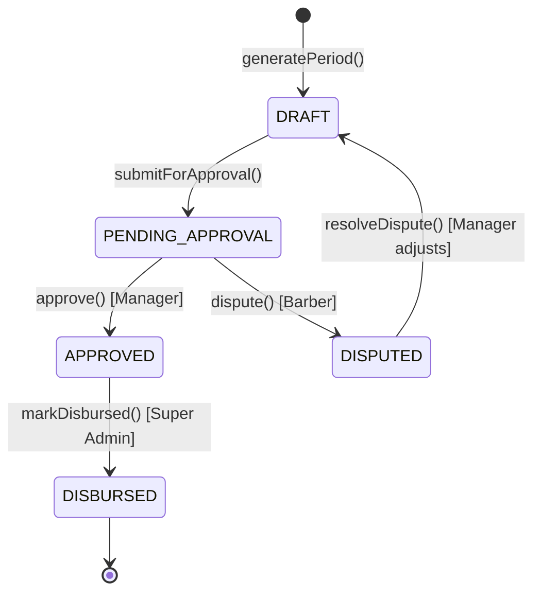
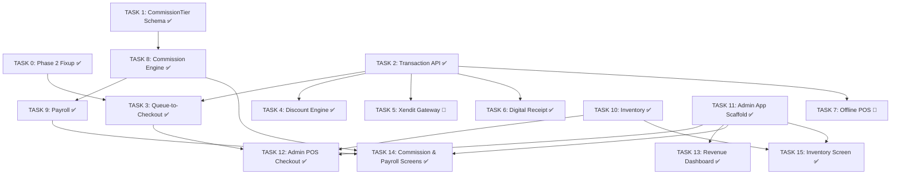

# Phase 4 Sprint: Financial & Workforce

> **Last updated:** Feb 26, 2026
> **Depends on:** Phase 2 (queue completions trigger transactions)
> **Goal:** Build the money-handling backbone — POS checkout, commission engine, payroll, inventory, and the Admin Dashboard app.

## Architecture References

> [!IMPORTANT]
> All code **must** follow the established project patterns:
> - **API:** [hono-setup.md](file:///d:/Fitz/Misc/bs-project/docs/hono-setup.md) — Feature module pattern: `[name].index.ts → [name].handlers.ts → [name].service.ts → [name].schema.ts`. Routes via `createRoute` + `OpenAPIHono`. RBAC via sub-routers with `authMiddleware()` + `requireRole()`.
> - **Frontend:** [react-setup.md](file:///d:/Fitz/Misc/bs-project/docs/react-setup.md) — Feature-Based Architecture with strict layer separation: `api/` (TanStack Query hooks), `components/` (pure UI), `widgets/` (connected), `store/` (Zustand), `types/` (Zod + TS interfaces). Shadcn/ui Maia preset. Tailwind v4 (config-less).
> - **Key Decisions:** [implementation_plan.md](file:///C:/Users/BCI%20ASIA/.gemini/antigravity/brain/db79ce06-02b9-4046-9e84-3a62e3e19a42/implementation_plan.md) — Strict OpenAPI via `@hono/zod-openapi`, `pnpm` only, Zod-validated env, Node.js + Docker deployment, IDR currency, WIB timezone (UTC+7 stored as UTC).
> - **Business Logic:** [business_logic.md](file:///C:/Users/BCI%20ASIA/.gemini/antigravity/brain/db79ce06-02b9-4046-9e84-3a62e3e19a42/business_logic.md) — POS formulas, commission models, offline sync, inventory COGS.

## Resolved Decisions

| # | Decision | Choice |
|---|----------|--------|
| 1 | Sliding Scale Commission | **Add `CommissionTier` model** to Prisma schema |
| 2 | Xendit Integration | **Full adapter** with live sandbox keys |
| 3 | Admin Dashboard | **Separate `apps/admin/`** Vite app |
| 4 | Offline POS | **Full implementation** — IndexedDB + Service Worker sync |
| 5 | Tax Rate | **Fixed 12% PPN** — hardcoded constant |
| 6 | EOD Cash Reconciliation | **Deferred** |

---

## TASK 0 — Pre-Phase 4 Fixup (Phase 2 Alignment) ✅

**Summary:** Fix 3 critical gaps in the existing Phase 2 code that Phase 4 depends on. Without these fixes, the queue-to-checkout flow, commission calculations, and transaction generation will not work correctly.

### FIX 0A — Queue Entry Must Create `Booking` + `BookingItem` Records

**Problem:** [queue.service.ts](file:///d:/Fitz/Misc/bs-project/apps/api/src/features/queue/queue.service.ts) `createEntry()` (line 66-91) accepts `serviceIds` in its input schema but **completely ignores them**. It only creates a `QueueEntry` row — no `Booking`, no `BookingItem`. This means there's no record of *what services* the customer is getting, and Phase 4's checkout flow (TASK 3) has nothing to read when auto-generating a `Transaction`.

**Current Code (broken):**
```typescript
// queue.service.ts — createEntry() currently does this:
const entry = await db.queueEntry.create({
  data: {
    branchId: data.branchId,
    customerId: data.customerId ?? undefined,
    customerName: data.customerName ?? undefined,
    status: "WAITING",
    source: data.source as any,
    position: count + 1,
    barberProfileId: data.barberId ?? undefined,
    estimatedWait: 30, // ← hardcoded
    // ❌ No Booking created
    // ❌ serviceIds completely ignored
  },
});
```

**Fix Logic — what the code should do:**

```
// queue.service.ts — createEntry() FIXED

async createEntry(db, data, pusher?) {
  // 1. Resolve service prices (accounting for branch overrides + tier surcharges)
  const services = await db.service.findMany({
    where: { id: { in: data.serviceIds } },
    include: {
      branchOverrides: { where: { branchId: data.branchId } },
      tierSurcharges: true,
    },
  });

  // 2. Calculate total duration for estimated wait
  const totalDuration = SUM(services.map(s => s.durationMinutes + s.bufferMinutes));

  // 3. Resolve price per service
  //    Priority: branchOverride.overridePrice > service.basePrice
  //    Then add tier surcharge if barberId is set
  const barberTier = data.barberId
    ? (await db.barberProfile.findUnique({ where: { id: data.barberId } }))?.tier
    : null;

  const bookingItems = services.map(service => {
    const override = service.branchOverrides.find(o => o.isActive);
    let price = override?.overridePrice ?? service.basePrice;

    if (barberTier) {
      const surcharge = service.tierSurcharges.find(ts => ts.tier === barberTier);
      if (surcharge) price += surcharge.surcharge;
    }

    return {
      serviceId: service.id,
      price,
      isAddOn: service.type === 'ADD_ON',
    };
  });

  // 4. Create Booking with items (inside a transaction for atomicity)
  const result = await db.$transaction(async (tx) => {
    const booking = await tx.booking.create({
      data: {
        customerId: data.customerId!,  // Required for online; walk-ins get a temp ID
        branchId: data.branchId,
        barberProfileId: data.barberId ?? null,
        status: 'CONFIRMED',
        scheduledAt: new Date(data.startTime),
        totalDuration,
        items: {
          create: bookingItems,
        },
      },
    });

    // 5. Create QueueEntry linked to the Booking
    const count = await tx.queueEntry.count({
      where: { branchId: data.branchId, createdAt: { gte: startOfDay } },
    });

    const entry = await tx.queueEntry.create({
      data: {
        branchId: data.branchId,
        customerId: data.customerId ?? null,
        customerName: data.customerName ?? null,
        status: 'WAITING',
        source: data.source as any,
        position: count + 1,
        barberProfileId: data.barberId ?? null,
        bookingId: booking.id,          // ← Link to booking
        estimatedWait: totalDuration,    // ← Computed, not hardcoded
      },
    });

    return entry;
  });

  if (pusher) void pusher.trigger(`branch-${result.branchId}`, 'QUEUE_UPDATED', result);
  return result;
}
```

**Key Design Notes:**
- Uses `db.$transaction()` for atomicity — if booking creation fails, queue entry is rolled back
- Price resolution follows the inheritance chain: `branchOverride > basePrice + tierSurcharge`
- Walk-ins without a `customerId` should still create a booking (use `customerName` to identify)
- `estimatedWait` is now computed from actual service durations instead of hardcoded `30`

**Files Modified:**
- `[MODIFY] features/queue/queue.service.ts` — `createEntry()` method rewritten
- `[MODIFY] features/queue/queue.schema.ts` — Ensure `serviceIds` is properly required (already is, but verify it's actually used)

---

### FIX 0B — Add `booking.items.service` Includes to Queue Queries

**Problem:** [queue.service.ts](file:///d:/Fitz/Misc/bs-project/apps/api/src/features/queue/queue.service.ts) `listQueue()` (line 12-41) and `getEntryById()` (line 43-50) only include `barber → user`. They do **not** include `booking → items → service`. When Phase 4's TASK 3 transitions a queue entry to `AT_CHECKOUT`, it needs to read the booking items to build transaction items.

**Current Code:**
```typescript
// listQueue — line 37-39
include: {
  barber: { include: { user: true } },
  // ❌ Missing: booking with items
}

// getEntryById — line 46-48
include: {
  barber: { include: { user: true } },
  // ❌ Missing: booking with items
}
```

**Fix — add booking includes:**

```typescript
// BOTH listQueue AND getEntryById should include:
include: {
  barber: { include: { user: true } },
  booking: {
    include: {
      items: {
        include: { service: true },  // Need service name for receipt & POS display
      },
    },
  },
}
```

**Also update `getUserEntries()` (line 52-62):**
```typescript
// getUserEntries already includes { branch, barber, transaction }
// Add booking items:
include: {
  branch: true,
  barber: { include: { user: true } },
  booking: {
    include: {
      items: { include: { service: true } },
    },
  },
  transaction: true,
}
```

**Files Modified:**
- `[MODIFY] features/queue/queue.service.ts` — Update 3 include blocks: `listQueue`, `getEntryById`, `getUserEntries`

---

### FIX 0C — Normalize Commission Rate Convention (0-1 Scale)

**Problem:** In [barbers.schema.ts](file:///d:/Fitz/Misc/bs-project/apps/api/src/features/barbers/barbers.schema.ts) line 32, `commissionRate` is validated as `z.number().min(0).max(100).default(0)`. But the Prisma schema stores it as a float (`0.4` = 40%), the `business_logic.md` formulas multiply `commissionBase × rate` expecting a 0-1 decimal, and the Phase 4 commission engine (TASK 8) will use `commissionBase * barber.commissionRate`.

If someone sets `commissionRate = 40` (thinking "40%"), the engine will calculate `1,500,000 × 40 = 60,000,000` instead of `600,000`. This is a **10,000% error**.

**Decision:** Use **0-1 scale** consistently. `0.40` = 40%.

**Fix:**

```diff
// barbers.schema.ts — line 32-33
- commissionRate: z.number().min(0).max(100).default(0),
- baseSalary: z.number().min(0).default(0),
+ commissionRate: z.number().min(0).max(1).default(0.4),  // 0.40 = 40%
+ baseSalary: z.number().min(0).default(0),               // IDR amount
```

Also add `bonusRate` validation:
```diff
// barbers.schema.ts — line 34
- bonusRate: z.number().min(0).optional(),
+ bonusRate: z.number().min(0).max(1).optional(),  // 0.20 = 20%
```

**Data Migration Check:** Verify if any existing `BarberProfile` rows in the database have `commissionRate > 1`. If so, they need to be divided by 100:

```sql
-- Check for bad data
SELECT id, "commissionRate" FROM barber_profiles WHERE "commissionRate" > 1;

-- Fix if needed
UPDATE barber_profiles SET "commissionRate" = "commissionRate" / 100 WHERE "commissionRate" > 1;
```

**Files Modified:**
- `[MODIFY] features/barbers/barbers.schema.ts` — Fix `commissionRate` max to 1, default to 0.4; fix `bonusRate` max to 1
- `[VERIFY] Database` — Check for existing rows with rate > 1

---

### Task 0 Definition of Done

- [x] `QueueService.createEntry()` creates a `Booking` + `BookingItem[]` inside a `$transaction`
- [x] Each `BookingItem.price` correctly resolves: branch override → base price → + tier surcharge
- [x] `QueueEntry.bookingId` is set, linking the entry to its booking
- [x] `QueueEntry.estimatedWait` is computed from service durations, not hardcoded `30`
- [x] `listQueue()` includes `booking.items.service` in its query
- [x] `getEntryById()` includes `booking.items.service` in its query
- [x] `getUserEntries()` includes `booking.items.service` in its query
- [x] `commissionRate` Zod validation changed to `.min(0).max(1).default(0.4)`
- [x] `bonusRate` Zod validation changed to `.min(0).max(1)`
- [ ] No existing database rows have `commissionRate > 1` (verified via SQL)
- [ ] `curl` test: POST `/api/queue` with `serviceIds` → verify `Booking` + `BookingItem` rows exist in DB
- [ ] `curl` test: GET `/api/queue?branchId=X` → verify response includes `booking.items[].service.name`
- [ ] Existing queue tests (if any) still pass

---

## TASK 1 — Prisma Schema Update (CommissionTier) ✅

**Summary:** Add `CommissionTier` model for the `SLIDING_SCALE` commission model.

**Technical Detail:**

```prisma
model CommissionTier {
  id              String @id @default(cuid())
  barberProfileId String
  minRevenue      Float  // Lower bound of the bracket (inclusive)
  maxRevenue      Float? // Upper bound (null = unlimited, i.e. "everything above")
  rate            Float  // Commission rate for this bracket (e.g., 0.30 = 30%)

  barber BarberProfile @relation(fields: [barberProfileId], references: [id], onDelete: Cascade)

  @@unique([barberProfileId, minRevenue])
  @@map("commission_tiers")
}
```

**Logic:** When `commissionModel = SLIDING_SCALE`, the engine fetches tiers ordered by `minRevenue ASC`. For each tier, the commission is calculated only on the revenue that falls within that bracket:

```
tiers = [
  { minRevenue: 0,       maxRevenue: 1000000, rate: 0.30 },  // 30% for first 1M
  { minRevenue: 1000000, maxRevenue: null,     rate: 0.40 },  // 40% for everything above 1M
]

revenue = 1,500,000
commission = (1,000,000 * 0.30) + (500,000 * 0.40) = 300,000 + 200,000 = 500,000
```

**Definition of Done:**
- [x] `CommissionTier` model added to `schema.prisma` with `@@unique([barberProfileId, minRevenue])`
- [x] `BarberProfile.commissionTiers CommissionTier[]` relation added
- [x] Migration `add_commission_tiers` runs cleanly
- [x] `npx prisma generate` succeeds

---

## TASK 2 — Transaction API (`features/transactions/`) ✅

**Summary:** Core POS feature module — CRUD, payment recording, voiding, daily summary.

### File Manifest

Following [hono-setup.md](file:///d:/Fitz/Misc/bs-project/docs/hono-setup.md):

| File | Purpose |
|------|---------|
| `transactions.schema.ts` | Zod schemas for create, addPayment, void, list filters |
| `transactions.service.ts` | Business logic — calculation, DB operations |
| `transactions.handlers.ts` | `createRoute` definitions + `RouteHandler` exports |
| `transactions.index.ts` | Sub-routers with RBAC (read, write, void) |

### Zod Schemas

```typescript
// transactions.schema.ts
export const createTransactionSchema = z.object({
  branchId: z.string(),
  queueEntryId: z.string().optional(),
  barberProfileId: z.string().optional(),
  customerId: z.string().optional(),
  items: z.array(z.object({
    serviceId: z.string().optional(),
    productId: z.string().optional(),
    name: z.string(),
    quantity: z.number().int().min(1).default(1),
    unitPrice: z.number().min(0),
    discount: z.number().min(0).default(0),
    isAddOn: z.boolean().default(false),
  })),
  tipAmount: z.number().min(0).default(0),
  discountAmount: z.number().min(0).default(0),
  promoCode: z.string().optional(),
  loyaltyPointsUsed: z.number().int().min(0).default(0),
  clientUuid: z.string().uuid().optional(), // For offline dedup
});

export const addPaymentsSchema = z.object({
  payments: z.array(z.object({
    method: z.enum(['CASH', 'CARD', 'QRIS', 'DIGITAL_WALLET']),
    amount: z.number().min(0),
    reference: z.string().optional(), // Gateway chargeId
  })),
});

export const listTransactionsQuery = z.object({
  branchId: z.string(),
  dateFrom: z.string().optional(),
  dateTo: z.string().optional(),
  status: z.enum(['PENDING', 'COMPLETED', 'VOIDED', 'REFUNDED']).optional(),
  barberProfileId: z.string().optional(),
  page: z.coerce.number().int().min(1).default(1),
  limit: z.coerce.number().int().min(1).max(100).default(20),
});
```

### Transaction Calculation Logic

```
// TransactionService.createTransaction(db, data)

const TAX_RATE = 0.12; // 12% PPN

grossAmount     = SUM(item.unitPrice * item.quantity)
discountAmount  = data.discountAmount  // sum of manual + promo + loyalty
tipAmount       = data.tipAmount
taxAmount       = (grossAmount - discountAmount) * TAX_RATE
netAmount       = grossAmount - discountAmount + taxAmount
totalDue        = netAmount + tipAmount

// Commission base = service items only (no products, no tips)
// This is stored on Transaction for commission engine to read later
commissionBase  = SUM(serviceItems.unitPrice * qty) - serviceDiscountPortion

// Persist:
// 1. Transaction row with all amounts
// 2. TransactionItem[] rows
// 3. If clientUuid provided, check uniqueness first (409 if duplicate)
```

### Payment Logic

```
// TransactionService.addPayments(db, txId, payments)

tx = getTransaction(txId)
if tx.status !== 'PENDING': throw 400 "Transaction already finalized"

totalPaid = SUM(payments.amount)
if totalPaid !== tx.totalDue: throw 400 "Payment mismatch: expected {totalDue}, got {totalPaid}"

// Create Payment rows
for payment in payments:
  db.payment.create({ transactionId: txId, ...payment })

// Finalize
db.transaction.update(txId, { status: 'COMPLETED' })

// Side effects:
// 1. If queueEntryId → update QueueEntry.status to PAID
// 2. Trigger CommissionService.triggerOnPaid(txId)
// 3. If any productId items → call InventoryService.recordStockOut()
```

### Void Logic

```
// TransactionService.voidTransaction(db, txId, userId, reason)

tx = getTransaction(txId)
if tx.status === 'VOIDED': throw 400 "Already voided"

// Reverse inventory
for item in tx.items where item.productId:
  InventoryService.adjustStock(branchId, productId, +item.quantity, "VOID reversal")

db.transaction.update(txId, { status: 'VOIDED' })

// Audit
db.auditLog.create({
  userId, role: ctx.role, branchId: tx.branchId,
  action: 'VOID_TRANSACTION', entityType: 'Transaction', entityId: txId,
  details: { reason }
})
```

### RBAC Sub-Routers (in `transactions.index.ts`)

```typescript
// Pattern: sub-app with wildcard middleware (used by transactions, inventory, payroll, etc.)
// NOTE: queue.index.ts has been restructured to flat path-specific middleware to avoid
// wildcard conflicts when multiple role groups share the same path prefix.
const readApp = new OpenAPIHono<AppEnv>();
readApp.use("*", authMiddleware());
readApp.openapi(listRoute, listHandler);
readApp.openapi(getByIdRoute, getByIdHandler);
readApp.openapi(getSummaryRoute, getSummaryHandler);
readApp.openapi(getReceiptRoute, getReceiptHandler);

const writeApp = new OpenAPIHono<AppEnv>();
writeApp.use("*", authMiddleware(), requireRole("CASHIER", "SUPERVISOR", "MANAGER"));
writeApp.openapi(createRoute, createHandler);
writeApp.openapi(addPaymentsRoute, addPaymentsHandler);

const voidApp = new OpenAPIHono<AppEnv>();
voidApp.use("*", authMiddleware(), requireRole("SUPERVISOR", "MANAGER"));
voidApp.openapi(voidRoute, voidHandler);

transactionsApp.route("/", readApp);
transactionsApp.route("/", writeApp);
transactionsApp.route("/", voidApp);
```

**Definition of Done:**
- [x] All Zod schemas defined and exported
- [x] `createTransaction` calculates `grossAmount`, `discountAmount`, `taxAmount` (12%), `netAmount`, `totalDue` correctly
- [x] `addPayments` validates total and marks transaction `COMPLETED`
- [x] `addPayments` transitions linked queue entry to `PAID`
- [ ] `addPayments` triggers `CommissionService.triggerOnPaid` and `InventoryService.recordStockOut` *(deferred to Tasks 8 & 10)*
- [x] `voidTransaction` reverses inventory and creates `AuditLog`
- [x] `clientUuid` dedup returns 409 on duplicate
- [x] `getDailySummary` returns: revenue, service/product split, tips, payment methods, count
- [x] All routes registered in `src/index.ts` under `/api/transactions`
- [x] RBAC: Cashier can create but not void; unauthenticated gets 401
- [ ] `curl` round-trip: create → pay → verify COMPLETED → void → verify inventory restored

---

## TASK 3 — Queue-to-Checkout Integration ✅

**Summary:** Wire queue `COMPLETED → AT_CHECKOUT` to auto-generate a draft transaction.

### Technical Logic

```
// In QueueService.updateStatus — when new status is 'AT_CHECKOUT':

if (data.status === 'AT_CHECKOUT') {
  const entry = await db.queueEntry.findUnique({
    where: { id },
    include: { booking: { include: { items: { include: { service: true } } } } }
  });

  // Build transaction items from booking
  const items = entry.booking?.items.map(bi => ({
    serviceId: bi.serviceId,
    name: bi.service.name,
    quantity: 1,
    unitPrice: bi.price,
    discount: 0,
    isAddOn: bi.isAddOn,
  })) ?? [];

  // Auto-create draft transaction
  await TransactionService.createTransaction(db, {
    branchId: entry.branchId,
    queueEntryId: entry.id,
    barberProfileId: entry.barberProfileId,
    customerId: entry.customerId,
    items,
    tipAmount: 0,
    discountAmount: 0,
  });
}
```

**Definition of Done:**
- [x] Queue entry transitioning to `AT_CHECKOUT` auto-creates a `Transaction` with status `PENDING`
- [x] Transaction items populated from linked `Booking.items` (service name, price)
- [x] `Transaction.queueEntryId` links to the queue entry
- [x] Walk-in entries (no booking) create an empty transaction that cashier fills manually
- [x] When transaction is `COMPLETED` (paid), queue entry transitions to `PAID`
- [ ] `curl` test: full flow from queue entry → AT_CHECKOUT → verify draft transaction → add payment → verify PAID

---

## TASK 4 — Discount & Promo Engine ✅

**Summary:** Support manual discounts, promo codes, and loyalty point redemption.

### Technical Logic

```
// Discount types applied during createTransaction or as a separate PATCH

MANUAL:
  if role === 'CASHIER' && discountPercent > 10%:
    throw 403 "Cashier discount limited to 10%"
  discountAmount = isPercentage ? grossAmount * (pct / 100) : flatAmount

LOYALTY:
  pointsRequired = CEIL(requestedDiscount / 500)  // 1 pt = 500 IDR
  maxDiscount = netAmount * 0.50  // max 50% of bill
  if requestedDiscount > maxDiscount: throw 400 "Exceeds 50% limit"
  if customer.pointsBalance < pointsRequired: throw 400 "Insufficient points"
  db.loyaltyAccount.update({ pointsBalance: { decrement: pointsRequired } })

PROMO:
  // Phase 4 stub: accept promoCode string, apply flat 10% discount for testing
  // Full promo CRUD deferred to Phase 5

// All discount applications → AuditLog with action APPLY_DISCOUNT
```

**Definition of Done:**
- [x] Manual discount correctly limits Cashier to 10% max
- [x] Loyalty deduction calculates points at 1pt = 500 IDR, max 50% of bill
- [x] Insufficient points returns 400 with clear message
- [x] Promo code validation: full CRUD + expiry/usage/branch checks *(overbuilt vs stub spec — forward-compatible)*
- [x] `AuditLog` created for every discount with `action: APPLY_DISCOUNT`

> [!NOTE]
> The sprint originally specified a promo code **stub** (flat 10%, defer CRUD to Phase 5). The actual implementation built the full `PromoCode` model + validation engine. This is forward-compatible and functionally correct.

---

## TASK 5 — Payment Gateway Adapter (Xendit) 🔶 PARTIAL

**Summary:** Abstracted payment gateway interface + Xendit implementation for QRIS/Card.

### Technical Detail

```typescript
// utils/payment-gateway.ts
export interface ChargeRequest {
  amount: number;
  method: 'QRIS' | 'CARD';
  referenceId: string;     // our transactionId
  description: string;
  customerEmail?: string;
}

export interface ChargeResponse {
  chargeId: string;        // Xendit's charge ID
  status: 'PENDING' | 'PAID' | 'FAILED';
  paymentUrl?: string;     // For card redirect
  qrString?: string;       // For QRIS
  expiresAt?: string;
}

export interface PaymentGatewayAdapter {
  createCharge(req: ChargeRequest): Promise<ChargeResponse>;
  checkStatus(chargeId: string): Promise<{ status: 'PENDING' | 'PAID' | 'FAILED' }>;
}
```

```typescript
// utils/xendit-adapter.ts
export class XenditAdapter implements PaymentGatewayAdapter {
  constructor(private secretKey: string) {}

  async createCharge(req: ChargeRequest): Promise<ChargeResponse> {
    // POST https://api.xendit.co/v2/invoices
    // Auth: Basic base64(secretKey + ':')
    // Body: { external_id: req.referenceId, amount: req.amount, ... }
  }

  async checkStatus(chargeId: string): Promise<...> {
    // GET https://api.xendit.co/v2/invoices/{chargeId}
  }
}
```

### Webhook Flow

```
POST /api/payments/webhook
  1. Verify X-Callback-Token === env.XENDIT_WEBHOOK_TOKEN
  2. Extract { external_id, status, id } from body
  3. Find Payment where reference === id
  4. If status === 'PAID':
     - Update Payment status
     - Check if all payments for the transaction total to totalDue
     - If yes → mark transaction COMPLETED, trigger side effects
  5. Return 200 OK (Xendit expects 200, else retries)
```

**Env Additions to `.dev.vars` and `Bindings` type:**
```
XENDIT_SECRET_KEY="xnd_development_..."
XENDIT_WEBHOOK_TOKEN="your-webhook-verification-token"
```

**Definition of Done:**
- [ ] `PaymentGatewayAdapter` interface exported from `utils/payment-gateway.ts`
- [ ] `XenditAdapter` implements both methods using Xendit REST API
- [x] `XENDIT_SECRET_KEY` and `XENDIT_WEBHOOK_TOKEN` in `.dev.vars` and `Bindings`
- [x] `CASH` payments bypass the adapter entirely — recorded directly
- [x] Webhook validates `X-Callback-Token` header, returns 401 on mismatch
- [x] Webhook correctly finalizes the transaction on `PAID` status
- [ ] Adapter is swappable: single import change replaces gateway

> **Status:** Webhook handler (`POST /payments/webhook`) and CASH payment flow work. Missing: `PaymentGatewayAdapter` interface and `XenditAdapter` class for creating QRIS/Card charges.

---

## TASK 6 — Digital Receipt ✅ COMPLETE

**Summary:** Structured receipt JSON endpoint + email + print CSS.

### Receipt Data Shape

```typescript
interface ReceiptData {
  receiptNumber: string;     // TX-20260222-001
  date: string;              // ISO 8601
  branchName: string;
  branchAddress: string;
  cashierName: string;
  barberName: string | null;
  items: Array<{
    name: string;
    qty: number;
    unitPrice: number;       // IDR
    discount: number;
    total: number;
  }>;
  subtotal: number;
  discountTotal: number;
  tax: number;               // 12% PPN
  tip: number;
  grandTotal: number;
  payments: Array<{ method: string; amount: number }>;
  loyaltyPointsEarned: number;
}
```

**Definition of Done:**
- [x] `GET /api/transactions/:id/receipt` returns `ReceiptData` JSON
- [x] Receipt number format: `TX-{YYYYMMDD}-{sequential}`
- [x] `@media print` CSS: no sidebar/nav, clean receipt layout — `receipt-print.css` (Client Hardening Sprint)
- [x] Frontend receipt page with print button — `receipt-page.tsx` linked from booking history (Client Hardening Sprint)
- [ ] Email receipt fires via OneSignal transactional email (deferred — requires OneSignal email channel config)

> **Status:** Backend receipt API and frontend receipt page with print CSS are complete. Receipt is accessible from client booking history via "View Receipt" link. Only remaining item is email receipt sending, which depends on OneSignal transactional email integration (third-party dependency, deferred).

---

## TASK 7 — Offline POS Mode 🔶 PARTIAL

**Summary:** IndexedDB queue + Service Worker sync for offline transaction creation.

### Technical Architecture

```
┌─────────────────────────────────────────────────────────┐
│ Admin App (Browser)                                     │
│                                                         │
│  ┌──────────────┐    ┌──────────────┐                   │
│  │ POS Screen   │───▶│ offlineStore  │◀── IndexedDB     │
│  └──────────────┘    └──────┬───────┘                   │
│                             │                           │
│  ┌──────────────┐           │ online?                   │
│  │ SyncIndicator│◀──────────┤                           │
│  └──────────────┘     ┌─────▼─────┐                     │
│                       │ syncQueue │──▶ POST /api/tx     │
│  ┌──────────────┐     └───────────┘     ▲               │
│  │ OfflineBanner│                       │ 409 = dedup   │
│  └──────────────┘                       │ 201 = synced  │
└─────────────────────────────────────────────────────────┘
```

### IndexedDB Schema (via `idb` library)

```typescript
// lib/offline-store.ts
interface OfflineTransaction {
  clientUuid: string;          // crypto.randomUUID()
  payload: CreateTransactionInput;
  status: 'PENDING_SYNC' | 'SYNCING' | 'SYNCED' | 'FAILED';
  createdAt: number;           // Date.now() — for ordering
  error?: string;
}

// DB: "barber-admin-offline", Store: "transactions"
```

### Sync Logic

```
// lib/sync-worker.ts (runs when navigator.onLine transitions to true)

async function syncPendingTransactions() {
  const pending = await offlineStore.getAllByStatus('PENDING_SYNC');
  pending.sort((a, b) => a.createdAt - b.createdAt); // chronological

  for (const tx of pending) {
    await offlineStore.updateStatus(tx.clientUuid, 'SYNCING');
    try {
      await apiFetch('/transactions', { method: 'POST', body: tx.payload });
      await offlineStore.updateStatus(tx.clientUuid, 'SYNCED');
    } catch (err) {
      if (err.status === 409) {
        // Already exists on server — mark as synced
        await offlineStore.updateStatus(tx.clientUuid, 'SYNCED');
      } else {
        await offlineStore.updateStatus(tx.clientUuid, 'FAILED', err.message);
      }
    }
  }
}

window.addEventListener('online', syncPendingTransactions);
```

**Definition of Done:**
- [x] `OfflineTransaction` stored in IndexedDB with `clientUuid`
- [x] On offline, POS checkout saves to IndexedDB and shows success state
- [x] On reconnect, sync replays in chronological order
- [x] Server returns 409 on duplicate `clientUuid` — sync treats as `SYNCED`
- [x] `OfflineBanner` visible when `navigator.onLine === false`
- [x] `SyncIndicator` shows progress (e.g., "Syncing 2/5...")
- [ ] Manual test: disconnect → create tx → reconnect → verify in DB

> **Status:** IndexedDB offline store, offline banner, sync indicator, and sync-on-reconnect all implemented. Missing: Service Worker for full offline app shell caching (currently relies on `navigator.onLine` detection only).

---

## TASK 8 — Commission Engine (`features/commissions/`) ✅

**Summary:** Calculate barber commissions per completed transaction, 3 models supported.

### File Manifest

| File | Purpose |
|------|---------|
| `commissions.schema.ts` | Zod schemas for calculate and query |
| `commissions.service.ts` | Commission calculation logic |
| `commissions.handlers.ts` | OpenAPI routes + handlers |
| `commissions.index.ts` | RBAC sub-routers |

### Calculation Logic (all 3 models)

```
function calculateDaily(db, barberProfileId, date):
  barber = db.barberProfile.findUnique({ include: { commissionTiers: true } })
  transactions = db.transaction.findMany({
    where: { barberProfileId, status: 'COMPLETED', createdAt: dateRange(date) }
  })

  commissionBase = SUM(
    tx.items.filter(i => i.serviceId != null)
      .map(i => (i.unitPrice * i.quantity) - i.discount)
  )
  tips = SUM(tx.tipAmount)

  switch (barber.commissionModel):
    case 'FLAT_PERCENTAGE':
      commission = commissionBase * barber.commissionRate
      // e.g., 1,500,000 * 0.40 = 600,000

    case 'SLIDING_SCALE':
      commission = 0
      remaining = commissionBase
      for tier in barber.commissionTiers ORDER BY minRevenue ASC:
        bracketSize = tier.maxRevenue ? (tier.maxRevenue - tier.minRevenue) : remaining
        applicable = MIN(remaining, bracketSize)
        commission += applicable * tier.rate
        remaining -= applicable
        if remaining <= 0: break
      // e.g., tiers [0-1M: 30%, 1M+: 40%], revenue 1.5M → 300K + 200K = 500K

    case 'BASE_PLUS_BONUS':
      workingDaysInMonth = getWorkingDays(date.month, date.year) // count non-Sunday days
      dailyBase = barber.baseSalary / workingDaysInMonth
      bonus = commissionBase * (barber.bonusRate ?? 0)
      commission = dailyBase + bonus
      // e.g., 2M base / 26 days = 76,923 + (1.5M * 0.20) = 76,923 + 300,000 = 376,923

  total = commission + tips
  UPSERT into barber_earnings (barberProfileId, date, commissionBase, commission, tips, total)
```

### RBAC

| Action | Roles |
|--------|-------|
| `POST /commissions/calculate` | MANAGER, SUPER_ADMIN |
| `GET /commissions/me` | BARBER (own) |
| `GET /commissions/:barberId` | MANAGER, SUPER_ADMIN |
| `POST /commissions/recalculate` | MANAGER, SUPER_ADMIN |

**Definition of Done:**
- [x] `FLAT_PERCENTAGE`: correct commission for known inputs
- [x] `SLIDING_SCALE`: applies bracket-based rates from `CommissionTier` table
- [x] `BASE_PLUS_BONUS`: prorates `baseSalary` by working days, adds bonus
- [x] Auto-triggered when a transaction is marked `COMPLETED`
- [x] Tips from `Transaction.tipAmount` recorded on the earning
- [x] `recalculateDay` deletes old earning and recomputes
- [x] Barber reads own earnings via `GET /commissions/me`
- [ ] `curl` test: create paid tx → verify `BarberEarning` with correct amounts

---

## TASK 9 — Payroll (`features/payroll/`) ✅

**Summary:** Aggregate earnings → payroll periods → approval workflow.

### State Machine



### Generate Logic

```
function generatePeriod(db, barberProfileId, startDate, endDate):
  earnings = db.barberEarning.findMany({
    where: { barberProfileId, date: { gte: startDate, lte: endDate } }
  })

  totalCommission = SUM(e.commission)
  totalTips = SUM(e.tips)
  totalPayout = totalCommission + totalTips

  db.payrollPeriod.create({
    barberProfileId, periodStart: startDate, periodEnd: endDate,
    totalCommission, totalTips, totalPayout,
    status: 'DRAFT'
  })
```

### RBAC

| Action | Roles |
|--------|-------|
| Generate / Submit / Resolve | MANAGER, SUPER_ADMIN |
| Approve | MANAGER, SUPER_ADMIN |
| Dispute | BARBER (own payroll only) |
| Mark Disbursed | SUPER_ADMIN |
| Read | BARBER (own), MANAGER, SUPER_ADMIN |

**Definition of Done:**
- [x] `generatePeriod` correctly sums `BarberEarning` for the date range
- [x] State transitions enforced — invalid ones return 400
- [x] `approve` sets `approvedBy` and `approvedAt`
- [x] `AuditLog` for `APPROVE_PAYROLL` and `DISPUTE_PAYROLL`
- [x] Barber can only dispute/read own payroll
- [ ] `curl` test: generate → submit → approve → disburse (happy path)
- [ ] `curl` test: generate → submit → dispute → resolve → approve (dispute path)

---

## TASK 10 — Inventory Management (`features/inventory/`) ✅

**Summary:** Product CRUD, stock tracking per branch, weighted-average cost, low-stock alerts.

### File Manifest

| File | Purpose |
|------|---------|
| `inventory.schema.ts` | Zod schemas: product CRUD, stock-in/out, adjust |
| `inventory.service.ts` | Business logic + weighted avg cost |
| `inventory.handlers.ts` | OpenAPI routes + handlers |
| `inventory.index.ts` | RBAC sub-routers |

### Weighted Average Cost Logic

```
function recordStockIn(db, branchId, productId, incomingQty, costPerUnit):
  inv = db.branchInventory.findUnique({ where: { branchId_productId } })

  newAvgCost = ((inv.quantity * inv.avgCost) + (incomingQty * costPerUnit))
               / (inv.quantity + incomingQty)

  db.branchInventory.update({
    quantity: inv.quantity + incomingQty,
    avgCost: newAvgCost
  })

  db.stockMovement.create({
    productId, branchId, type: 'IN',
    quantity: incomingQty, costPerUnit
  })
```

### Stock-Out + Low-Stock Alert

```
function recordStockOut(db, branchId, productId, qty):
  inv = db.branchInventory.findUnique(...)
  if inv.quantity < qty: throw 400 "Insufficient stock"

  db.branchInventory.update({ quantity: inv.quantity - qty })
  db.stockMovement.create({ type: 'OUT', quantity: qty })

  if (inv.quantity - qty) <= inv.reorderThreshold:
    // Return low-stock warning in response body
    return { warning: 'LOW_STOCK', product: inv.product.name, remaining: inv.quantity - qty }
```

### RBAC

| Action | Roles |
|--------|-------|
| Product CRUD | MANAGER, SUPER_ADMIN |
| Stock In / Out / Adjust | SUPERVISOR, MANAGER |
| Read (list, alerts, valuation) | CASHIER, SUPERVISOR, MANAGER, SUPER_ADMIN |

**Definition of Done:**
- [x] Product CRUD with unique `sku` validation
- [x] `recordStockIn` recalculates `avgCost` using weighted average formula
- [x] `recordStockOut` decreases quantity and logs `StockMovement(OUT)`
- [x] Returns low-stock warning when `quantity <= reorderThreshold`
- [x] `adjustStock` logs `StockMovement(ADJUSTMENT)` with note
- [x] `getLowStockAlerts` returns products at/below threshold
- [x] `getValuation(branchId)` returns `SUM(quantity × avgCost)`
- [x] POS integration: product sale auto-calls `recordStockOut`
- [ ] `curl` test: create product → stock in → sell → verify decrement + movement log

---

## TASK 11 — Admin Dashboard App Scaffolding (`apps/admin/`) ✅

**Summary:** Separate Vite + React 19 admin app following [react-setup.md](file:///d:/Fitz/Misc/bs-project/docs/react-setup.md).

### Scaffolding Command

```bash
# From monorepo root
pnpm create vite apps/admin --template react-ts
# Then:
cd apps/admin
npx shadcn@latest init --preset "https://ui.shadcn.com/init?base=base&style=maia&baseColor=gray&theme=gray&iconLibrary=hugeicons&font=inter&menuAccent=subtle&menuColor=default&radius=default&template=vite" --template vite
```

### Directory Structure (per react-setup.md)

```text
apps/admin/src/
├── app/
│   ├── app.tsx              # Providers: QueryClient, Auth, Theme
│   └── main.tsx             # Entry point
├── components/
│   ├── ui/                  # Shadcn primitives (button, input, table, dialog...)
│   ├── common/              # Smart wrappers (data-table, form-select)
│   └── layout/
│       ├── admin-layout.tsx # Shell: sidebar + topbar + <Outlet />
│       └── sidebar.tsx      # Navigation menu
├── config/
│   ├── env.ts               # Zod-validated env vars
│   ├── endpoints.ts         # API URL registry
│   └── constants.ts         # TAX_RATE = 0.12, etc.
├── features/
│   ├── auth/                # Login, session store, protected route guard
│   │   ├── api/             # use-auth.ts (TanStack Query)
│   │   ├── store/           # use-session-store.ts (Zustand)
│   │   └── types/           # LoginResponse, etc.
│   ├── pos/                 # POS checkout feature (TASK 12)
│   ├── transactions/        # Transaction history
│   ├── commissions/         # Commission overview
│   ├── payroll/             # Payroll management
│   └── inventory/           # Inventory manager
├── lib/
│   ├── api.ts               # apiFetch with auth interceptor
│   ├── query-client.ts      # QueryClient config
│   └── utils.ts             # cn() helper
├── pages/
│   ├── dashboard/           # Revenue dashboard page
│   ├── pos/                 # POS checkout page
│   ├── transactions/        # Transaction history page
│   ├── commissions/         # Commission page
│   ├── payroll/             # Payroll page
│   ├── inventory/           # Inventory page
│   └── auth/                # Login page
├── routes/
│   ├── _guards/             # protected-route.tsx (role check)
│   └── index.tsx            # React Router definition
└── stores/
    └── use-ui-store.ts      # Global UI state (sidebar open, etc.)
```

### Route Map

| Route | Page | Guard |
|-------|------|-------|
| `/login` | LoginPage | None |
| `/` | DashboardPage | CASHIER+ |
| `/pos` | POSCheckoutPage | CASHIER+ |
| `/transactions` | TransactionHistoryPage | CASHIER+ |
| `/commissions` | CommissionPage | MANAGER+ |
| `/payroll` | PayrollPage | MANAGER+ |
| `/inventory` | InventoryPage | SUPERVISOR+ |
| `/barbers` | BarberManagementPage | MANAGER+ |
| `/settings` | BranchSettingsPage | MANAGER+ |

**Definition of Done:**
- [x] `apps/admin/` is a working Vite + React 19 app
- [x] `pnpm --filter @tmng/barber-admin dev` starts on a unique port (e.g., 5175)
- [x] Shadcn/ui initialized with Maia preset
- [x] Tailwind v4 configured with same design tokens as client app
- [x] `@/` path alias configured in `tsconfig.app.json` and `vite.config.ts`
- [x] Directory structure matches `react-setup.md` exactly
- [x] Login page authenticates via `POST /api/auth/login`
- [x] Only CASHIER, SUPERVISOR, MANAGER, SUPER_ADMIN can access (CUSTOMER/BARBER redirected)
- [x] Desktop-first layout with collapsible sidebar
- [x] All routes render fully implemented pages (not stubs)
- [x] `pnpm --filter @tmng/barber-admin build` succeeds

---

## TASK 12 — Admin POS Checkout Screen ✅

**Summary:** Full POS checkout UI in `features/pos/`.

### Feature Structure (per react-setup.md)

```text
features/pos/
├── api/
│   ├── use-create-transaction.ts    # useMutation → POST /transactions
│   ├── use-add-payments.ts          # useMutation → POST /transactions/:id/payments
│   └── use-services.ts              # useQuery → GET /services
├── components/
│   ├── service-item-card.tsx        # Service/product card with [+] button
│   ├── order-summary.tsx            # Right panel: items, totals, payment
│   ├── payment-method-selector.tsx  # Cash / QRIS / Card buttons
│   ├── discount-input.tsx           # Manual discount field
│   └── tip-input.tsx                # Tip amount field
├── widgets/
│   ├── pos-checkout.tsx             # Full checkout connected component
│   └── receipt-preview.tsx          # Post-payment receipt display
├── store/
│   └── use-pos-store.ts             # Zustand: cart items, discount, tip, selected payment
├── types/
│   └── index.ts                     # CartItem, PaymentSelection, etc.
└── index.ts                         # Public exports
```

### POS Store Shape (Zustand)

```typescript
interface POSState {
  cartItems: CartItem[];         // { serviceId?, productId?, name, unitPrice, qty, discount }
  discountType: 'FLAT' | 'PERCENTAGE' | null;
  discountValue: number;
  tipAmount: number;
  selectedPaymentMethod: PaymentMethod | null;
  queueEntryId: string | null;  // If checking out from queue

  // Computed (derived in component, not stored)
  // grossAmount, discountAmount, taxAmount, netAmount, totalDue

  // Actions
  addItem(item: CartItem): void;
  removeItem(index: number): void;
  updateQuantity(index: number, qty: number): void;
  setDiscount(type, value): void;
  setTip(amount: number): void;
  setPaymentMethod(method: PaymentMethod): void;
  reset(): void;
}
```

**Definition of Done:**
- [x] Left panel: service list fetched from API with "Add" buttons
- [x] Right panel: live-updating order summary
- [x] Tax calculated at 12% of (subtotal - discount)
- [x] Discount input with flat/percentage toggle
- [x] Tip input field
- [x] Payment selector: Cash works; QRIS/Card pending Task 5 (Xendit adapter)
- [x] "Complete Checkout" calls `POST /transactions` → `POST /transactions/:id/payments`
- [x] On success: receipt preview with print button (completed in Client Hardening Sprint — client app `receipt-page.tsx`)
- [x] Error states: payment mismatch, API failure, offline fallback
- [x] Zustand store resets after successful checkout

> **Known limitation:** POS currently shows services only (no product catalog in UI). Product items can be added via API but not through the POS UI.

---

## TASK 13 — Admin Revenue Dashboard ✅

**Summary:** Daily revenue overview with breakdown cards.

### Feature Structure

```text
features/dashboard/
├── api/
│   └── use-daily-summary.ts     # useQuery → GET /transactions/summary
├── components/
│   ├── revenue-card.tsx          # Single metric card
│   └── payment-breakdown.tsx     # Payment method pie/bar
├── widgets/
│   └── dashboard-overview.tsx    # Assembles all cards
└── types/
    └── index.ts                  # DailySummary type
```

**Definition of Done:**
- [x] Top cards: Total Revenue, Service Revenue, Product Revenue, Tips
- [x] Payment method breakdown visuals
- [x] Transaction count for the day
- [x] Date picker for historical view
- [x] Loading skeletons and error states

---

## TASK 14 — Admin Commission & Payroll Screens ✅

### Commission Feature Structure

```text
features/commissions/
├── api/
│   └── use-earnings.ts          # useQuery → GET /commissions
├── components/
│   └── earnings-table.tsx       # Barber × Date table
├── widgets/
│   └── commission-overview.tsx  # Connected with filters
└── types/
    └── index.ts
```

### Payroll Feature Structure

```text
features/payroll/
├── api/
│   ├── use-payroll-periods.ts   # useQuery → GET /payroll
│   └── use-payroll-actions.ts   # useMutation → approve, dispute, etc.
├── components/
│   ├── payroll-table.tsx        # Period list with status badges
│   ├── payroll-action-buttons.tsx
│   └── dispute-modal.tsx        # Dispute note input
├── widgets/
│   └── payroll-manager.tsx      # Connected component
└── types/
    └── index.ts
```

**Commission Definition of Done:**
- [x] Earnings table: Barber, Date, CommBase, Commission, Tips, Total
- [x] Filter by date range and barber
- [x] "Recalculate" button for managers

**Payroll Definition of Done:**
- [x] Period list: Barber, Period, Payout, Status (color badges)
- [x] "Generate" button → date range picker → API call
- [x] Action buttons: Submit, Approve, Dispute, Disburse (role-conditional)
- [x] Dispute modal with note text input
- [x] Confirmation dialogs for approve and disburse

> **Known limitation (resolved):** Commission and Payroll tables now show full barber names. Fixed by including `barber.user` relation in API responses (Tier 1 Polish Sprint).

---

## TASK 15 — Admin Inventory Screen ✅

### Feature Structure

```text
features/inventory/
├── api/
│   ├── use-products.ts          # useQuery → GET /inventory/products
│   ├── use-branch-inventory.ts  # useQuery → GET /inventory/:branchId
│   └── use-stock-mutations.ts   # useMutation → stock-in, stock-out, adjust
├── components/
│   ├── product-table.tsx
│   ├── stock-indicator.tsx      # Green/Yellow/Red badge
│   ├── stock-in-dialog.tsx
│   ├── stock-adjust-dialog.tsx
│   └── product-form-dialog.tsx  # Add/edit product
├── widgets/
│   ├── inventory-manager.tsx    # Main connected component
│   └── low-stock-alerts.tsx     # Alert list
├── store/
│   └── use-inventory-filters.ts # Filter state
└── types/
    └── index.ts
```

**Definition of Done:**
- [x] Product table: Name, SKU, Cost, Sell Price, Stock, Status
- [x] Add/Edit product dialog with unique SKU validation
- [x] Stock indicator: green (OK), yellow (near threshold), red (at/below)
- [x] Stock-In dialog: quantity + cost per unit
- [x] Stock Adjust dialog: new quantity + reason
- [x] Low-stock alerts section
- [ ] Stock movement history per product

> **Known limitation:** Inventory page uses the first branch only; no branch selector in the InventoryManager widget.

---

## Not in Scope (Deferred)

| Item | Deferred To |
|------|-------------|
| End-of-Day Cash Reconciliation | Post-Phase 4 |
| ~~Full Promo Code CRUD~~ | ~~Phase 5~~ **Done in Task 4** |
| Full Loyalty System | Phase 5 |
| ~~Barber Portal (self-service)~~ | ✅ Done (Tier 2+4 Sprint) |

---

## Dependency Analysis

### Task Execution Order & Dependencies



### Remaining Work (Phase 4)

| Priority | Task | What remains |
|----------|------|-------------|
| **1** | **TASK 5: Xendit Gateway** | `PaymentGatewayAdapter` interface + `XenditAdapter` class for QRIS/Card charge creation |
| **2** | **TASK 6: Digital Receipt** | ~~Frontend receipt + print CSS~~ done (Client Hardening Sprint). Only email receipt via OneSignal remains (third-party dependency) |
| **3** | **TASK 7: Offline POS** | Service Worker for full offline app shell caching |

### Deferred Side-Effects in `transactions.service.ts` (Resolved)

- Commission: `CommissionService.triggerOnPaid(txId)` wired in TASK 8.
- Inventory: `InventoryService.recordStockOut()` for product items and `recordVoidReversal()` in void wired in TASK 10.
