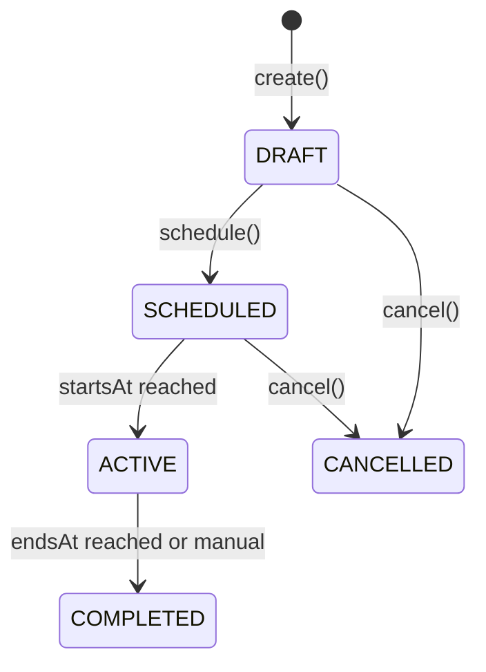
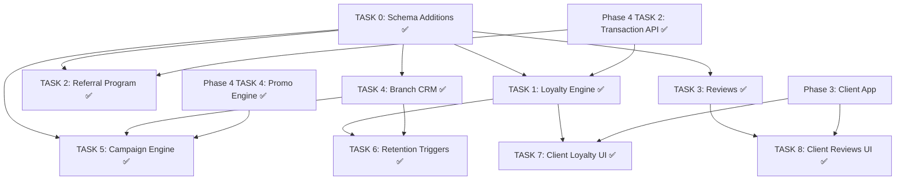

# Phase 5 Sprint: Loyalty & Engagement

> **Last updated:** Feb 26, 2026 — Phase 5 fully complete (Tasks 0-8 + Pre-Req A/B)
> **Depends on:** Phase 3 (customer app) + Phase 4 (POS for point earning)
> **Goal:** Build the customer retention engine — loyalty tiers, referral program, ratings & reviews, branch CRM, and re-engagement campaigns.

### Prerequisites Completed Early

| Item | Originally Planned | Completed In |
|------|--------------------|--------------|
| Barber Portal (self-service) | Phase 5 scope | Tier 2+4 Sprint — BARBER role sees My Schedule, My Commissions, My Attendance in admin app |

## Architecture References

> [!IMPORTANT]
> All code **must** follow the established project patterns:
> - **API:** [hono-setup.md](file:///d:/Fitz/Misc/bs-project/docs/hono-setup.md) — Feature module pattern: `[name].index.ts → [name].handlers.ts → [name].service.ts → [name].schema.ts`. Routes via `createRoute` + `OpenAPIHono`. RBAC via sub-routers with `authMiddleware()` + `requireRole()`.
> - **Frontend:** [react-setup.md](file:///d:/Fitz/Misc/bs-project/docs/react-setup.md) — Feature-Based Architecture with strict layer separation: `api/` (TanStack Query hooks), `components/` (pure UI), `widgets/` (connected), `store/` (Zustand), `types/` (Zod + TS interfaces). Shadcn/ui Maia preset. Tailwind v4 (config-less).
> - **Key Decisions:** [implementation_plan.md](file:///C:/Users/BCI%20ASIA/.gemini/antigravity/brain/db79ce06-02b9-4046-9e84-3a62e3e19a42/implementation_plan.md) — Strict OpenAPI via `@hono/zod-openapi`, `pnpm` only, Zod-validated env, Node.js + Docker deployment, IDR currency, WIB timezone (UTC+7 stored as UTC).
> - **Business Logic:** [business_logic.md](file:///d:/Fitz/Misc/bs-project/docs/business_logic.md) — Loyalty tiers, point accumulation, redemption rules, referral flows.

## Existing Infrastructure

These Prisma models **already exist** in `schema.prisma` and do NOT need to be created:

| Model | Status | Notes |
|-------|--------|-------|
| `LoyaltyAccount` | ✅ Exists | `userId` (unique), `pointsBalance`, `lifetimePoints`, `tier`, `lastActivityAt` |
| `LoyaltyTransaction` | ✅ Exists | `points` (+/-), `description`, `transactionId` link |
| `LoyaltyTier` enum | ✅ Exists | `BRONZE`, `SILVER`, `GOLD`, `PLATINUM` |
| `Review` | ✅ Exists | `customerId`, `barberProfileId`, `branchId`, `rating`, `comment`, `photoUrls`, `isVisible` |
| `PromoCode` | ✅ Exists | Full CRUD built in Phase 4 Task 4 |
| `AuditAction` enum | ✅ Exists | Needs new values for Phase 5 actions |

---

## TASK 0 — Prisma Schema Additions ✅

**Summary:** Add models and enum values required by Phase 5 that don't exist yet.

### 0A — New Models

```prisma
// Add to AuditAction enum:
enum AuditAction {
  // ... existing values ...
  REDEEM_POINTS
  EARN_POINTS
  TIER_UPGRADE
  REFERRAL_REWARD
  MODERATE_REVIEW
  CREATE_CAMPAIGN
}

// Referral tracking
model Referral {
  id            String   @id @default(cuid())
  referrerId    String   // User who referred
  refereeId     String   // User who was referred
  bonusPoints   Int      // Points awarded to referrer
  status        ReferralStatus @default(PENDING)
  completedAt   DateTime?       // When referee completes first transaction
  createdAt     DateTime @default(now())

  referrer User @relation("referrals_given", fields: [referrerId], references: [id])
  referee  User @relation("referrals_received", fields: [refereeId], references: [id])

  @@unique([referrerId, refereeId])  // Can't refer same person twice
  @@map("referrals")
}

enum ReferralStatus {
  PENDING       // Referee signed up but hasn't transacted
  COMPLETED     // Referee completed first transaction — referrer rewarded
  EXPIRED       // Referral expired (configurable window)
}

// Customer segmentation for CRM
model CustomerSegment {
  id          String   @id @default(cuid())
  branchId    String?  // null = global segment
  name        String   // "VIP", "At-Risk", "New", "Lapsed"
  rules       Json     // { "minVisits": 10, "lastVisitWithin": "30d" }
  isAutomatic Boolean  @default(true)  // Auto-computed vs manual
  createdAt   DateTime @default(now())
  updatedAt   DateTime @updatedAt

  branch  Branch? @relation(fields: [branchId], references: [id])
  members CustomerSegmentMember[]

  @@map("customer_segments")
}

model CustomerSegmentMember {
  id         String   @id @default(cuid())
  segmentId  String
  customerId String
  addedAt    DateTime @default(now())

  segment  CustomerSegment @relation(fields: [segmentId], references: [id], onDelete: Cascade)
  customer User            @relation(fields: [customerId], references: [id], onDelete: Cascade)

  @@unique([segmentId, customerId])
  @@map("customer_segment_members")
}

// Campaign tracking
model Campaign {
  id          String         @id @default(cuid())
  branchId    String?        // null = global campaign
  name        String
  description String?
  type        CampaignType
  promoCodeId String?        // optional linked PromoCode
  segmentId   String?        // target segment
  status      CampaignStatus @default(DRAFT)
  startsAt    DateTime
  endsAt      DateTime?
  sentCount   Int            @default(0)
  openCount   Int            @default(0)
  createdAt   DateTime       @default(now())
  updatedAt   DateTime       @updatedAt

  branch    Branch?          @relation(fields: [branchId], references: [id])
  promoCode PromoCode?       @relation(fields: [promoCodeId], references: [id])

  @@map("campaigns")
}

enum CampaignType {
  EMAIL
  PUSH
  IN_APP
}

enum CampaignStatus {
  DRAFT
  SCHEDULED
  ACTIVE
  COMPLETED
  CANCELLED
}
```

### 0B — User Model Additions

```prisma
// Add to User model:
model User {
  // ... existing fields ...
  referralCode      String?  @unique  // Auto-generated on account creation
  referredById      String?            // Who referred this user

  // ... existing relations ...
  referralsGiven    Referral[] @relation("referrals_given")
  referralsReceived Referral[] @relation("referrals_received")
  segmentMemberships CustomerSegmentMember[]
}
```

### 0C — LoyaltyAccount Additions

```prisma
model LoyaltyAccount {
  // ... existing fields ...
  pointsExpiringAt  DateTime?  // Next expiry date
  tierMultiplier    Float @default(1.0)  // 1.0, 1.25, 1.5, 2.0 based on tier
}
```

**Definition of Done:**
- [x] All new models added to `schema.prisma`
- [x] New `AuditAction` enum values added
- [x] `User` model has `referralCode` and `referredById` fields
- [x] `LoyaltyAccount` has `pointsExpiringAt` and `tierMultiplier`
- [x] Migration runs cleanly: `prisma db push` applied
- [x] `npx prisma generate` succeeds
- [x] `pnpm --filter @tmng/saas-api typecheck` passes with 0 errors

---

## TASK 1 — Loyalty Points Engine (`features/loyalty/`) ✅

**Summary:** Full loyalty point earn/redeem/expiry system with tier progression. Replaces the basic point logic stubbed in Phase 4's `TransactionService`.

### File Manifest

| File | Purpose |
|------|---------|
| `loyalty.schema.ts` | Zod schemas: account, transactions, redeem, tier rules |
| `loyalty.service.ts` | Business logic — earn, redeem, tier upgrade, expiry |
| `loyalty.handlers.ts` | OpenAPI routes + handlers |
| `loyalty.index.ts` | RBAC sub-routers |

### Zod Schemas

```typescript
// loyalty.schema.ts
export const loyaltyAccountSchema = z.object({
  id: z.string().cuid(),
  userId: z.string(),
  pointsBalance: z.number().int(),
  lifetimePoints: z.number().int(),
  tier: z.nativeEnum(LoyaltyTier),
  tierMultiplier: z.number(),
  pointsExpiringAt: z.string().datetime().nullable(),
  lastActivityAt: z.string().datetime().nullable(),
  createdAt: z.string().datetime(),
}).openapi('LoyaltyAccount');

export const loyaltyTransactionSchema = z.object({
  id: z.string().cuid(),
  loyaltyAccountId: z.string(),
  points: z.number().int(),
  description: z.string(),
  transactionId: z.string().nullable(),
  createdAt: z.string().datetime(),
}).openapi('LoyaltyTransaction');

export const redeemPointsSchema = z.object({
  points: z.number().int().min(1),
  transactionId: z.string(),  // POS transaction to apply discount to
});

export const loyaltyHistoryQuery = z.object({
  page: z.coerce.number().int().min(1).default(1),
  limit: z.coerce.number().int().min(1).max(100).default(20),
});
```

### Earn Logic (replaces Phase 4 inline code)

```
function earnPoints(db, customerId, posTransactionId, netAmount):
  account = db.loyaltyAccount.upsert({ userId: customerId, ... })

  // Base rate: 1 point per 10,000 IDR
  earnRate = 10000
  basePoints = FLOOR(netAmount / earnRate)

  // Apply tier multiplier
  pointsEarned = FLOOR(basePoints * account.tierMultiplier)
  // e.g., Gold (1.5×): 150,000 IDR → 15 base → 22 actual points

  if pointsEarned > 0:
    // Update balances
    account.pointsBalance += pointsEarned
    account.lifetimePoints += pointsEarned
    account.lastActivityAt = NOW()

    // Reset expiry clock (6 months from now)
    account.pointsExpiringAt = NOW() + 6 months

    // Log the earn transaction
    db.loyaltyTransaction.create({
      loyaltyAccountId: account.id,
      points: +pointsEarned,
      description: `Earned from transaction ${posTransactionId}`,
      transactionId: posTransactionId,
    })

    // Check for tier upgrade
    checkAndUpgradeTier(db, account)

    // AuditLog
    db.auditLog.create({ action: 'EARN_POINTS', ... })

  return { pointsEarned, newBalance: account.pointsBalance, tier: account.tier }
```

### Tier Progression Logic

```
function checkAndUpgradeTier(db, account):
  thresholds = {
    BRONZE:   0,
    SILVER:   200,
    GOLD:     500,
    PLATINUM: 1000,
  }

  multipliers = {
    BRONZE:   1.0,
    SILVER:   1.25,
    GOLD:     1.5,
    PLATINUM: 2.0,
  }

  // Tier is based on lifetimePoints (never downgrades)
  newTier = BRONZE
  for tier in [PLATINUM, GOLD, SILVER, BRONZE]:
    if account.lifetimePoints >= thresholds[tier]:
      newTier = tier
      break

  if newTier !== account.tier:
    oldTier = account.tier
    account.tier = newTier
    account.tierMultiplier = multipliers[newTier]

    db.auditLog.create({
      action: 'TIER_UPGRADE',
      details: { from: oldTier, to: newTier, lifetimePoints: account.lifetimePoints }
    })

    // TODO: Send push notification for tier upgrade celebration
```

### Points Expiry Logic

```
// Runs as a scheduled job (node-cron or system cron, or manual endpoint)
function processPointExpiry(db):
  expiredAccounts = db.loyaltyAccount.findMany({
    where: { pointsExpiringAt: { lte: NOW() }, pointsBalance: { gt: 0 } }
  })

  for account in expiredAccounts:
    expiredPoints = account.pointsBalance
    account.pointsBalance = 0
    account.pointsExpiringAt = null

    db.loyaltyTransaction.create({
      points: -expiredPoints,
      description: 'Points expired due to inactivity',
    })
```

### RBAC

| Action | Roles |
|--------|-------|
| `GET /loyalty/me` | CUSTOMER (own account) |
| `GET /loyalty/me/history` | CUSTOMER (own transactions) |
| `GET /loyalty/:userId` | MANAGER, SUPER_ADMIN |
| `POST /loyalty/redeem` | CUSTOMER, CASHIER (on behalf) |
| `POST /loyalty/admin/expire` | SUPER_ADMIN |
| `PATCH /loyalty/admin/adjust` | SUPER_ADMIN (manual point adjustment) |

**Definition of Done:**
- [x] `LoyaltyService.earnPoints()` correctly applies tier multiplier to base earn rate
- [x] Tier upgrades trigger when `lifetimePoints` crosses threshold (never downgrades)
- [x] Tier multipliers: Bronze 1.0×, Silver 1.25×, Gold 1.5×, Platinum 2.0×
- [x] Points expire after 6 months of inactivity (configurable)
- [x] `redeemPoints` validates: balance ≥ requested, max 50% of bill, 1pt = 500 IDR
- [x] Earn, redeem, and expiry all create `LoyaltyTransaction` records
- [x] `AuditLog` created for `EARN_POINTS`, `REDEEM_POINTS`, `TIER_UPGRADE`
- [x] Phase 4 inline earn/redeem code in `TransactionService` refactored to call `LoyaltyService`
- [x] `GET /loyalty/me` returns account with balance, tier, multiplier, expiry date
- [x] `GET /loyalty/me/history` returns paginated transaction history
- [x] All routes registered in `src/index.ts` under `/api/loyalty`
- [ ] `curl` test: earn points → verify balance → redeem → verify deduction → check tier upgrade

---

## TASK 2 — Referral Program (`features/referrals/`) ✅

**Summary:** Referral tracking — generate referral codes, track sign-ups, award bonus points on first purchase.

### File Manifest

| File | Purpose |
|------|---------|
| `referrals.schema.ts` | Zod schemas: referral, apply code |
| `referrals.service.ts` | Create referral link, track, award |
| `referrals.handlers.ts` | OpenAPI routes + handlers |
| `referrals.index.ts` | RBAC sub-routers |

### Technical Logic

```
// Auto-generate referral code on user creation or first request
function getOrCreateReferralCode(db, userId):
  user = db.user.findUnique({ where: { id: userId } })
  if user.referralCode:
    return user.referralCode

  // Generate short unique code: first 3 chars of name + random 4 digits
  code = (user.firstName.slice(0, 3) + randomDigits(4)).toUpperCase()
  db.user.update({ where: { id: userId }, data: { referralCode: code } })
  return code

// When a new user signs up with a referral code
function applyReferralCode(db, newUserId, referralCode):
  referrer = db.user.findUnique({ where: { referralCode } })
  if !referrer: throw 404 "Invalid referral code"
  if referrer.id === newUserId: throw 400 "Cannot refer yourself"

  existing = db.referral.findUnique({ where: { referrerId_refereeId: ... } })
  if existing: throw 409 "Already referred"

  db.referral.create({
    referrerId: referrer.id,
    refereeId: newUserId,
    bonusPoints: 10,  // Configurable: points awarded to referrer
    status: 'PENDING',
  })

  db.user.update({ where: { id: newUserId }, data: { referredById: referrer.id } })

// Triggered when referee completes their FIRST transaction
function completeReferral(db, refereeId):
  referral = db.referral.findFirst({
    where: { refereeId, status: 'PENDING' }
  })
  if !referral: return  // No pending referral

  // Award bonus points to referrer
  LoyaltyService.addBonusPoints(db, referral.referrerId, referral.bonusPoints,
    `Referral bonus: friend completed first visit`)

  referral.status = 'COMPLETED'
  referral.completedAt = NOW()

  db.auditLog.create({ action: 'REFERRAL_REWARD', ... })

// Hook: call completeReferral() from TransactionService.addPayments()
// when transaction is COMPLETED and it's the customer's first transaction
```

### RBAC

| Action | Roles |
|--------|-------|
| `GET /referrals/me/code` | CUSTOMER (get own referral code) |
| `POST /referrals/apply` | CUSTOMER (apply code during registration) |
| `GET /referrals/me/history` | CUSTOMER (see who they referred) |
| `GET /referrals/stats` | MANAGER, SUPER_ADMIN |

**Definition of Done:**
- [x] Every user gets a unique referral code (auto-generated, 7 chars)
- [x] `applyReferralCode` validates: code exists, not self-referral, not duplicate
- [x] Referral `PENDING` → `COMPLETED` triggered on referee's first completed transaction
- [x] Referrer receives bonus points (default: 10 pts) upon completion
- [ ] Referral expires after configurable window (default: 30 days)
- [x] `AuditLog` with `REFERRAL_REWARD` action on completion
- [x] `GET /referrals/me/code` returns or generates the customer's referral code
- [x] `GET /referrals/me/history` shows referred users with status
- [x] Integration: `TransactionService.addPayments()` calls `completeReferral()` for first-time customers
- [ ] `curl` test: register with code → complete transaction → verify referrer received bonus points

---

## TASK 3 — Ratings & Reviews (`features/reviews/`) ✅

**Summary:** Post-appointment review system with moderation. The `Review` model already exists in Prisma.

### File Manifest

| File | Purpose |
|------|---------|
| `reviews.schema.ts` | Zod schemas: create, list, moderate |
| `reviews.service.ts` | CRUD + moderation + aggregate ratings |
| `reviews.handlers.ts` | OpenAPI routes + handlers |
| `reviews.index.ts` | RBAC sub-routers |

### Zod Schemas

```typescript
export const createReviewSchema = z.object({
  barberProfileId: z.string().optional(),
  branchId: z.string(),
  rating: z.number().int().min(1).max(5),
  comment: z.string().max(1000).optional(),
  photoUrls: z.array(z.string().url()).max(3).default([]),
  queueEntryId: z.string().optional(), // Link to the visit
});

export const reviewResponseSchema = z.object({
  id: z.string().cuid(),
  customerId: z.string(),
  customerName: z.string(),
  barberProfileId: z.string().nullable(),
  barberName: z.string().nullable(),
  branchId: z.string().nullable(),
  rating: z.number().int(),
  comment: z.string().nullable(),
  photoUrls: z.array(z.string()),
  isVisible: z.boolean(),
  createdAt: z.string().datetime(),
}).openapi('Review');

export const listReviewsQuery = z.object({
  branchId: z.string().optional(),
  barberProfileId: z.string().optional(),
  minRating: z.coerce.number().int().min(1).max(5).optional(),
  page: z.coerce.number().int().min(1).default(1),
  limit: z.coerce.number().int().min(1).max(50).default(20),
});

export const moderateReviewSchema = z.object({
  isVisible: z.boolean(),
  moderationNote: z.string().optional(),
});
```

### Technical Logic

```
function createReview(db, customerId, data):
  // Validate: customer has a completed visit at this branch
  recentVisit = db.queueEntry.findFirst({
    where: { customerId, branchId: data.branchId, status: 'PAID' },
    orderBy: { completedAt: 'desc' },
  })
  if !recentVisit: throw 403 "You can only review branches you've visited"

  // Duplicate check: one review per queue entry
  if data.queueEntryId:
    existing = db.review.findFirst({ where: { customerId, queueEntryId: data.queueEntryId } })
    if existing: throw 409 "You already reviewed this visit"

  review = db.review.create({ data: { customerId, ...data } })

  // Recalculate aggregate ratings for barber and branch
  if data.barberProfileId:
    updateBarberAverageRating(db, data.barberProfileId)
  updateBranchAverageRating(db, data.branchId)

  return review

function updateBarberAverageRating(db, barberProfileId):
  agg = db.review.aggregate({
    where: { barberProfileId, isVisible: true },
    _avg: { rating: true },
    _count: true,
  })
  db.barberProfile.update({
    where: { id: barberProfileId },
    data: { averageRating: agg._avg.rating, totalReviews: agg._count }
  })

function moderateReview(db, reviewId, moderatorId, data):
  db.review.update({ where: { id: reviewId }, data: { isVisible: data.isVisible } })
  db.auditLog.create({
    action: 'MODERATE_REVIEW',
    details: { reviewId, isVisible: data.isVisible, note: data.moderationNote },
    userId: moderatorId,
  })
```

**Key Design Notes:**
- Customers can only review branches they've actually visited (verified via `QueueEntry` with `PAID` status)
- One review per visit (linked via `queueEntryId`)
- Reviews are visible by default; moderation hides them (`isVisible: false`)
- Aggregate ratings (`averageRating`, `totalReviews`) are denormalized on `BarberProfile` and `Branch` for fast reads

### Schema Dependencies

> [!IMPORTANT]
> The following fields need to be added to existing models:
> - `BarberProfile`: add `averageRating Float @default(0)` and `totalReviews Int @default(0)`
> - `Branch`: add `averageRating Float @default(0)` and `totalReviews Int @default(0)`
> - `Review`: add `queueEntryId String?` relation field

### RBAC

| Action | Roles |
|--------|-------|
| `POST /reviews` | CUSTOMER |
| `GET /reviews` | Public (no auth — for branch/barber profiles) |
| `GET /reviews/:id` | Public |
| `PATCH /reviews/:id/moderate` | MANAGER, SUPER_ADMIN |
| `DELETE /reviews/:id` | SUPER_ADMIN |

**Definition of Done:**
- [x] Customers can only review branches they've visited (verified via `QueueEntry.status === PAID`)
- [x] One review per visit — duplicate returns 409
- [x] Rating is 1–5 stars, comment max 1000 chars, max 3 photo URLs
- [x] `POST /reviews` creates review and recalculates aggregate ratings
- [x] `GET /reviews?branchId=X` returns paginated, publicly visible reviews
- [x] `GET /reviews?barberProfileId=X` returns barber-specific reviews
- [x] `PATCH /reviews/:id/moderate` toggles visibility with audit log
- [x] Aggregate `averageRating` and `totalReviews` denormalized on `BarberProfile` and `Branch`
- [x] `AuditLog` with `MODERATE_REVIEW` for moderation actions
- [x] Photo URLs validated as proper URLs (upload via MinIO is a separate concern)
- [ ] `curl` test: complete a visit → create review → verify aggregate rating → moderate → verify hidden

---

## TASK 4 — Branch CRM (`features/crm/`) ✅

**Summary:** Customer database per branch with segmentation, visit tracking, and spend analytics.

### File Manifest

| File | Purpose |
|------|---------|
| `crm.schema.ts` | Zod schemas: customer profile, segments, filters |
| `crm.service.ts` | Customer insights, segmentation engine |
| `crm.handlers.ts` | OpenAPI routes + handlers |
| `crm.index.ts` | RBAC sub-routers |

### Customer Insights Logic

```
function getCustomerInsights(db, branchId, customerId):
  // Aggregate from transactions linked to this branch
  transactions = db.transaction.findMany({
    where: { branchId, customerId, status: 'COMPLETED' },
    orderBy: { createdAt: 'desc' },
    include: { items: true },
  })

  return {
    totalVisits: transactions.length,
    totalSpend: SUM(tx.netAmount),
    averageSpend: AVG(tx.netAmount),
    lastVisitAt: transactions[0]?.createdAt ?? null,
    daysSinceLastVisit: DIFF_DAYS(NOW(), transactions[0]?.createdAt),
    favoriteServices: topServices(transactions),  // Most booked service names
    loyaltyTier: customer.loyaltyAccount?.tier ?? 'BRONZE',
  }

function listBranchCustomers(db, branchId, filters):
  // Returns customers who have transacted at this branch
  // Filters: segment, min visits, last visit range, sort by spend/frequency
  // Pagination included
```

### Segmentation Engine

```
// Auto-segmentation rules (computed periodically or on-demand)
segments = {
  VIP:      { minVisits: 10, lastVisitWithin: "60d", minSpend: 2000000 },
  REGULAR:  { minVisits: 3,  lastVisitWithin: "60d" },
  NEW:      { maxVisits: 2,  createdWithin: "30d" },
  AT_RISK:  { minVisits: 3,  lastVisitBeyond: "60d", lastVisitWithin: "120d" },
  LAPSED:   { minVisits: 1,  lastVisitBeyond: "120d" },
}

function recomputeSegments(db, branchId):
  customers = getAllBranchCustomers(db, branchId)
  for customer in customers:
    insights = getCustomerInsights(db, branchId, customer.id)
    matchedSegment = evaluateSegmentRules(insights, segments)
    upsertSegmentMembership(db, customer.id, matchedSegment)
```

### RBAC

| Action | Roles |
|--------|-------|
| `GET /crm/customers` | MANAGER, SUPER_ADMIN |
| `GET /crm/customers/:id` | MANAGER, SUPER_ADMIN |
| `GET /crm/segments` | MANAGER, SUPER_ADMIN |
| `POST /crm/segments/recompute` | MANAGER, SUPER_ADMIN |

**Definition of Done:**
- [x] `GET /crm/customers?branchId=X` returns paginated customer list with insights
- [x] Customer insights include: total visits, total spend, avg spend, last visit, favorite services
- [x] `daysSinceLastVisit` computed correctly in WIB timezone
- [x] Auto-segmentation: VIP, Regular, New, At-Risk, Lapsed
- [x] `POST /crm/segments/recompute` recomputes all segments for a branch
- [x] Segment membership stored in `CustomerSegmentMember` table
- [x] Filters: by segment, min visits, date range, sort by spend/recency
- [ ] `curl` test: create transactions for a customer → verify insights → recompute segments → verify membership

---

## TASK 5 — Campaign Engine (`features/campaigns/`) ✅

**Summary:** Create and manage retention campaigns linked to promo codes and customer segments.

### File Manifest

| File | Purpose |
|------|---------|
| `campaigns.schema.ts` | Zod schemas: campaign CRUD, send |
| `campaigns.service.ts` | Campaign lifecycle, sending integration |
| `campaigns.handlers.ts` | OpenAPI routes + handlers |
| `campaigns.index.ts` | RBAC sub-routers |

### Campaign Lifecycle



### Technical Logic

```
function createCampaign(db, data):
  // Validate linked promoCode exists and is active
  if data.promoCodeId:
    promo = db.promoCode.findUnique({ where: { id: data.promoCodeId } })
    if !promo || !promo.isActive: throw 400 "Invalid or inactive promo code"

  // Validate target segment exists
  if data.segmentId:
    segment = db.customerSegment.findUnique({ where: { id: data.segmentId } })
    if !segment: throw 404 "Segment not found"

  campaign = db.campaign.create({ data })
  db.auditLog.create({ action: 'CREATE_CAMPAIGN', ... })
  return campaign

function sendCampaign(db, campaignId, notificationService):
  campaign = db.campaign.findUnique({ include: { segment: { include: { members: true } } } })

  recipients = campaign.segment
    ? campaign.segment.members.map(m => m.customerId)
    : getAllCustomers(db, campaign.branchId)

  for userId in recipients:
    switch campaign.type:
      case 'PUSH':  notificationService.sendPush(userId, campaign.name, campaign.description)
      case 'EMAIL': notificationService.sendEmail(userId, campaign.name, campaign.description)
      case 'IN_APP': // Store as in-app notification (future)

  campaign.sentCount = recipients.length
  campaign.status = 'ACTIVE'
```

### RBAC

| Action | Roles |
|--------|-------|
| `GET /campaigns` | MANAGER, SUPER_ADMIN |
| `POST /campaigns` | MANAGER, SUPER_ADMIN |
| `PATCH /campaigns/:id` | MANAGER, SUPER_ADMIN |
| `POST /campaigns/:id/send` | MANAGER, SUPER_ADMIN |
| `DELETE /campaigns/:id` | SUPER_ADMIN |

**Definition of Done:**
- [x] Campaign CRUD with status lifecycle (DRAFT → SCHEDULED → ACTIVE → COMPLETED)
- [x] Campaign can be linked to a `PromoCode` and/or a `CustomerSegment`
- [x] `POST /campaigns/:id/send` delivers to segment members via notification service
- [x] `sentCount` tracked per campaign
- [x] Only DRAFT and SCHEDULED campaigns can be edited or cancelled
- [x] `AuditLog` with `CREATE_CAMPAIGN` for campaign creation
- [ ] `curl` test: create segment → create campaign → send → verify sentCount

---

## TASK 6 — Retention Triggers (Re-engagement) ✅

**Summary:** Automated "nudge" notifications for at-risk and lapsed customers.

### Technical Logic

```
// Scheduled job (node-cron — runs daily at 10:00 WIB)
function processRetentionTriggers(db, notificationService):
  // 1. "It's been a while" nudge — customers with no visit in 30-60 days
  atRiskCustomers = db query:
    SELECT users WHERE last_transaction > 30 days ago AND last_transaction < 60 days ago
    AND NOT already_nudged_this_period

  for customer in atRiskCustomers:
    notificationService.sendPush(customer.id,
      "We miss you! 💈",
      "It's been a while since your last visit. Book now and get a special offer!")

  // 2. Birthday bonus (if birthday field exists — deferred, stretch goal)

  // 3. Points expiry warning — 7 days before points expire
  expiringAccounts = db.loyaltyAccount.findMany({
    where: { pointsExpiringAt: { gte: NOW(), lte: NOW() + 7 days }, pointsBalance: { gt: 0 } }
  })

  for account in expiringAccounts:
    notificationService.sendPush(account.userId,
      "Your points are expiring! ⏰",
      `You have ${account.pointsBalance} points expiring soon. Use them before they're gone!`)
```

**Key Design Notes:**
- Runs as a scheduled job via `node-cron` (`cron.schedule("0 3 * * *", ...)` — 3:00 UTC = 10:00 WIB)
- Uses a simple "already nudged" check to prevent spam (e.g., flag column or check notification log)
- Notification service is pluggable — V1 uses OneSignal for push + email

### RBAC

| Action | Roles |
|--------|-------|
| `POST /retention/trigger` (manual run) | MANAGER, SUPER_ADMIN |
| `GET /retention/stats` | MANAGER, SUPER_ADMIN |

**Definition of Done:**
- [x] Cron schedule configured in `node-cron` (daily 03:05 UTC = 10:05 WIB)
- [x] At-risk nudge fires for customers with 30-60 day inactivity
- [x] Points expiry warning fires 7 days before expiry
- [x] Anti-spam: each customer receives max 1 nudge per 14-day period
- [x] Nudge history logged for audit/stats
- [x] `POST /retention/trigger` allows manual trigger for testing
- [x] `GET /retention/stats` returns counts: nudges sent, open rate, conversion rate

---

## TASK 7 — Client App: Loyalty UI ✅

**Summary:** Customer-facing loyalty features in `apps/client/`.

### Feature Structure (per react-setup.md)

```text
apps/client/src/features/loyalty/
├── api/
│   ├── use-loyalty-account.ts     # useQuery → GET /loyalty/me
│   ├── use-loyalty-history.ts     # useQuery → GET /loyalty/me/history
│   ├── use-referral-code.ts       # useQuery → GET /referrals/me/code
│   └── use-referral-history.ts    # useQuery → GET /referrals/me/history
├── components/
│   ├── loyalty-card.tsx           # Tier badge + balance display
│   ├── points-history-list.tsx    # Transaction history
│   ├── tier-progress-bar.tsx      # Progress to next tier
│   └── referral-share-card.tsx    # Referral code + share buttons
├── widgets/
│   └── loyalty-dashboard.tsx      # Connected component assembling all above
├── types/
│   └── index.ts
└── index.ts
```

**Definition of Done:**
- [x] Loyalty card shows: current tier (with color/icon), points balance, multiplier
- [x] Tier progress bar shows points needed for next tier
- [x] Points history displays earn/redeem transactions with dates
- [x] Referral share card shows personal code with copy + WhatsApp/share buttons
- [x] Loading skeletons and error states for all queries
- [x] Mobile-first responsive design matching app design system

---

## TASK 8 — Client App: Reviews UI ✅

**Summary:** Post-appointment review flow + public review feed.

### Feature Structure

```text
apps/client/src/features/reviews/
├── api/
│   ├── use-create-review.ts       # useMutation → POST /reviews
│   ├── use-reviews.ts             # useQuery → GET /reviews
│   └── use-upload-photo.ts        # useMutation → POST /media/upload
├── components/
│   ├── star-rating-input.tsx      # Interactive 1-5 star selector
│   ├── review-card.tsx            # Single review display
│   ├── review-form.tsx            # Form with star rating + comment + photo upload
│   └── review-summary.tsx         # Average rating + distribution bar
├── widgets/
│   ├── post-review-dialog.tsx     # Post-appointment review modal
│   └── review-feed.tsx            # Paginated review list for branch/barber
├── types/
│   └── index.ts
└── index.ts
```

**Definition of Done:**
- [x] Post-appointment review prompt appears after transaction is PAID (receipt page + history page)
- [x] Star rating input (1-5) with hover/tap interaction
- [x] Comment field with character counter (max 1000)
- [x] Photo upload supports up to 3 images (via MinIO S3-compatible storage)
- [x] Review feed shows reviews with customer name, rating, comment, photos, date
- [x] Review summary shows average rating + star distribution (5★: 40%, 4★: 30%, etc.)
- [x] Form validated with `react-hook-form` + `@hookform/resolvers/zod`
- [x] ReviewFeed integrated into barber selection page (expandable per barber)
- [x] Branch average rating and review count shown on branch cards

---

## Not in Scope (Deferred)

| Item | Deferred To |
|------|-------------|
| WhatsApp notification delivery | Post-Phase 5 (pluggable provider ready) |
| Birthday bonus automation | Future enhancement |
| Review photo moderation (AI) | Future enhancement |
| Campaign A/B testing | Future enhancement |
| Points gifting between customers | Future enhancement |

---

## Dependency Analysis

### Task Execution Order & Dependencies



### Cross-Phase Dependencies

| This Phase Needs | From Phase | Status |
|-----------------|-----------|--------|
| `TransactionService.addPayments()` hook for earn/referral | Phase 4 Task 2 | ✅ Done |
| `PromoCode` model + validation | Phase 4 Task 4 | ✅ Done |
| Client app shell + routing | Phase 3 | ✅ Done |
| Notification service (OneSignal) | Phase 3 (1.6) | ✅ Done — `utils/notifications.ts` with graceful degradation |
| Cloudflare R2 for photo uploads | Cross-cutting (5.4) | ✅ Replaced with MinIO on VPS — see [minio_server_setup.md](file:///d:/Fitz/Misc/bs-project/docs/minio_server_setup.md) |

### Recommended Execution Order

| Priority | Task | Reason |
|----------|------|--------|
| **1** | **TASK 0: Schema** | Blocks everything |
| **2** | **TASK 1: Loyalty Engine** | Core backend, blocks Tasks 6 & 7 |
| **3** | **TASK 3: Reviews** | Independent after schema |
| **4** | **TASK 2: Referral** | Independent after schema |
| **5** | **TASK 4: CRM** | Blocks Tasks 5 & 6 |
| **6** | **TASK 5: Campaigns** | Needs CRM + PromoCode |
| **7** | **TASK 6: Retention** | Needs Loyalty + CRM |
| **8** | **TASK 7: Client Loyalty UI** | Needs Phase 3 + Task 1 |
| **9** | **TASK 8: Client Reviews UI** | Needs Phase 3 + Task 3 |
