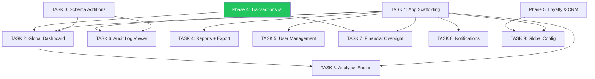

# Phase 6 Sprint: Super Admin & Analytics

> **Depends on:** All previous phases (aggregates data from everything)
> **Goal:** Build the HQ-level oversight layer — multi-branch monitoring, analytics, user management, audit logs, financial reporting, and the Super Admin Dashboard app.

## Architecture References

> [!IMPORTANT]
> All code **must** follow the established project patterns:
> - **API:** [hono-setup.md](file:///d:/Fitz/Misc/bs-project/docs/hono-setup.md) — Feature module pattern: `[name].index.ts → [name].handlers.ts → [name].service.ts → [name].schema.ts`. Routes via `createRoute` + `OpenAPIHono`. RBAC via sub-routers with `authMiddleware()` + `requireRole()`.
> - **Frontend:** [react-setup.md](file:///d:/Fitz/Misc/bs-project/docs/react-setup.md) — Feature-Based Architecture with strict layer separation. Shadcn/ui Maia preset. Tailwind v4.
> - **Key Decisions:** [implementation_plan.md](file:///C:/Users/BCI%20ASIA/.gemini/antigravity/brain/db79ce06-02b9-4046-9e84-3a62e3e19a42/implementation_plan.md) — Strict OpenAPI, `pnpm`, IDR currency, WIB timezone.
> - **Business Logic:** [business_logic.md](file:///d:/Fitz/Misc/bs-project/docs/business_logic.md) — Audit trail rules, anomaly detection flags.

## Existing Infrastructure

These models and endpoints **already exist** and will be consumed by Phase 6:

| Resource | Source Phase | Notes |
|----------|-------------|-------|
| `AuditLog` model + enum | P1 | Append-only, indexed on `branchId`, `userId`, `action`, `createdAt` |
| `Transaction` + daily summary | P4 Task 2 | `getDailySummary()` returns revenue/tips/payment breakdown per branch |
| `BarberEarning` | P4 Task 8 | Per-barber daily commission records |
| `PayrollPeriod` | P4 Task 9 | Payroll approval status tracking |
| `BranchInventory` | P4 Task 10 | Stock levels, valuations |
| `User` model with roles | P1 | Role enum: CUSTOMER, BARBER, CASHIER, SUPERVISOR, MANAGER, SUPER_ADMIN |
| `Branch` model | P2 | Full branch data with operating hours |
| `LoyaltyAccount` | P5 Task 1 | Customer points and tier data |
| `Review` | P5 Task 3 | Customer ratings and review moderation |
| Admin Dashboard (`apps/admin/`) | P4 Task 11 | Branch-level admin app (login, POS, transactions) |

---

## TASK 0 — Prisma Schema Additions

**Summary:** Add models for analytics snapshots and reporting configuration.

### New Models

```prisma
// Add to AuditAction enum:
enum AuditAction {
  // ... existing values ...
  ASSIGN_ROLE
  REMOVE_ROLE
  DEACTIVATE_USER
  BRANCH_ASSIGNMENT
  ANOMALY_FLAGGED
}

// Daily branch analytics snapshot (pre-computed for fast dashboard reads)
model BranchDailySnapshot {
  id              String   @id @default(cuid())
  branchId        String
  date            DateTime @db.Date
  totalRevenue    Float    @default(0)
  serviceRevenue  Float    @default(0)
  productRevenue  Float    @default(0)
  totalTips       Float    @default(0)
  transactionCount Int     @default(0)
  customerCount   Int      @default(0)  // Unique customers
  walkInCount     Int      @default(0)
  onlineCount     Int      @default(0)
  avgTransValue   Float    @default(0)
  topServiceId    String?
  createdAt       DateTime @default(now())

  branch Branch @relation(fields: [branchId], references: [id])

  @@unique([branchId, date])
  @@index([date])
  @@map("branch_daily_snapshots")
}

// Anomaly detection flags
model AnomalyFlag {
  id         String        @id @default(cuid())
  branchId   String
  userId     String?
  type       AnomalyType
  severity   AnomSeverity  @default(MEDIUM)
  details    Json
  isResolved Boolean       @default(false)
  resolvedBy String?
  resolvedAt DateTime?
  createdAt  DateTime      @default(now())

  branch Branch @relation(fields: [branchId], references: [id])
  user   User?  @relation("anomaly_flags", fields: [userId], references: [id])

  @@index([branchId, createdAt])
  @@map("anomaly_flags")
}

enum AnomalyType {
  EXCESSIVE_VOIDS        // >3 voids in 1 hour by same user
  HIGH_DISCOUNT          // Discount >50% without Manager role
  OFF_HOURS_CLOCKIN      // Clock-in outside operating hours
  UNUSUAL_REFUND         // Multiple refunds in short period
  INVENTORY_DISCREPANCY  // Stock count mismatch
}

enum AnomSeverity {
  LOW
  MEDIUM
  HIGH
  CRITICAL
}
```

**Definition of Done:**
- [x] `BranchDailySnapshot` model added with `@@unique([branchId, date])`
- [x] `AnomalyFlag` model added with type + severity enums
- [x] New `AuditAction` values added for role and user management
- [x] Migration runs cleanly
- [x] `npx prisma generate` succeeds

---

## TASK 1 — Super Admin Integration into Admin Dashboard

**Summary:** Extend the existing `apps/admin/` with Super Admin pages and RBAC-gated navigation. No separate app needed.

> [!NOTE]
> **Confirmed decision:** Super Admin features are integrated into the existing Admin Dashboard (`apps/admin/`), not a separate app. SUPER_ADMIN role sees additional sidebar items. BARBER role also gets gated routes (clock-in, my schedule, my earnings) in the same app.

### Changes to Existing Admin App

```text
apps/admin/src/
├── features/
│   ├── ... (existing P4 features)
│   ├── analytics/           # Super Admin: branch comparison, heatmaps [TASK 3]
│   ├── reports/             # Super Admin: CSV/PDF export [TASK 4]
│   ├── users/               # Super Admin: user & role management [TASK 5]
│   ├── audit/               # Super Admin: audit log viewer [TASK 6]
│   ├── finance/             # Super Admin: P&L, void audit [TASK 7]
│   ├── notifications/       # Super Admin: notification mgmt [TASK 8]
│   ├── config/              # Super Admin: global settings [TASK 9]
│   └── barber-portal/       # Barber: clock-in, schedule, earnings
└── components/layout/
    └── sidebar.tsx          # Updated: role-conditional menu items
```

### Route Map (Extended)

| Route | Page | Guard |
|-------|------|-------|
| `/analytics` | AnalyticsPage | SUPER_ADMIN |
| `/reports` | ReportsPage | SUPER_ADMIN, MANAGER |
| `/users` | UserManagementPage | SUPER_ADMIN |
| `/audit` | AuditLogPage | SUPER_ADMIN, MANAGER (own branch) |
| `/finance` | FinancePage | SUPER_ADMIN |
| `/config` | GlobalConfigPage | SUPER_ADMIN |
| `/my-schedule` | BarberSchedulePage | BARBER |
| `/my-earnings` | BarberEarningsPage | BARBER |
| `/clock-in` | ClockInPage | BARBER |

**Definition of Done:**
- [x] Sidebar shows role-conditional menu items (BARBER sees only barber routes, SUPER_ADMIN sees all)
- [x] SUPER_ADMIN routes added with page shells
- [x] BARBER routes added: my-schedule, my-earnings, clock-in
- [x] `recharts` dependency installed for analytics charts
- [x] `pnpm --filter @tmng/barber-admin build` still succeeds

---

## TASK 2 — Global Dashboard API + UI

**Summary:** Real-time multi-branch overview: live status, aggregate revenue, alerts.

### API Endpoints (`features/analytics/`)

```typescript
// analytics.schema.ts
export const globalDashboardQuery = z.object({
  date: z.string().optional(), // defaults to today
});

export const globalDashboardResponse = z.object({
  date: z.string(),
  branches: z.array(z.object({
    branchId: z.string(),
    branchName: z.string(),
    isOpen: z.boolean(),
    revenue: z.number(),
    transactionCount: z.number(),
    activeBarbers: z.number(),
    queueLength: z.number(),
    avgRating: z.number(),
  })),
  totals: z.object({
    totalRevenue: z.number(),
    totalTransactions: z.number(),
    totalActiveBarbers: z.number(),
    totalQueueEntries: z.number(),
  }),
  alerts: z.array(z.object({
    type: z.string(),
    branchId: z.string(),
    branchName: z.string(),
    message: z.string(),
    severity: z.enum(['LOW', 'MEDIUM', 'HIGH', 'CRITICAL']),
    createdAt: z.string().datetime(),
  })),
}).openapi('GlobalDashboard');
```

### Service Logic

```
function getGlobalDashboard(db, date):
  branches = db.branch.findMany({ where: { isActive: true } })

  results = []
  for branch in branches:
    // Get today's snapshot (or compute live)
    snapshot = db.branchDailySnapshot.findUnique({
      where: { branchId_date: { branchId: branch.id, date } }
    }) ?? computeLiveSnapshot(db, branch.id, date)

    // Live data: active barbers & queue
    activeBarbers = db.barberAttendance.count({
      where: { branchId: branch.id, date, clockOutAt: null }
    })
    queueLength = db.queueEntry.count({
      where: { branchId: branch.id, status: { in: ['WAITING', 'CALLED', 'IN_CHAIR'] } }
    })

    results.push({ ...snapshot, activeBarbers, queueLength, avgRating: branch.averageRating })

  // Alerts: low stock, anomalies, attendance issues
  alerts = await getActiveAlerts(db)

  return { date, branches: results, totals: aggregate(results), alerts }

// Pre-compute snapshots nightly via cron
function computeDailySnapshots(db, date):
  branches = db.branch.findMany({ where: { isActive: true } })
  for branch in branches:
    summary = TransactionService.getDailySummary(db, branch.id, date)
    // Count unique customers, walk-in vs online
    db.branchDailySnapshot.upsert({ branchId: branch.id, date, ...summary })
```

### RBAC

| Action | Roles |
|--------|-------|
| `GET /analytics/dashboard` | SUPER_ADMIN |
| `POST /analytics/snapshots/compute` | SUPER_ADMIN (manual trigger) |

### UI Components

```text
features/dashboard/
├── api/
│   └── use-global-dashboard.ts    # useQuery → GET /analytics/dashboard
├── components/
│   ├── branch-status-card.tsx     # Revenue + status per branch
│   ├── totals-row.tsx             # Aggregate stat cards
│   ├── alert-feed.tsx             # Active alerts list
│   └── revenue-ticker.tsx         # Live-updating total revenue
├── widgets/
│   └── global-overview.tsx        # Assembles all cards
└── types/
    └── index.ts
```

**Definition of Done:**
- [x] `GET /analytics/dashboard` returns all branches with revenue, queue, barber count
- [x] Aggregate totals computed correctly across all active branches
- [x] Alerts include: low stock, unresolved anomalies, attendance gaps
- [x] `BranchDailySnapshot` populated via nightly cron job
- [x] Dashboard UI shows branch status cards in a grid layout
- [x] Revenue ticker updates every 60 seconds (polling via TanStack Query `refetchInterval`)
- [x] Alert feed sorted by severity (CRITICAL first) with branch name
- [x] `curl` test: create transactions across 2+ branches → verify dashboard aggregates

---

## TASK 3 — Analytics Engine API + UI

**Summary:** Branch comparison, peak hour heatmap, retention analysis, service trends, revenue forecasting.

### Endpoints

```typescript
// analytics.schema.ts — additional schemas
export const branchComparisonQuery = z.object({
  branchIds: z.array(z.string()).min(2).max(10),
  dateFrom: z.string(),
  dateTo: z.string(),
  metric: z.enum(['revenue', 'transactions', 'avgTicket', 'customerCount', 'rating']),
});

export const peakHourQuery = z.object({
  branchId: z.string().optional(),  // null = all branches
  dateFrom: z.string(),
  dateTo: z.string(),
});

export const retentionQuery = z.object({
  branchId: z.string().optional(),
  cohortMonth: z.string(),  // "2026-01" format
});

export const forecastQuery = z.object({
  branchId: z.string(),
  periods: z.coerce.number().int().min(1).max(12).default(3),  // months to forecast
});
```

### Service Logic

```
function getBranchComparison(db, query):
  // For each branch, aggregate snapshots in date range
  results = []
  for branchId in query.branchIds:
    snapshots = db.branchDailySnapshot.findMany({
      where: { branchId, date: { gte: dateFrom, lte: dateTo } }
    })
    results.push({
      branchId,
      branchName: ...,
      dataPoints: snapshots.map(s => ({ date: s.date, value: s[query.metric] })),
      total: SUM(snapshots, query.metric),
      average: AVG(snapshots, query.metric),
    })
  return results  // Frontend renders as multi-line chart

function getPeakHourHeatmap(db, query):
  // Group transactions by dayOfWeek + hour
  // Returns 7×24 matrix of transaction counts
  transactions = db.transaction.findMany({
    where: { branchId: query.branchId, status: 'COMPLETED', createdAt: range }
  })

  heatmap = new Array(7).fill(null).map(() => new Array(24).fill(0))
  for tx in transactions:
    day = tx.createdAt.getDay()  // 0=Sun, 6=Sat
    hour = tx.createdAt.getHours()  // Convert from UTC to WIB (+7)
    heatmap[day][hour]++

  return { heatmap, peakDay, peakHour }

function getRetentionCohort(db, query):
  // Month-over-month retention: of customers who first visited in cohortMonth,
  // what % returned in month+1, month+2, etc.
  cohortCustomers = db.transaction.findMany({
    where: { branchId, status: 'COMPLETED', createdAt: cohortMonth range },
    distinct: ['customerId'],
  })

  returnRates = []
  for monthOffset in [1..6]:
    returned = count customers from cohort who also transacted in cohortMonth + monthOffset
    returnRates.push({ month: monthOffset, rate: returned / cohortCustomers.length })

  return { cohortSize: cohortCustomers.length, returnRates }

function getRevenueForecast(db, query):
  // Simple linear regression on monthly revenue data
  last12Months = db.branchDailySnapshot.findMany({
    where: { branchId: query.branchId, date: { gte: 12 months ago } },
    groupBy: month, SUM revenue
  })
  // Fit line: y = mx + b, then Project forward `periods` months
  // Return: historical + forecast data points with confidence interval
```

### RBAC

| Action | Roles |
|--------|-------|
| `GET /analytics/comparison` | SUPER_ADMIN |
| `GET /analytics/heatmap` | MANAGER (own branch), SUPER_ADMIN (any) |
| `GET /analytics/retention` | SUPER_ADMIN |
| `GET /analytics/forecast` | SUPER_ADMIN |
| `GET /analytics/service-trends` | MANAGER (own branch), SUPER_ADMIN |

### UI Components

```text
features/analytics/
├── api/
│   ├── use-branch-comparison.ts
│   ├── use-peak-heatmap.ts
│   ├── use-retention.ts
│   └── use-forecast.ts
├── components/
│   ├── comparison-chart.tsx       # Multi-line chart with branch selector
│   ├── heatmap-grid.tsx           # 7×24 color grid
│   ├── retention-table.tsx        # Cohort retention table
│   ├── forecast-chart.tsx         # Historical + projected line chart
│   └── metric-selector.tsx        # Revenue / Transactions / Rating toggle
├── widgets/
│   └── analytics-dashboard.tsx    # Tab-based analytics views
└── types/
    └── index.ts
```

**Definition of Done:**
- [x] Branch comparison returns time-series data for selected metrics
- [x] Heatmap correctly maps transactions to WIB timezone (UTC+7 conversion)
- [x] Retention cohort analysis shows month-over-month return rates
- [x] Revenue forecast uses linear regression on 12-month historical data
- [x] Comparison chart renders multi-line for 2-10 branches
- [x] Heatmap shows 7-day × 24-hour grid with color intensity
- [x] All analytics queries accept date range filters
- [x] `curl` test: pre-load snapshot data → verify comparison data → verify heatmap matrix

---

## TASK 4 — Branch Reporting + Export

**Summary:** Detailed branch-level reports with CSV/PDF export capability.

### Report Types

| Report | Data Source | Export |
|--------|-----------|--------|
| Daily Revenue | `BranchDailySnapshot` | CSV, PDF |
| Service Popularity | `TransactionItem` aggregation | CSV |
| Barber Leaderboard | `BarberEarning` aggregation | CSV, PDF |
| Customer Visit Frequency | `Transaction` by customer | CSV |
| Booking Source Analysis | `QueueEntry.source` aggregation | CSV |

### Technical Logic

```
function generateReport(db, type, branchId, dateRange):
  switch type:
    case 'daily_revenue':
      data = db.branchDailySnapshot.findMany({ where: { branchId, date: range } })
      columns = ['Date', 'Revenue', 'Service Rev', 'Product Rev', 'Tips', 'Tx Count']

    case 'barber_leaderboard':
      data = db.barberEarning.findMany({
        where: { barber: { branchId }, date: range },
        groupBy: barberProfileId,
        _sum: { commissionBase, commission, tips, total },
        orderBy: { _sum: { total: 'desc' } }
      })
      columns = ['Rank', 'Barber', 'Revenue', 'Commission', 'Tips', 'Total']

    case 'service_popularity':
      data = db.transactionItem.findMany({
        where: { transaction: { branchId, status: 'COMPLETED', createdAt: range } },
        groupBy: serviceId,
        _sum: { total },
        _count: true,
        orderBy: { _count: { _all: 'desc' } }
      })
      columns = ['Service', 'Times Sold', 'Revenue', '% of Total']

  return { type, columns, rows: data, generatedAt: NOW() }

function exportCSV(reportData):
  header = reportData.columns.join(',')
  rows = reportData.rows.map(row => columns.map(col => row[col]).join(','))
  return header + '\n' + rows.join('\n')

function exportPDF(reportData):
  // Use jsPDF or server-side PDF generation
  // Include header: branch name, date range, generated timestamp
  // Table layout matching the report columns
```

### RBAC

| Action | Roles |
|--------|-------|
| `GET /reports/generate` | MANAGER (own branch), SUPER_ADMIN (any) |
| `GET /reports/export/csv` | MANAGER (own branch), SUPER_ADMIN (any) |
| `GET /reports/export/pdf` | MANAGER (own branch), SUPER_ADMIN (any) |

**Definition of Done:**
- [x] 5 report types implemented: revenue, service popularity, leaderboard, visit frequency, booking source
- [x] Reports accept `branchId` + `dateFrom`/`dateTo` filters
- [x] CSV export generates valid CSV with correct column headers
- [x] PDF export generates clean, branded PDF with header information
- [x] Leaderboard sorted by total earnings (descending)
- [x] Service popularity includes percentage of total revenue
- [x] Booking source shows online vs walk-in ratio
- [x] `curl` test: generate report → export CSV → verify file content

---

## TASK 5 — User & Role Management API + UI

**Summary:** Staff directory, role assignment, branch assignment. Covers implementation_plan sections 3.5.1–3.5.3.

### API Endpoints (`features/users/`)

> [!NOTE]
> Basic user CRUD may already exist in `features/auth/`. This task extends it with role management and branch assignment.

```typescript
// users.schema.ts (admin-level)
export const updateUserRoleSchema = z.object({
  role: z.nativeEnum(Role),
});

export const assignBranchSchema = z.object({
  branchId: z.string(),
  position: z.string().optional(), // "Head Barber", "Cashier Lead", etc.
});

export const listUsersQuery = z.object({
  role: z.nativeEnum(Role).optional(),
  branchId: z.string().optional(),
  search: z.string().optional(),   // Search by name or email
  isActive: z.coerce.boolean().optional(),
  page: z.coerce.number().int().min(1).default(1),
  limit: z.coerce.number().int().min(1).max(100).default(20),
});
```

### Service Logic

```
function updateUserRole(db, userId, newRole, adminId):
  user = db.user.findUnique({ where: { id: userId } })
  if !user: throw 404

  oldRole = user.role
  if oldRole === newRole: return user  // No change

  // Cannot demote or modify another SUPER_ADMIN
  if oldRole === 'SUPER_ADMIN' && newRole !== 'SUPER_ADMIN':
    superAdminCount = db.user.count({ where: { role: 'SUPER_ADMIN', isActive: true } })
    if superAdminCount <= 1: throw 403 "Cannot demote the last Super Admin"

  db.user.update({ where: { id: userId }, data: { role: newRole } })

  db.auditLog.create({
    action: 'ASSIGN_ROLE',
    entityType: 'User', entityId: userId,
    details: { oldRole, newRole },
    userId: adminId,
  })

function deactivateUser(db, userId, adminId):
  // Soft-delete: set isActive = false
  // Cannot deactivate self or last SUPER_ADMIN
  db.user.update({ where: { id: userId }, data: { isActive: false } })
  db.auditLog.create({ action: 'DEACTIVATE_USER', ... })
```

### RBAC

| Action | Roles |
|--------|-------|
| `GET /users` | MANAGER (own branch staff), SUPER_ADMIN (all) |
| `GET /users/:id` | MANAGER, SUPER_ADMIN |
| `PATCH /users/:id/role` | SUPER_ADMIN |
| `POST /users/:id/assign-branch` | SUPER_ADMIN |
| `PATCH /users/:id/deactivate` | SUPER_ADMIN |

**Definition of Done:**
- [x] `GET /users` returns paginated staff list filterable by role, branch, search, active status
- [x] `PATCH /users/:id/role` updates role with audit log
- [x] Cannot demote the last SUPER_ADMIN — returns 403
- [x] Cannot deactivate self
- [x] `POST /users/:id/assign-branch` creates `StaffAssignment` record
- [x] `AuditLog` entries for `ASSIGN_ROLE`, `DEACTIVATE_USER`, `BRANCH_ASSIGNMENT`
- [x] UI: searchable user table with role badge, branch assignment, action buttons
- [x] UI: role change confirmation dialog with audit trail display
- [x] `curl` test: create user → assign role → assign branch → deactivate → verify audit log

---

## TASK 6 — Audit Log Viewer API + UI

**Summary:** Filterable, searchable audit log with anomaly detection. Covers implementation_plan sections 3.5.4 and 4.2.

### API Endpoints

```typescript
export const auditLogQuery = z.object({
  branchId: z.string().optional(),
  userId: z.string().optional(),
  action: z.nativeEnum(AuditAction).optional(),
  entityType: z.string().optional(),
  dateFrom: z.string().optional(),
  dateTo: z.string().optional(),
  page: z.coerce.number().int().min(1).default(1),
  limit: z.coerce.number().int().min(1).max(100).default(50),
});

export const anomalyQuery = z.object({
  branchId: z.string().optional(),
  type: z.nativeEnum(AnomalyType).optional(),
  severity: z.nativeEnum(AnomSeverity).optional(),
  isResolved: z.coerce.boolean().optional(),
  page: z.coerce.number().int().min(1).default(1),
  limit: z.coerce.number().int().min(1).max(50).default(20),
});
```

### Anomaly Detection Logic

```
// Runs periodically (every 15 minutes or on-write hooks)
function detectAnomalies(db):
  // 1. Excessive voids: >3 voids in 1 hour by same user
  recentVoids = db.auditLog.findMany({
    where: { action: 'VOID_TRANSACTION', createdAt: { gte: NOW() - 1 hour } },
    groupBy: userId,
    _count: true,
    having: { _count: { _all: { gte: 3 } } },
  })
  for void in recentVoids:
    createAnomaly(db, {
      type: 'EXCESSIVE_VOIDS',
      severity: 'HIGH',
      userId: void.userId,
      details: { count: void._count, window: '1 hour' },
    })

  // 2. High discount without Manager role
  recentDiscounts = db.auditLog.findMany({
    where: { action: 'APPLY_DISCOUNT', createdAt: { gte: NOW() - 24 hours } },
  })
  for discount in recentDiscounts:
    if discount.details.totalDiscount / discount.details.grossAmount > 0.50:
      if discount.role not in ['MANAGER', 'SUPER_ADMIN']:
        createAnomaly(db, { type: 'HIGH_DISCOUNT', severity: 'CRITICAL', ... })

  // 3. Off-hours clock-in
  recentClockIns = db.auditLog.findMany({
    where: { action: 'CLOCK_IN', createdAt: { gte: NOW() - 24 hours } },
  })
  // Cross-reference with branch operating hours
  for clockIn in recentClockIns:
    if !isWithinOperatingHours(clockIn.branchId, clockIn.createdAt):
      createAnomaly(db, { type: 'OFF_HOURS_CLOCKIN', severity: 'MEDIUM', ... })
```

### RBAC

| Action | Roles |
|--------|-------|
| `GET /audit/logs` | MANAGER (own branch), SUPER_ADMIN (all) |
| `GET /audit/anomalies` | MANAGER (own branch), SUPER_ADMIN (all) |
| `PATCH /audit/anomalies/:id/resolve` | MANAGER, SUPER_ADMIN |

### UI Components

```text
features/audit/
├── api/
│   ├── use-audit-logs.ts
│   └── use-anomalies.ts
├── components/
│   ├── audit-log-table.tsx        # Filterable table with action icons
│   ├── audit-filters.tsx          # Branch, user, action, date range filters
│   ├── anomaly-card.tsx           # Severity-colored anomaly card
│   └── anomaly-resolve-dialog.tsx # Resolution note + confirm
├── widgets/
│   ├── audit-viewer.tsx           # Full audit log viewer
│   └── anomaly-dashboard.tsx      # Active anomaly list with stats
└── types/
    └── index.ts
```

**Definition of Done:**
- [x] `GET /audit/logs` returns paginated, filterable audit log entries
- [x] Filters: branch, user, action type, entity type, date range
- [x] Anomaly detection: excessive voids (>3/hr), high discount (>50%), off-hours clock-in
- [x] `AnomalyFlag` records created automatically with appropriate severity
- [x] `PATCH /audit/anomalies/:id/resolve` marks anomaly resolved with resolver info
- [x] Manager can only view own branch's audit logs — enforced server-side
- [x] UI: timeline-style audit log with user avatars, action badges, detail expandable rows
- [x] UI: anomaly dashboard with severity-based color coding (red/orange/yellow)
- [x] `curl` test: trigger void 4 times in 1 hour → verify anomaly created

---

## TASK 7 — Financial Oversight API + UI

**Summary:** Consolidated P&L, payroll tracking, void & discount audit. Covers implementation_plan section 3.5 (Financial Oversight).

### API Endpoints

```typescript
export const plSummaryQuery = z.object({
  dateFrom: z.string(),
  dateTo: z.string(),
  branchId: z.string().optional(), // null = all branches consolidated
});

export const plSummaryResponse = z.object({
  period: z.object({ from: z.string(), to: z.string() }),
  revenue: z.object({
    serviceRevenue: z.number(),
    productRevenue: z.number(),
    tipsCollected: z.number(),
    totalRevenue: z.number(),
  }),
  costs: z.object({
    totalCommissions: z.number(),
    totalPayroll: z.number(),
    inventoryCOGS: z.number(),
    totalCosts: z.number(),
  }),
  grossProfit: z.number(),
  margins: z.object({
    grossMarginPercent: z.number(),
  }),
  taxes: z.object({
    ppnCollected: z.number(),
  }),
  discountsGiven: z.number(),
  voidsTotal: z.number(),
}).openapi('PLSummary');
```

### Service Logic

```
function getPLSummary(db, query):
  // Revenue
  snapshots = db.branchDailySnapshot.findMany({ where: { branchId, date: range } })
  serviceRevenue = SUM(snapshots.serviceRevenue)
  productRevenue = SUM(snapshots.productRevenue)
  tips = SUM(snapshots.totalTips)

  // Costs
  commissions = db.barberEarning.aggregate({
    where: { barber: { branchId }, date: range },
    _sum: { commission: true }
  })
  payroll = db.payrollPeriod.aggregate({
    where: { barber: { branchId }, status: 'DISBURSED', periodStart: range },
    _sum: { totalPayout: true }
  })
  cogs = db.stockMovement.aggregate({
    where: { branchId, type: 'OUT', createdAt: range },
    _sum: { quantity * costPerUnit }  // Simplified — actual calc uses avgCost
  })

  // Voids & Discounts
  voidedTx = db.transaction.aggregate({
    where: { branchId, status: 'VOIDED', createdAt: range },
    _sum: { netAmount: true }
  })
  discounts = db.transaction.aggregate({
    where: { branchId, status: 'COMPLETED', createdAt: range },
    _sum: { discountAmount: true }
  })

  grossProfit = serviceRevenue + productRevenue - commissions - cogs
  return { revenue, costs, grossProfit, margins, taxes, discountsGiven, voidsTotal }

function getVoidDiscountAudit(db, branchId, dateRange):
  // Detailed list of all voided transactions and discount applications
  voids = db.auditLog.findMany({
    where: { action: 'VOID_TRANSACTION', branchId, createdAt: range },
    include: { user: true },
    orderBy: { createdAt: 'desc' },
  })
  discounts = db.auditLog.findMany({
    where: { action: 'APPLY_DISCOUNT', branchId, createdAt: range },
    include: { user: true },
    orderBy: { createdAt: 'desc' },
  })
  return { voids, discounts, voidTotal: SUM(voids.details.amount), discountTotal: SUM(...) }
```

### RBAC

| Action | Roles |
|--------|-------|
| `GET /finance/pl` | SUPER_ADMIN |
| `GET /finance/pl/:branchId` | MANAGER (own branch), SUPER_ADMIN |
| `GET /finance/void-discount-audit` | MANAGER (own branch), SUPER_ADMIN |
| `GET /finance/payroll-oversight` | SUPER_ADMIN |
| `GET /finance/tax-summary` | SUPER_ADMIN |

**Definition of Done:**
- [x] P&L returns revenue, costs, gross profit, margins for any date range
- [x] Consolidated P&L aggregates all branches when no branchId specified
- [x] Costs include: commissions, payroll, inventory COGS
- [x] Void/discount audit returns detailed list with user who performed action
- [x] Payroll oversight shows all payroll periods across branches with status
- [x] Tax summary shows total PPN collected per period
- [x] UI: P&L summary cards with trend indicators (↑↓ vs previous period)
- [x] UI: void/discount audit table with user name, amount, reason
- [x] `curl` test: create transactions + commission + void → verify P&L numbers

---

## TASK 8 — Notification Management Screen

**Summary:** Manage notification preferences and view delivery logs.

### API Endpoints

```typescript
export const notificationLogQuery = z.object({
  type: z.enum(['PUSH', 'EMAIL']).optional(),
  status: z.enum(['SENT', 'DELIVERED', 'FAILED']).optional(),
  dateFrom: z.string().optional(),
  dateTo: z.string().optional(),
  page: z.coerce.number().int().min(1).default(1),
  limit: z.coerce.number().int().min(1).max(100).default(50),
});
```

### RBAC

| Action | Roles |
|--------|-------|
| `GET /notifications/logs` | SUPER_ADMIN |
| `GET /notifications/stats` | SUPER_ADMIN |
| `POST /notifications/test` | SUPER_ADMIN |

**Definition of Done:**
- [x] Notification delivery logs viewable with filters
- [x] Stats: total sent, delivered, failed — per type (push/email)
- [x] Test notification endpoint for debugging delivery
- [ ] UI: log table with delivery status badges — **NOT IMPLEMENTED** (no admin page, feature folder, or route exists; deferred until OneSignal logging is configured)

> **Status (Mar 23, 2026):** API-side notification management is lightweight/stub. The admin app has no notification management page — no feature folder, no route, no UI component. This task should be reclassified as **partial**.

---

## TASK 9 — Global Configuration Panel

**Summary:** Super Admin settings for loyalty rules, commission templates, and platform configuration.

### Configuration Items

| Setting | Description | Default |
|---------|-------------|---------|
| `POINTS_EARN_RATE` | IDR per 1 loyalty point | 10,000 |
| `POINTS_REDEEM_RATE` | IDR discount per 1 point | 500 |
| `POINTS_EXPIRY_MONTHS` | Months before points expire | 6 |
| `MAX_REDEMPTION_PERCENT` | Max % of bill payable by points | 50% |
| `REFERRAL_BONUS_POINTS` | Points awarded to referrer | 50 |
| `REFERRAL_EXPIRY_DAYS` | Days before referral expires | 30 |
| `CASHIER_DISCOUNT_LIMIT` | Max % manual discount for cashiers | 10% |
| `TAX_RATE` | PPN rate | 12% |

### Technical Logic

```
// Store config in a simple key-value table or ENV vars
// For Phase 6, use a PlatformConfig model:

model PlatformConfig {
  key       String   @id
  value     String   // JSON-encoded value
  updatedBy String?
  updatedAt DateTime @updatedAt

  @@map("platform_config")
}

// Service reads config with caching:
function getConfig(db, key, defaultValue):
  cached = configCache.get(key)
  if cached && !expired: return cached

  config = db.platformConfig.findUnique({ where: { key } })
  value = config ? JSON.parse(config.value) : defaultValue
  configCache.set(key, value, TTL: 5 minutes)
  return value
```

### RBAC

| Action | Roles |
|--------|-------|
| `GET /config` | SUPER_ADMIN |
| `PATCH /config/:key` | SUPER_ADMIN |

**Definition of Done:**
- [x] `PlatformConfig` key-value model added to schema
- [x] All hardcoded config values (TAX_RATE, earn rate, etc.) migrated to `PlatformConfig`
- [x] `GET /config` returns all config values
- [x] `PATCH /config/:key` updates a config value with audit log
- [x] Config reads are cached (5-minute TTL) to avoid DB hits
- [x] UI: settings form with grouped sections (Loyalty, POS, Tax, Referral)
- [x] UI: shows "last updated by" and timestamp per setting
- [x] `curl` test: update config → verify new value used in loyalty earn calculation

---

## Not in Scope (Deferred)

| Item | Deferred To |
|------|-------------|
| Revenue forecasting ML model | Future — using simple linear regression for now |
| Real-time WebSocket dashboard updates | Future — using 60s polling for now |
| Multi-language support (i18n) | Future |
| Data export API rate limiting | Future |
| Custom report builder | Future |

---

## Dependency Analysis

### Task Execution Order & Dependencies



### Cross-Phase Dependencies

| This Phase Needs | From Phase | Status |
|-----------------|-----------|--------|
| `Transaction` data + `getDailySummary()` | Phase 4 Task 2 | ✅ Done |
| `BarberEarning` records | Phase 4 Task 8 | ✅ Done |
| `PayrollPeriod` records | Phase 4 Task 9 | ✅ Done |
| `BranchInventory` + `StockMovement` | Phase 4 Task 10 | ✅ Done |
| `LoyaltyAccount` + tier data | Phase 5 Task 1 | ✅ Done |
| `Review` data with moderation | Phase 5 Task 3 | ✅ Done |
| `AuditLog` records from all previous phases | All phases | ✅ Ongoing |

> [!NOTE]
> All cross-phase dependencies are now satisfied. Phase 4 Tasks 8–10 (Commission, Payroll, Inventory) and Phase 5 (Loyalty, Reviews, CRM) are complete. Phase 6 can proceed with all tasks.

### Recommended Execution Order

| Priority | Task | Reason |
|----------|------|--------|
| **1** | **TASK 0: Schema** | Blocks everything |
| **2** | **TASK 1: App Scaffold** | Blocks all UI tasks |
| **3** | **TASK 5: User Management** | Independent once scaffold exists |
| **4** | **TASK 6: Audit Log + Anomaly** | Independent, high security value |
| **5** | **TASK 2: Global Dashboard** | Needs snapshots, drives rest of analytics |
| **6** | **TASK 3: Analytics** | Depends on dashboard data pipelines |
| **7** | **TASK 7: Financial Oversight** | Needs Phase 4 Tasks 8-10 complete |
| **8** | **TASK 4: Reports + Export** | Needs data from all sources |
| **9** | **TASK 9: Global Config** | Lower priority, nice to have |
| **10** | **TASK 8: Notifications** | Lowest priority |

---

## Completion Status

> **Phase 6 tasks are complete except TASK 8 (Notification UI — deferred).** Last updated: Mar 23, 2026.

| Task | Status | Notes |
|------|--------|-------|
| TASK 0: Schema Additions | ✅ Complete | `BranchDailySnapshot`, `AnomalyFlag`, `PlatformConfig` models; `AnomalyType`, `AnomSeverity` enums; extended `AuditAction` |
| TASK 1: App Scaffold | ✅ Complete | Sidebar with role-conditional nav, lazy-loaded page shells, `recharts` installed |
| TASK 2: Global Dashboard | ✅ Complete | Multi-branch overview, nightly snapshot cron, 60s polling |
| TASK 3: Analytics Engine | ✅ Complete | Branch comparison, heatmap (WIB), retention cohorts, linear regression forecast |
| TASK 4: Reports + Export | ✅ Complete | 5 report types, CSV export |
| TASK 5: User Management | ✅ Complete | CRUD, role assign, deactivate/reactivate, branch assignment, audit logging |
| TASK 6: Audit Log + Anomaly | ✅ Complete | Filterable log table, anomaly detection cron, resolve dialog |
| TASK 7: Financial Oversight | ✅ Complete | P&L summary, void/discount audit, payroll oversight, tax summary |
| TASK 8: Notifications | 🔶 Partial | API stub only — no admin UI page exists. Notification delivery log viewer, stats, and test-send page deferred until OneSignal logging is configured. See [gap_analysis.md](gap_analysis.md) Admin UI Gaps section. |
| TASK 9: Global Config | ✅ Complete | `PlatformConfig` CRUD with 5-min cache, grouped settings UI |

### Test Coverage Added

| Type | Count | File |
|------|-------|------|
| API curl tests (sections 28–34) | 44 new tests | `docs/curl_tests.sh` |
| Admin Playwright (Super Admin) | 18 tests | `apps/admin/e2e/super-admin.spec.ts` |
| Total project test count | 237 curl + 28 Playwright | — |
