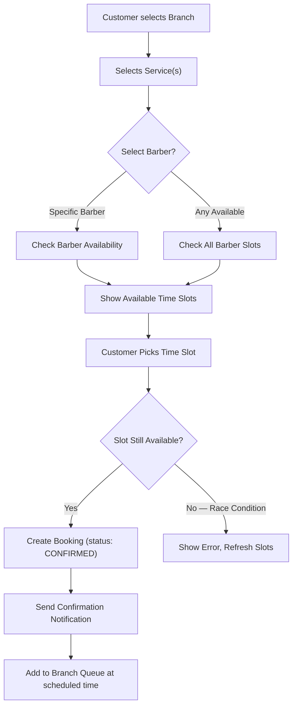
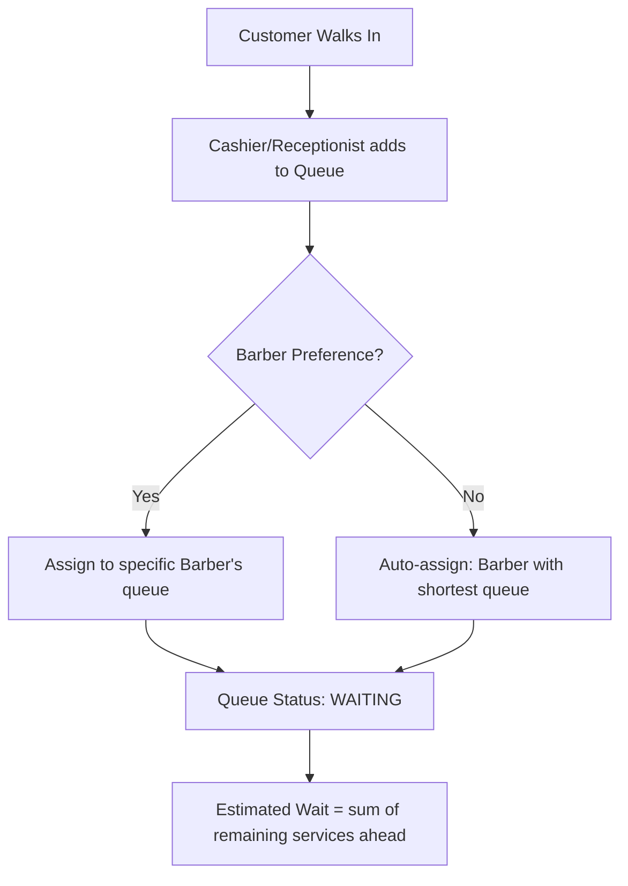
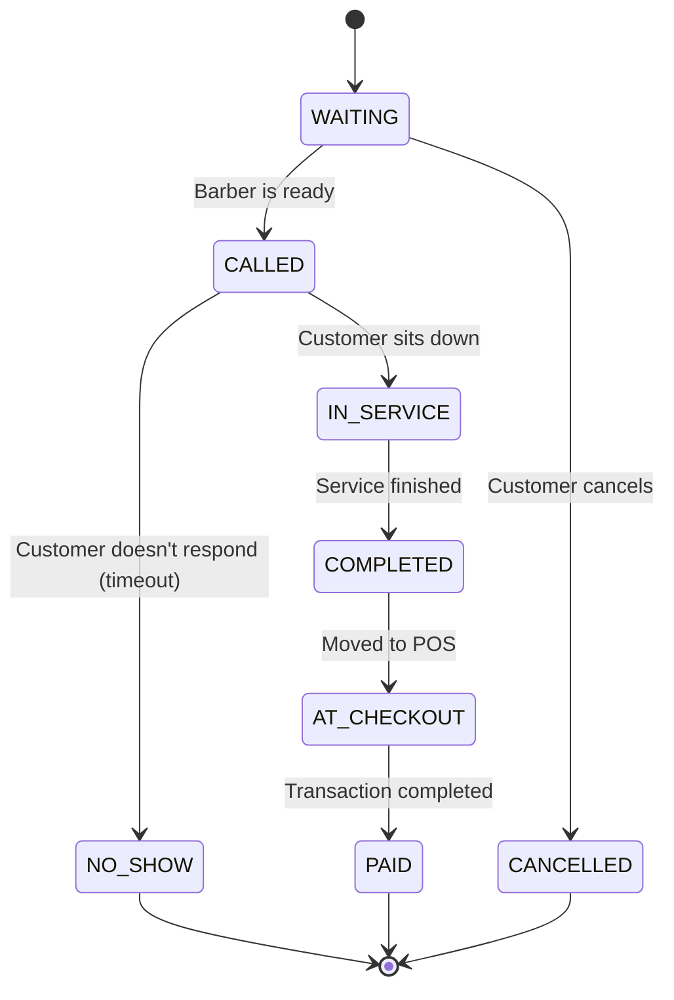
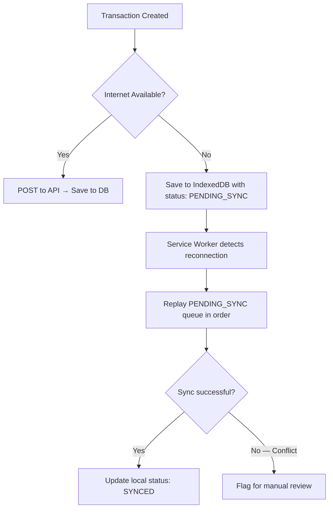
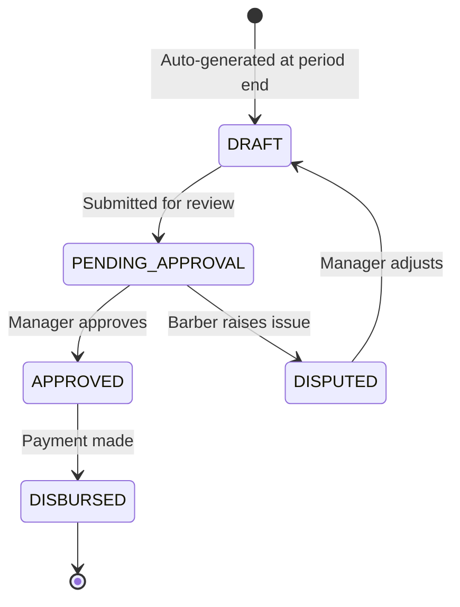

# TMNG SaaS Platform — Core Business Logic

This document maps out the critical business logic flows, state machines, and decision rules that power the system.

---

## 1. Booking & Queue Flow

This is the heart of the system — how a customer goes from wanting a haircut to sitting in the chair.

### 1.1. Online Booking Flow



**Key Logic:**
- **Optimistic Locking:** When two customers try to book the same slot simultaneously, the first `INSERT` wins. The second gets a conflict error and is asked to pick another slot.
- **Booking Buffer:** Each service has a `durationMinutes` + a configurable `bufferMinutes` (e.g., 5 min cleanup). Slots are calculated as `service.duration + buffer`.
- **No Prepayment:** Booking is reservation only. Payment happens at POS after service completion (Option A).
- **No Penalties:** Cancellations and reschedules are always free. No point deductions, no fees, no blacklisting.
- **10-Minute Grace Period:** After the booked time, the system waits 10 minutes. During grace, the barber stays in `RESERVED` status (idle, available for personal tasks — system does NOT auto-assign walk-ins to them).
- **Auto-Release:** After 10 min grace expires → slot released, barber status → `AVAILABLE`, next queue entry assigned. Customer receives a warm "We missed you! Tap to rebook" notification.
- **Late Arrival:** If the customer shows up after their slot was released, they are treated as a **regular walk-in** — added to the end of the queue. No special priority, but no penalty either.

### 1.2. Walk-in Flow



**Key Logic:**
- **Auto-Assignment Algorithm:** When no barber is preferred, the system assigns the walk-in to the barber with the **lowest estimated remaining work time** (not just fewest people — a barber with 1 combo cut remaining has more work than one with 2 simple trims).
- **Priority:** Online bookings with a confirmed time slot take priority over walk-ins. Walk-ins fill gaps between scheduled appointments.

### 1.3. Unified Queue State Machine

Every queue entry (whether from online booking or walk-in) follows this lifecycle:



**Key Logic:**
- **NO_SHOW Timeout:** If a customer is `CALLED` but doesn't respond within a configurable window (e.g., 5 minutes), the entry auto-transitions to `NO_SHOW` and the staff member becomes available for the next person.
- **Real-Time Updates:** Every state change fires a WebSocket event to update the Live Queue Board and the customer's app in real time.

---

## 2. Point of Sale (POS) Logic

### 2.1. Transaction Calculation

```
grossAmount     = SUM(service.price * quantity) + SUM(product.price * quantity)
discount        = manualDiscount + promoCodeDiscount + loyaltyPointsDiscount
tipAmount       = customerTip (optional)
taxAmount       = (grossAmount - discount) * taxRate     // if applicable
netAmount       = grossAmount - discount + taxAmount
totalDue        = netAmount + tipAmount

// Commission base is calculated on NET service revenue (excluding products & tips)
commissionBase  = SUM(service.price * quantity) - serviceDiscountPortion
```

### 2.2. Payment Split Logic

A single transaction can be split across multiple payment methods:

```
payments = [
  { method: "CASH",     amount: 50000 },
  { method: "QRIS",     amount: 75000 },   // via Xendit adapter
]

// Validation: SUM(payments.amount) must === totalDue
// If CASH: calculate change = cashReceived - cashPortion
```

### 2.3. Offline Sync Logic



**Key Logic:**
- Every offline transaction gets a **client-generated UUID** so the server can deduplicate if the same transaction is sent twice.
- The sync queue is **ordered by timestamp** — transactions replay in the exact order they occurred.

---

## 3. Commission & Payroll Engine

### 3.1. Commission Structures

The system supports **3 commission models** (configurable per barber or per tier):

| Model | Formula | Example |
|---|---|---|
| **Flat Percentage** | `commissionBase × rate` | 40% of service revenue |
| **Sliding Scale** | Rate increases at thresholds | 30% for first 1M, 40% above 1M |
| **Base + Bonus** | `baseSalary + (commissionBase × rate)` | 2M base + 20% of services |

### 3.2. Daily Commission Calculation

```
FOR each staff IN branch:
    transactions = getCompletedTransactions(staff, today)
    commissionBase = SUM(tx.serviceRevenue - tx.serviceDiscounts)
    tips = SUM(tx.tipAmount)  // if per-staff tip model

    SWITCH staffProfile.commissionModel:
        FLAT:
            commission = commissionBase × staffProfile.commissionRate
        SLIDING:
            commission = calculateSlidingScale(commissionBase, staffProfile.tiers)
        BASE_BONUS:
            commission = staffProfile.baseSalary/workingDays + (commissionBase × staffProfile.bonusRate)

    dailyEarning = commission + tips
    SAVE to staff_earnings(staffProfileId, date, commissionBase, commission, tips, total)
```

### 3.3. Payroll Approval Flow



---

## 4. Loyalty & Rewards Logic

### 4.1. Points Accumulation

```
pointsEarned = FLOOR(transaction.netAmount / pointsEarnRate)

// Example: pointsEarnRate = 10000 (earn 1 point per 10,000 IDR)
// Transaction of 150,000 IDR → 15 points
```

### 4.2. Tier Progression

| Tier | Points Required (Lifetime) | Perks |
|---|---|---|
| Bronze | 0 | Base earn rate |
| Silver | 200 | 1.25× earn rate, birthday bonus |
| Gold | 500 | 1.5× earn rate, priority booking |
| Platinum | 1000 | 2× earn rate, exclusive services, priority booking |

**Key Logic:**
- Tiers are based on **lifetime accumulated points**, not current balance.
- Tier **never downgrades** (once Gold, always Gold) — configurable by Super Admin.
- Points **expire** after X months of inactivity (configurable, e.g., 6 months).

### 4.3. Points Redemption

```
pointsRequired = CEIL(discountAmount / pointsRedeemRate)

// Example: pointsRedeemRate = 500 (1 point = 500 IDR discount)
// Customer wants 25,000 IDR discount → needs 50 points

// Validation:
// - customer.pointsBalance >= pointsRequired
// - discountAmount <= transaction.netAmount  (can't go negative)
// - maxRedemptionPercent check (e.g., max 50% of bill payable by points)
```

---

## 5. Attendance & Utilization Logic

### 5.1. Clock-in / Clock-out Rules

```
- Staff can only clock-in during branch operating hours (± grace period)
- Clock-in sets staff status: AVAILABLE
- Clock-out only allowed if staff has no IN_SERVICE queue entries
- If staff forgets to clock-out, auto-clock-out at branch closing time (flagged in audit)
```

### 5.2. Chair Utilization Rate

```
utilizationRate = (totalCuttingMinutes / totalClockedInMinutes) × 100%

// Example: Barber clocked in 8 hours (480 min), spent 360 min on services
// Utilization = 75%

// Breakdown:
// - CUTTING: time between IN_SERVICE → COMPLETED transitions
// - IDLE: clocked in time minus cutting time minus break time
// - BREAK: manually toggled break periods
```

---

## 6. Inventory Logic

### 6.1. Stock Movement

```
ON product_sold(productId, branchId, quantity):
    stock = getStock(productId, branchId)
    stock.quantity -= quantity
    IF stock.quantity <= stock.reorderThreshold:
        createAlert(LOW_STOCK, productId, branchId)

ON stock_received(productId, branchId, quantity, costPerUnit):
    stock.quantity += quantity
    stock.avgCost = recalculateWeightedAvgCost(stock, quantity, costPerUnit)
    logStockMovement(IN, productId, branchId, quantity, costPerUnit)
```

### 6.2. COGS Calculation

```
// Uses Weighted Average Cost method
COGS_per_unit = totalInventoryCost / totalInventoryQuantity

ON sale:
    COGS = quantity × COGS_per_unit
    profit = sellPrice - COGS_per_unit
```

---

## 7. Dynamic / Surge Pricing Logic

```
FOR each booking request:
    currentHour = booking.startTime.hour
    dayOfWeek = booking.startTime.dayOfWeek
    
    surgeRules = branch.surgeRules  // e.g., [{days: [SAT, SUN], hours: [10-14], multiplier: 1.2}]
    
    matchingRule = surgeRules.find(rule => 
        rule.days.includes(dayOfWeek) && 
        rule.hours.includes(currentHour)
    )
    
    IF matchingRule:
        adjustedPrice = service.basePrice × matchingRule.multiplier
    ELSE:
        adjustedPrice = service.basePrice
    
    // Barber tier surcharge applied ON TOP of surge
    finalPrice = adjustedPrice + barber.tierSurcharge
```

---

## 8. Audit Trail Logic

```
ON any state-changing action:
    auditLog.append({
        timestamp:     NOW(),
        userId:        currentUser.id,
        tenantRoleId:  currentUser.tenantRoleId,
        branchId:      currentBranch.id,
        action:     ACTION_TYPE,       // e.g., VOID_TRANSACTION, APPLY_DISCOUNT, OVERRIDE_SCHEDULE
        entityType: "Transaction",     // what was affected
        entityId:   entity.id,
        details:    { before: {...}, after: {...} },  // snapshot diff
        ipAddress:  request.ip
    })

// Anomaly detection (runs periodically or on-write):
// - Flag if same user voids > 3 transactions in 1 hour
// - Flag if discount > 50% applied without appropriate permission
// - Flag if clock-in occurs outside operating hours
```

---

## 9. Service & Pricing Logic

### 9.1. Global Catalog Inheritance

```
// Super Admin creates master catalog
globalServices = [
    { id: "svc_001", name: "Haircut", category: "HAIRCUT", basePrice: 75000, duration: 30, buffer: 5 },
    { id: "svc_002", name: "Shave",   category: "SHAVE",   basePrice: 50000, duration: 20, buffer: 5 },
    ...
]

// Branches auto-inherit ALL global services
// Branch can ONLY:
//   1. Override basePrice → branchPrice
//   2. Disable a service (isActive: false for this branch)
// Branch CANNOT create new services — only Super Admin can

branchServiceOverride = {
    branchId: "branch_001",
    serviceId: "svc_001",
    overridePrice: 80000,   // null = use global basePrice
    isActive: true          // false = hidden from this branch's menu
}
```

### 9.2. Combo / Package Deals

```
combo = {
    id: "combo_001",
    name: "Gentleman's Special",
    includedServices: ["svc_001", "svc_002", "svc_003"],  // Haircut + Shave + Wash
    comboPrice: 120000,         // instead of 75K + 50K + 25K = 150K
    savingsDisplay: "Save 30K", // auto-calculated: SUM(basePrices) - comboPrice
    duration: SUM(includedServices.duration),  // total time
    buffer: MAX(includedServices.buffer),      // single buffer at the end
    isCommissionable: true,
    commissionBase: comboPrice  // commission calculated on combo price, not individual
}

// Booking constraint: combo books a SINGLE continuous time block
// Queue: combo = ONE queue entry (not split into separate services)
```

### 9.3. Add-Ons

```
addOns = [
    { id: "addon_001", name: "Hot Towel",            price: 10000, duration: 5  },
    { id: "addon_002", name: "Scalp Massage",        price: 15000, duration: 10 },
    { id: "addon_003", name: "Beard Oil Treatment",  price: 20000, duration: 5  },
]

// Add-ons can be attached to ANY main service or combo
// Add-on time is ADDED to the base service duration for slot calculation
// Add-ons are commissionable by default (configurable)
// Add-on prices are NOT affected by surge pricing or tier surcharges
```

### 9.4. Final Price Resolution

```
resolvePrice(serviceId, branchId, staffProfileId, bookingTime):

    // Step 1: Get base price (branch override or global)
    branchOverride = getBranchOverride(serviceId, branchId)
    basePrice = branchOverride?.overridePrice ?? globalService.basePrice

    // Step 2: Apply surge pricing (if applicable)
    surgeMultiplier = getSurgeMultiplier(branchId, bookingTime)  // default: 1.0
    surgedPrice = basePrice × surgeMultiplier

    // Step 3: Apply staff tier surcharge
    tierSurcharge = getStaffTierSurcharge(staffProfileId)  // e.g., Master: +30K
    servicePrice = surgedPrice + tierSurcharge

    // Step 4: Add add-ons (flat price, no surge/tier modification)
    addOnsTotal = SUM(selectedAddOns.price)

    // Final
    lineItemTotal = servicePrice + addOnsTotal

    RETURN {
        basePrice,
        surgeMultiplier,
        surgedPrice,
        tierSurcharge,
        servicePrice,
        addOnsTotal,
        lineItemTotal,
        // breakdown shown to customer for full transparency
    }
```

### 9.5. Duration Calculation for Slot Booking

```
totalDuration(service, addOns):
    IF service is COMBO:
        baseDuration = SUM(combo.includedServices.duration)
        buffer = MAX(combo.includedServices.buffer)
    ELSE:
        baseDuration = service.duration
        buffer = service.buffer

    addOnsDuration = SUM(addOns.duration)

    RETURN baseDuration + addOnsDuration + buffer
    // This is the time block reserved in the barber's schedule
```

