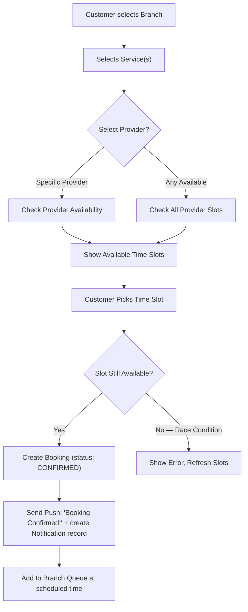
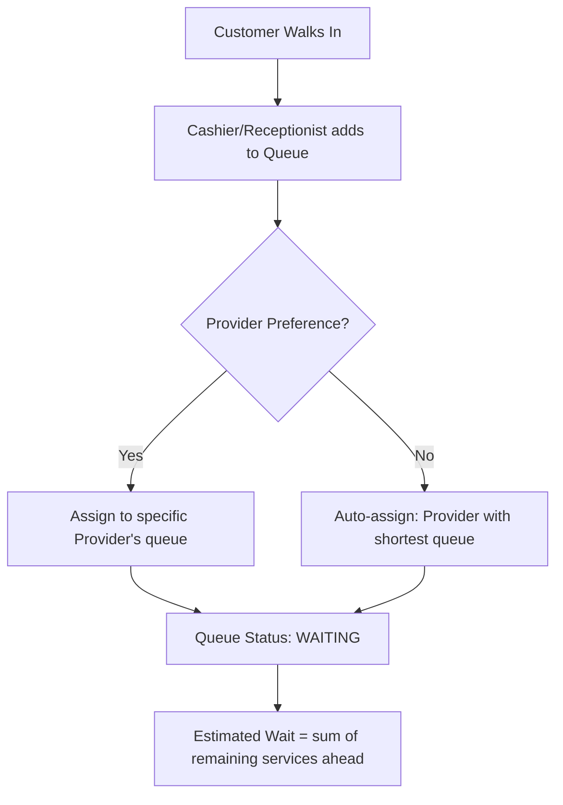
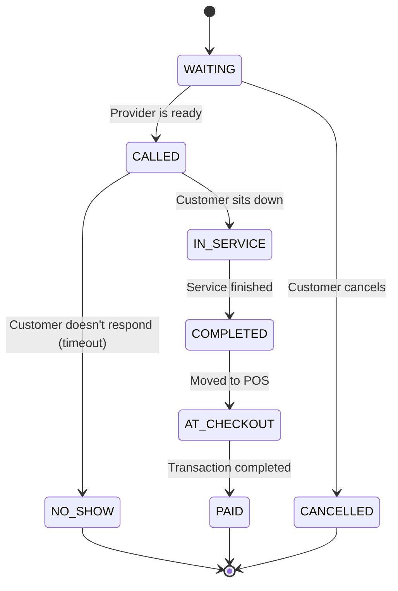
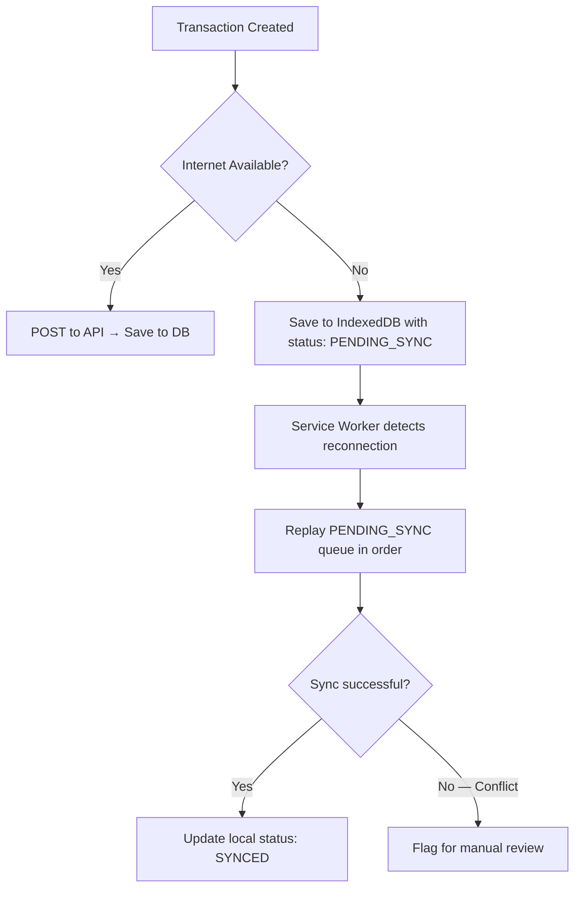
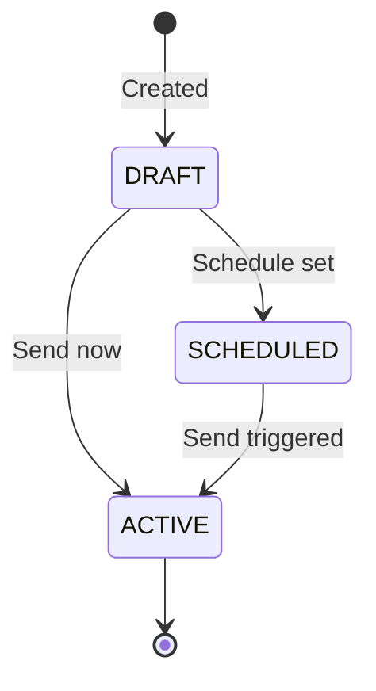
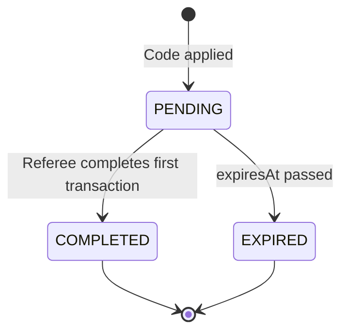
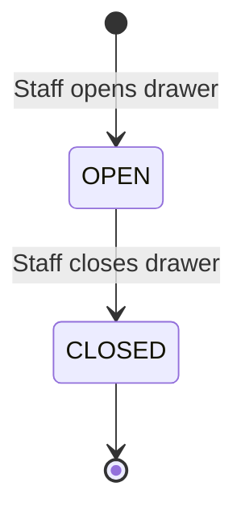

# TMNG SaaS Platform — Core Business Logic

> Industry-agnostic platform logic. All examples use abstract placeholders (Service A, Provider X, Branch Y). For industry-specific examples, see the [templates directory](templates/) — e.g., [barbershop template](templates/barbershop.md).

This document maps out the critical business logic flows, state machines, and decision rules that power the system. It covers 22 business domains.

---

## 1. Booking & Queue Flow

This is the heart of the system — how a customer goes from wanting a service to being served.

### 1.1. Online Booking Flow



**Key Logic:**
- **Optimistic Locking:** When two customers try to book the same slot simultaneously, the first `INSERT` wins. The second gets a conflict error and is asked to pick another slot.
- **Booking Buffer:** Each service has a `durationMinutes` + a configurable `bufferMinutes` (e.g., 5 min cleanup). Slots are calculated as `service.duration + buffer`.
- **Prepayment (Optional):** When org config `PREPAYMENT_ENABLED` is true, customers can pay a deposit online via Xendit at booking time. Deposit amount = `totalDue × DEPOSIT_PERCENTAGE`. Stored as `QueueEntry.prepaidAmount` and `prepaymentReference`. When disabled, booking is reservation-only with payment at POS.
- **Cancellation Policy (Prepaid Bookings Only):** Penalties apply ONLY to prepaid bookings. If cancelled within `CANCELLATION_POLICY_HOURS` of the scheduled time, a penalty of `prepaidAmount × CANCELLATION_PENALTY_PERCENTAGE` is deducted. Refund = `prepaidAmount - penalty`, stored as `QueueEntry.refundAmount`. Non-prepaid bookings have zero penalties.
- **Non-Prepaid Bookings:** Cancellations and reschedules are always free. No point deductions, no fees, no blacklisting.
- **10-Minute Grace Period:** After the booked time, the system waits 10 minutes. During grace, the provider stays in `RESERVED` status (idle, available for personal tasks — system does NOT auto-assign walk-ins to them).
- **Auto-Release:** After 10 min grace expires → slot released, provider status → `AVAILABLE`, next queue entry assigned. Customer receives a warm "We missed you! Tap to rebook" notification.
- **Late Arrival:** If the customer shows up after their slot was released, they are treated as a **regular walk-in** — added to the end of the queue. No special priority, but no penalty either.

### 1.2. Walk-in Flow



**Key Logic:**
- **Auto-Assignment Algorithm:** When no provider is preferred, the system assigns the walk-in to the provider with the **lowest estimated remaining work time** (not just fewest people — a provider with 1 combo service remaining has more work than one with 2 quick services).
- **Priority:** Online bookings with a confirmed time slot take priority over walk-ins. Walk-ins fill gaps between scheduled appointments.

### 1.3. Unified Queue State Machine

Every queue entry (whether from online booking or walk-in) follows this lifecycle:



**Key Logic:**
- **NO_SHOW Timeout:** If a customer is `CALLED` but doesn't respond within a configurable window (e.g., 5 minutes), the entry auto-transitions to `NO_SHOW` and the staff member becomes available for the next person.
- **Real-Time Updates:** Every state change fires a WebSocket event to update the Live Queue Board and the customer's app in real time.
- **Push Notifications on Status Transitions:**
  - `WAITING → CALLED`: Push "Your Turn Is Coming!" to the customer + creates `Notification` DB record
  - `IN_SERVICE → COMPLETED`: Push "Service Complete" to the customer + creates `Notification` DB record
  - Each push is sent via `NotificationService.sendPush()` and also persisted in the `Notification` table for the in-app inbox
- **Appointment Reminders:** Cron job (`processAppointmentReminders`) runs every 5 minutes. Sends a push notification 25-30 minutes before `scheduledAt` for CONFIRMED bookings. Uses audit log to deduplicate (sends once per booking).

---

## 2. Point of Sale (POS) Logic

### 2.1. Transaction Calculation

```
grossAmount     = SUM(service.price * quantity) + SUM(product.price * quantity)
discount        = manualDiscount + promoCodeDiscount + loyaltyPointsDiscount
tipAmount       = customerTip (optional)
taxAmount       = (grossAmount - discount) * taxRate     // if applicable
netAmount       = grossAmount - discount + taxAmount
totalDue        = netAmount + tipAmount

// Commission base is calculated on NET service revenue (excluding products & tips)
commissionBase  = SUM(service.price * quantity) - serviceDiscountPortion
```

### 2.2. Payment Split Logic

A single transaction can be split across multiple payment methods:

```
payments = [
  { method: "CASH",     amount: 50000 },
  { method: "QRIS",     amount: 75000 },   // via Xendit adapter
]

// Validation: SUM(payments.amount) must === totalDue
// If CASH: calculate change = cashReceived - cashPortion
```

### 2.3. Offline Sync Logic



**Key Logic:**
- Every offline transaction gets a **client-generated UUID** so the server can deduplicate if the same transaction is sent twice.
- The sync queue is **ordered by timestamp** — transactions replay in the exact order they occurred.

---

## 3. Commission & Payroll Engine

### 3.1. Commission Structures

The system supports **3 commission models** (configurable per staff member or per tier):

| Model | Formula | Example |
|---|---|---|
| **Flat Percentage** | `commissionBase × rate` | 40% of service revenue |
| **Sliding Scale** | Rate increases at thresholds | 30% for first 1M, 40% above 1M |
| **Base + Bonus** | `baseSalary + (commissionBase × rate)` | 2M base + 20% of services |

### 3.2. Daily Commission Calculation

```
FOR each staff IN branch:
    transactions = getCompletedTransactions(staff, today)
    commissionBase = SUM(tx.serviceRevenue - tx.serviceDiscounts)
    tips = SUM(tx.tipAmount)  // if per-staff tip model

    SWITCH staffProfile.commissionModel:
        FLAT:
            commission = commissionBase × staffProfile.commissionRate
        SLIDING:
            commission = calculateSlidingScale(commissionBase, staffProfile.tiers)
        BASE_BONUS:
            commission = staffProfile.baseSalary/workingDays + (commissionBase × staffProfile.bonusRate)

    dailyEarning = commission + tips
    SAVE to staff_earnings(staffProfileId, date, commissionBase, commission, tips, total)
```

### 3.3. Payroll Approval Flow


---

## 4. Loyalty & Rewards Logic

### 4.1. Points Accumulation

```
pointsEarned = FLOOR(transaction.netAmount / pointsEarnRate)

// Example: pointsEarnRate = 10000 (earn 1 point per 10,000 IDR)
// Transaction of 150,000 IDR → 15 points
```

### 4.2. Tier Progression

| Tier | Points Required (Lifetime) | Perks |
|---|---|---|
| Bronze | 0 | Base earn rate |
| Silver | 200 | 1.25× earn rate, birthday bonus |
| Gold | 500 | 1.5× earn rate, priority booking |
| Platinum | 1000 | 2× earn rate, exclusive services, priority booking |

**Key Logic:**
- Tiers are based on **lifetime accumulated points**, not current balance.
- Tier **never downgrades** (once Gold, always Gold) — configurable by Super Admin.
- Points **expire** after X months of inactivity (configurable, e.g., 6 months).

### 4.3. Points Redemption

```
pointsRequired = CEIL(discountAmount / pointsRedeemRate)

// Example: pointsRedeemRate = 500 (1 point = 500 IDR discount)
// Customer wants 25,000 IDR discount → needs 50 points

// Validation:
// - customer.pointsBalance >= pointsRequired
// - discountAmount <= transaction.netAmount  (can't go negative)
// - maxRedemptionPercent check (e.g., max 50% of bill payable by points)
```

---

## 5. Attendance & Utilization Logic

### 5.1. Clock-in / Clock-out Rules

```
- Staff can only clock-in during branch operating hours (± grace period)
- Clock-in sets staff status: AVAILABLE
- Clock-out only allowed if staff has no IN_SERVICE queue entries
- If staff forgets to clock-out, auto-clock-out at branch closing time (flagged in audit)
```

### 5.2. Station Utilization Rate

```
utilizationRate = (totalServiceMinutes / totalClockedInMinutes) × 100%

// Example: Provider X clocked in 8 hours (480 min), spent 360 min on services
// Utilization = 75%

// Breakdown:
// - SERVICE: time between IN_SERVICE → COMPLETED transitions
// - IDLE: clocked in time minus service time minus break time
// - BREAK: manually toggled break periods
```

---

## 6. Inventory Logic

### 6.1. Stock Movement

```
ON product_sold(productId, branchId, quantity):
    stock = getStock(productId, branchId)
    stock.quantity -= quantity
    IF stock.quantity <= stock.reorderThreshold:
        createAlert(LOW_STOCK, productId, branchId)

ON stock_received(productId, branchId, quantity, costPerUnit):
    stock.quantity += quantity
    stock.avgCost = recalculateWeightedAvgCost(stock, quantity, costPerUnit)
    logStockMovement(IN, productId, branchId, quantity, costPerUnit)
```

### 6.2. COGS Calculation

```
// Uses Weighted Average Cost method
COGS_per_unit = totalInventoryCost / totalInventoryQuantity

ON sale:
    COGS = quantity × COGS_per_unit
    profit = sellPrice - COGS_per_unit
```

---

## 7. Dynamic / Surge Pricing Logic

```
FOR each booking request:
    currentHour = booking.startTime.hour
    dayOfWeek = booking.startTime.dayOfWeek
    
    surgeRules = branch.surgeRules  // e.g., [{days: [SAT, SUN], hours: [10-14], multiplier: 1.2}]
    
    matchingRule = surgeRules.find(rule => 
        rule.days.includes(dayOfWeek) && 
        rule.hours.includes(currentHour)
    )
    
    IF matchingRule:
        adjustedPrice = service.basePrice × matchingRule.multiplier
    ELSE:
        adjustedPrice = service.basePrice
    
    // Staff tier surcharge applied ON TOP of surge
    finalPrice = adjustedPrice + staffProfile.tierSurcharge
```

---

## 8. Audit Trail Logic

```
ON any state-changing action:
    auditLog.append({
        timestamp:     NOW(),
        userId:        currentUser.id,
        tenantRoleId:  currentUser.tenantRoleId,
        branchId:      currentBranch.id,
        action:     ACTION_TYPE,       // e.g., VOID_TRANSACTION, APPLY_DISCOUNT, OVERRIDE_SCHEDULE
        entityType: "Transaction",     // what was affected
        entityId:   entity.id,
        details:    { before: {...}, after: {...} },  // snapshot diff
        ipAddress:  request.ip
    })

// Anomaly detection (runs periodically or on-write):
// - Flag if same user voids > 3 transactions in 1 hour
// - Flag if discount > 50% applied without appropriate permission
// - Flag if clock-in occurs outside operating hours
```

---

## 9. Service & Pricing Logic

### 9.1. Global Catalog Inheritance

```
// Super Admin creates master catalog
globalServices = [
    { id: "svc_001", name: "Service A", category: "PRIMARY", basePrice: 75000, duration: 30, buffer: 5 },
    { id: "svc_002", name: "Service B", category: "SECONDARY", basePrice: 50000, duration: 20, buffer: 5 },
    ...
]

// Branches auto-inherit ALL global services
// Branch can ONLY:
//   1. Override basePrice → branchPrice
//   2. Disable a service (isActive: false for this branch)
// Branch CANNOT create new services — only Super Admin can

branchServiceOverride = {
    branchId: "branch_001",
    serviceId: "svc_001",
    overridePrice: 80000,   // null = use global basePrice
    isActive: true          // false = hidden from this branch's menu
}
```

### 9.2. Combo / Package Deals

```
combo = {
    id: "combo_001",
    name: "Premium Package",
    includedServices: ["svc_001", "svc_002", "svc_003"],  // Service A + Service B + Service C
    comboPrice: 120000,         // instead of 75K + 50K + 25K = 150K
    savingsDisplay: "Save 30K", // auto-calculated: SUM(basePrices) - comboPrice
    duration: SUM(includedServices.duration),  // total time
    buffer: MAX(includedServices.buffer),      // single buffer at the end
    isCommissionable: true,
    commissionBase: comboPrice  // commission calculated on combo price, not individual
}

// Booking constraint: combo books a SINGLE continuous time block
// Queue: combo = ONE queue entry (not split into separate services)
```

### 9.3. Add-Ons

```
addOns = [
    { id: "addon_001", name: "Add-on A",  price: 10000, duration: 5  },
    { id: "addon_002", name: "Add-on B",  price: 15000, duration: 10 },
    { id: "addon_003", name: "Add-on C",  price: 20000, duration: 5  },
]

// Add-ons can be attached to ANY main service or combo
// Add-on time is ADDED to the base service duration for slot calculation
// Add-ons are commissionable by default (configurable)
// Add-on prices are NOT affected by surge pricing or tier surcharges
```

### 9.4. Final Price Resolution

```
resolvePrice(serviceId, branchId, staffProfileId, bookingTime):

    // Step 1: Get base price (branch override or global)
    branchOverride = getBranchOverride(serviceId, branchId)
    basePrice = branchOverride?.overridePrice ?? globalService.basePrice

    // Step 2: Apply surge pricing (if applicable)
    surgeMultiplier = getSurgeMultiplier(branchId, bookingTime)  // default: 1.0
    surgedPrice = basePrice × surgeMultiplier

    // Step 3: Apply staff tier surcharge
    tierSurcharge = getStaffTierSurcharge(staffProfileId)  // e.g., Senior Tier: +30K
    servicePrice = surgedPrice + tierSurcharge

    // Step 4: Add add-ons (flat price, no surge/tier modification)
    addOnsTotal = SUM(selectedAddOns.price)

    // Final
    lineItemTotal = servicePrice + addOnsTotal

    RETURN {
        basePrice,
        surgeMultiplier,
        surgedPrice,
        tierSurcharge,
        servicePrice,
        addOnsTotal,
        lineItemTotal,
        // breakdown shown to customer for full transparency
    }
```

### 9.5. Duration Calculation for Slot Booking

```
totalDuration(service, addOns):
    IF service is COMBO:
        baseDuration = SUM(combo.includedServices.duration)
        buffer = MAX(combo.includedServices.buffer)
    ELSE:
        baseDuration = service.duration
        buffer = service.buffer

    addOnsDuration = SUM(addOns.duration)

    RETURN baseDuration + addOnsDuration + buffer
    // This is the time block reserved in the provider's schedule
```

---

## 10. Notification System

### 10.1. Push Notification Triggers

| Event | Trigger Point | Push Title | Push Body |
|-------|--------------|------------|-----------|
| Booking Confirmed | `QueueService.createEntry()` | "Booking Confirmed!" | Service details + scheduled time |
| Your Turn Is Coming | `QueueService.updateStatus()` → CALLED | "Your Turn Is Coming!" | "Please proceed to {branch}" |
| Service Complete | `QueueService.updateStatus()` → COMPLETED | "Service Complete" | "Thank you for visiting!" |
| Appointment Reminder | `scheduler.processAppointmentReminders()` | "Upcoming Appointment" | "Your appointment is in ~30 minutes" |
| Retention Nudge | `scheduler` daily 03:05 UTC | At-risk / expiry message | Varies by trigger type |
| Campaign Send | `CampaignService.sendCampaign()` | Campaign title | Campaign body |

Each push notification also creates a `Notification` record in the database for the in-app inbox.

### 10.2. In-App Notification Inbox

```
Notification model:
  title      String       // "Booking Confirmed!", "Your Turn Is Coming!", etc.
  body       String       // Detail message
  type       String       // "BOOKING_CONFIRMED", "QUEUE_CALLED", "QUEUE_COMPLETED", "APPOINTMENT_REMINDER"
  data       Json?        // Optional metadata (queueEntryId, branchId, etc.)
  read       Boolean      // false by default, toggled via API
```

**Key Logic:**
- Notifications are **user-scoped** — each user only sees their own notifications.
- No RBAC permission required — notifications are personal data accessible by any authenticated user.
- `GET /notifications` returns paginated results (default 20 per page), sorted by `createdAt DESC`.
- `GET /notifications/unread-count` returns a single integer for the bell icon badge.
- `PATCH /notifications/:id/read` marks a single notification as read (validates ownership).
- `POST /notifications/mark-all-read` marks all unread notifications for the user as read.

---

## 11. Saved Payment Methods

### 11.1. Card Tokenization Flow

```
Customer opens Payment Methods page
  → Client calls Xendit.js to tokenize card details (browser-side, no raw card data hits our server)
  → Xendit returns a token_id
  → Client sends { tokenId, last4, expiryMonth, expiryYear } to POST /payments/methods
  → Server creates SavedPaymentMethod record (org-scoped, user-scoped)
```

**Key Logic:**
- Maximum **5 saved payment methods** per user. Attempting to save a 6th returns 400.
- First saved card is automatically set as `isDefault = true`.
- Deleting the default card does NOT auto-promote another card to default.
- Only the card owner can view or delete their cards (user-scoped queries).
- `tokenId` is the Xendit token — used when charging a saved card for future payments.
- No RBAC permission required — payment methods are personal customer data.

---

## 12. Waitlist Logic

### 12.1. Waitlist Flow

```
Customer selects a time slot that is fully booked
  → System shows "Join Waitlist" option (if WAITLIST_ENABLED)
  → Customer joins waitlist for that slot (branch + date + time + services)
  → WaitlistEntry created with status WAITING

When a booking is cancelled for that slot:
  → System checks waitlist for matching entries
  → First matching entry notified (push + in-app)
  → Status → NOTIFIED, customer has limited time to confirm
  → Customer confirms → CONVERTED (entry becomes a booking)
  → Customer ignores → EXPIRED (slot offered to next waitlist entry)
```

### 12.2. Waitlist Configuration

- `WAITLIST_ENABLED` — org-level toggle (default: false)
- `WAITLIST_MAX_PER_SLOT` — maximum waitlist entries per time slot (prevents unbounded queues)
- Entries auto-expire via cron (every 5 minutes) when past their `expiresAt` time

### 12.3. Waitlist State Machine

```
WAITING → NOTIFIED → CONVERTED (becomes booking)
WAITING → EXPIRED (past slot time)
WAITING → CANCELLED (customer leaves)
NOTIFIED → EXPIRED (customer didn't confirm in time)
```

---

## 13. Multi-Currency & Locale

### 13.1. Organization Currency Settings

Each organization defines its own currency and locale:

```
Organization.currency        // ISO 4217 code: "IDR", "USD", "MYR", etc.
Organization.currencySymbol  // Display symbol: "Rp", "$", "RM"
Organization.timezone        // IANA timezone: "Asia/Jakarta", "Asia/Kuala_Lumpur"
Organization.locale          // BCP 47: "id-ID", "en-US", "ms-MY"
```

### 13.2. Currency Handling Rules

- All monetary values are stored as numeric types in the database
- The API returns raw numeric values; the frontend formats them using the org's `currency`, `currencySymbol`, and `locale`
- Currency formatting happens ONLY at the UI rendering layer via `Intl.NumberFormat`
- Tax rates, commission rates, and loyalty earn/redeem rates are configured per org
- No cross-currency transactions — each org operates in exactly one currency

### 13.3. Timezone Handling

- All timestamps stored and transmitted in **UTC**
- Cron jobs operate in UTC; descriptions may reference local time for readability (e.g., WIB = UTC+7)
- Frontend converts UTC to local time using the org's `timezone` setting
- Display format uses the org's `locale` for date/number formatting

---

## 14. Demand Forecasting & Smart Scheduling

### 14.1. Demand Forecast

Daily cron (02:15 UTC) computes 14-day demand predictions per branch:

```
Algorithm:
  1. Compute 7-day moving average of daily bookings
  2. Calculate seasonal indices (day-of-week patterns)
  3. Apply linear regression for trend component
  4. Combine: forecast = trend × seasonalIndex

Output: DemandForecast records with predicted demand per day
```

### 14.2. Churn Prediction

Weekly cron (Monday 04:00 UTC) computes customer churn risk:

```
Weighted RFM scoring:
  recencyScore     × 0.35  (days since last visit, normalized)
  frequencyScore   × 0.30  (visits per month, normalized)
  monetaryScore    × 0.20  (average spend, normalized)
  engagementScore  × 0.15  (loyalty interactions, reviews, referrals)

churnRisk = 1 - weightedAverage(scores)
riskLevel = HIGH (>0.7) | MEDIUM (0.4-0.7) | LOW (<0.4)
```

### 14.3. Smart Scheduling

Uses demand forecasts to suggest optimal staff schedules:

```
For each branch + day:
  requiredStaff = CEIL(forecastedDemand / avgServicesPerStaffPerDay)
  currentScheduled = count of shifts already scheduled
  gap = requiredStaff - currentScheduled

  IF gap > 0: suggest adding staff
  IF gap < 0: suggest reducing (optional shifts)

Suggestions stored as ScheduleSuggestion records.
Manager can Accept (auto-creates ShiftSchedule) or Reject.
```

---

## 15. CRM Segmentation

### 15.1. Auto-Segment Definitions

The system auto-computes 5 customer segments per branch using completed transaction data:

| Segment | Rules (all conditions ANDed) |
|---|---|
| **VIP** | `visits >= 10` AND `lastVisitWithin <= 60 days` AND `totalSpend >= minSpendThreshold` |
| **REGULAR** | `visits >= 3` AND `lastVisitWithin <= 60 days` |
| **NEW** | `visits <= 2` AND `accountCreatedWithin <= 30 days` |
| **AT_RISK** | `visits >= 3` AND `lastVisit > 60 days` AND `lastVisit <= 120 days` |
| **LAPSED** | `visits >= 1` AND `lastVisit > 120 days` |

### 15.2. Segment Recompute Flow

```
ON recomputeSegments(branchId):
    FOR each segment definition:
        upsert CustomerSegment (id: auto_{branchId}_{NAME})
        clear all CustomerSegmentMember rows for this segment

    FOR each customer with COMPLETED transactions at branch:
        visits = COUNT(transactions)
        spend = SUM(netAmount)
        daysSinceLastVisit = DAYS_BETWEEN(lastTx.createdAt, NOW)
        // If no visit history, daysSince = 999 (always fails "within" checks)

        FOR each segment:
            IF ALL rules match → add customer to segment

    // A customer CAN belong to multiple segments simultaneously
```

### 15.3. Customer Insights

Per-customer metrics computed on demand:

```
totalVisits     = COUNT(COMPLETED transactions at branch)
totalSpend      = SUM(netAmount)
averageSpend    = totalSpend / totalVisits
lastVisitAt     = MAX(createdAt)
favoriteServices = TOP 3 service names by frequency (from TransactionItem)
loyaltyTier     = CustomerMembership.tier (default: BRONZE)
segment         = matched CustomerSegment name (if any)
```

---

## 16. Campaign Targeting & Send

### 16.1. Campaign Lifecycle



### 16.2. Recipient Resolution

```
ON sendCampaign(campaignId):
    IF campaign.segmentId:
        recipients = all CustomerSegmentMember.customerId for that segment
    ELSE IF campaign.branchId:
        recipients = distinct customerId from COMPLETED transactions at branch
    ELSE:
        recipients = [] (empty — no recipients)
```

### 16.3. Channel Dispatch

| Channel | Behavior |
|---|---|
| **PUSH** | Calls `NotificationService.sendPush()` per recipient; only counts `sent` on success |
| **IN_APP** | Creates in-app notification record; always counts as sent |
| **EMAIL** | Sends via configured email service; always counts as sent |

After dispatch: campaign `sentCount` updated, status → `ACTIVE`.

### 16.4. Validation Rules

- Only **DRAFT** or **SCHEDULED** campaigns can be edited
- Only **DRAFT** or **SCHEDULED** campaigns can be sent
- `promoCodeId` (optional) must reference an active promo code
- `segmentId` (optional) must reference an existing segment

---

## 17. Promo Code Validation

### 17.1. Validation Pipeline

```
validatePromoCode(code, branchId, grossAmount):
    promo = FIND(code, organizationId)

    CHECK promo exists                              → 404 if not
    CHECK promo.isActive                            → 400 if inactive
    CHECK promo.branchId matches (if branch-scoped) → 400 if wrong branch
    CHECK promo.startDate <= NOW                    → 400 if not yet active
    CHECK promo.endDate >= NOW (if set)             → 400 if expired
    CHECK promo.usageCount < promo.usageLimit (if set) → 400 if exhausted
    CHECK grossAmount >= promo.minGrossAmount       → 400 if basket too small
```

### 17.2. Discount Calculation

```
IF promo.type === PERCENTAGE:
    discountAmount = grossAmount × (promo.value / 100)
    IF promo.maxDiscount AND discountAmount > promo.maxDiscount:
        discountAmount = promo.maxDiscount
ELSE (FIXED):
    discountAmount = promo.value
```

### 17.3. Loyalty Points Redemption

Separate from promo codes; uses CustomerMembership balance:

```
pointsRedeemRate = configurable (e.g., 1 point = 500 currency units)
discountAmount = pointsToRedeem × pointsRedeemRate

Validation:
  - CustomerMembership exists
  - pointsBalance >= pointsToRedeem
  - discountAmount <= netAmount (can't go negative)
  - discountAmount <= netAmount × maxRedemptionPercent (e.g., 50%)
```

---

## 18. Referral System

### 18.1. Referral Code Generation

```
code = UPPERCASE(firstName[0:3], padded with "X") + RANDOM(1000-9999)
// e.g., "BUD4527" for user "Budi"

Collision handling: up to 10 retries within the same organization
Code stored on CustomerMembership.referralCode
```

### 18.2. Apply Referral Code

```
ON applyReferralCode(newUserId, referralCode):
    CHECK referrer exists in same organization
    CHECK referrer !== newUser (can't self-refer)
    CHECK no existing Referral(referrerId, refereeId) (no duplicates)

    expiryDays = ConfigService.get("REFERRAL_EXPIRY_DAYS", default: 30)
    bonusPoints = ConfigService.get("REFERRAL_BONUS_POINTS", default: 50)

    CREATE Referral(status: PENDING, expiresAt: NOW + expiryDays)
```

### 18.3. Referral Completion (First Visit)



```
ON completeReferral(refereeId):
    referral = FIND_FIRST(refereeId, status: PENDING)
    IF referral.expiresAt < NOW:
        referral.status = EXPIRED
        RETURN null
    ELSE:
        LoyaltyService.addBonusPoints(referrerId, bonusPoints)
        referral.status = COMPLETED
        referral.completedAt = NOW
        CREATE AuditLog(action: REFERRAL_REWARD)
```

---

## 19. Cash Drawer Reconciliation

### 19.1. Session Lifecycle



**Constraint:** Only **one OPEN session per branch** at any time.

### 19.2. Entry Tracking

While a session is OPEN, entries are recorded for cash movements:

```
entry = { type: SALE | REFUND | PAYOUT | ADJUSTMENT, amount: number, reference?: string }
// Entries can only be added to an OPEN session
```

### 19.3. Close & Reconcile

```
ON closeSession(sessionId, closingBalance):
    entriesSum      = SUM(entries.amount)
    expectedBalance = openingBalance + entriesSum
    discrepancy     = closingBalance - expectedBalance

    // discrepancy > 0 means OVERAGE (more cash than expected)
    // discrepancy < 0 means SHORTAGE (less cash than expected)
    // discrepancy = 0 means BALANCED

    SAVE { closingBalance, expectedBalance, discrepancy, status: CLOSED, closedAt: NOW }
```

---

## 20. Review & Moderation

### 20.1. Review Creation Rules

```
ON createReview(customerId, branchId, staffProfileId?, queueEntryId?):
    // Visit-proof: customer must have at least one PAID queue entry at this branch
    CHECK QueueEntry exists WHERE customerId AND branchId AND status = "PAID"
    IF queueEntryId provided:
        CHECK that specific entry matches
        CHECK no existing Review for (customerId, queueEntryId) — duplicate guard
```

### 20.2. Moderation Flow

```
ON moderateReview(reviewId, isVisible, moderationNote):
    UPDATE review.isVisible
    CREATE AuditLog(action: MODERATE_REVIEW, details: { isVisible, note })
    recalculateAggregates(branchId, staffProfileId)
```

### 20.3. Aggregate Recalculation

Triggered after create, moderate, or delete:

```
FOR staffProfile (if review has staffProfileId):
    avgRating = AVG(rating) WHERE staffProfileId AND isVisible = true
    totalReviews = COUNT(*) WHERE staffProfileId AND isVisible = true
    UPDATE StaffProfile SET { averageRating, totalReviews }

FOR branch (if review has branchId):
    avgRating = AVG(rating) WHERE branchId AND isVisible = true
    totalReviews = COUNT(*) WHERE branchId AND isVisible = true
    UPDATE Branch SET { averageRating, totalReviews }
```

---

## 21. Report Generation

### 21.1. Report Types

| Type | Data Source | Key Columns |
|---|---|---|
| `daily_revenue` | BranchDailySnapshot | Date, Revenue, Service Rev, Product Rev, Tips, Tx Count, Avg Value |
| `service_popularity` | TransactionItem (COMPLETED txs) | Service, Times Sold, Revenue, % of Total |
| `staff_leaderboard` | StaffEarning | Rank, Staff, Revenue, Commission, Tips, Total |
| `customer_visits` | Transaction (COMPLETED) | Customer, Email, Visits |
| `booking_source` | QueueEntry (non-CANCELLED) | Source, Count, % of Total |

### 21.2. Export Formats

- **CSV:** Columns as headers, money columns auto-formatted with org currency via `Intl.NumberFormat`
- **PDF:** Paginated A4 document with header row repeated on each page, auto-formatted money columns

### 21.3. Scheduled Reports

```
Schedule configuration:
  reportType    — one of the 5 report types
  frequency     — DAILY | WEEKLY | MONTHLY
  recipients    — list of email addresses
  filters       — optional overrides (branchId, dateFrom, dateTo)

computeNextRunAt:
  DAILY   → next day at 06:00 UTC
  WEEKLY  → next Monday at 06:00 UTC
  MONTHLY → 1st of next month at 06:00 UTC

Date range resolution:
  IF filters.dateFrom AND filters.dateTo → use those
  ELSE → auto-compute previous period:
    DAILY   → yesterday
    WEEKLY  → previous Monday–Sunday
    MONTHLY → previous calendar month
```

---

## 22. Finance & P&L

### 22.1. Profit & Loss Summary

```
Revenue:
    serviceRevenue = SUM(BranchDailySnapshot.serviceRevenue)
    productRevenue = SUM(BranchDailySnapshot.productRevenue)
    totalRevenue   = serviceRevenue + productRevenue
    tipsCollected  = SUM(BranchDailySnapshot.totalTips)  // tracked separately, NOT in totalRevenue

Costs:
    totalCommissions = SUM(StaffEarning.commission) in date range
    totalPayroll     = SUM(PayrollPeriod.totalPayout) WHERE status = DISBURSED
                       AND periodStart >= from AND periodEnd <= to
    inventoryCOGS    = 0  // placeholder for future implementation
    totalCosts       = totalCommissions + totalPayroll

Profit:
    grossProfit        = totalRevenue - totalCosts
    grossMarginPercent = (grossProfit / totalRevenue) × 100  // 0 if no revenue
```

### 22.2. Void & Discount Audit

```
voidTotal     = SUM(netAmount) from VOIDED transactions
refundTotal   = SUM(netAmount) from REFUNDED transactions
discountsGiven = SUM(discountAmount) from COMPLETED transactions
ppnCollected  = SUM(taxAmount) from COMPLETED transactions

// Drill-down: AuditLog entries for VOID_TRANSACTION, REFUND_TRANSACTION, APPLY_DISCOUNT
// Each with user attribution and amount details
```

### 22.3. Payroll Oversight

```
// Lists payroll periods with optional filters:
//   status: DRAFT | PENDING_APPROVAL | APPROVED | DISPUTED | DISBURSED
//   dateFrom, dateTo: filters on periodStart

// Includes staff profile and user name for each period
```

### 22.4. Tax Summary

```
totalTax         = SUM(taxAmount) from COMPLETED transactions in range
totalNetRevenue  = SUM(netAmount) from COMPLETED transactions in range
transactionCount = COUNT of COMPLETED transactions in range
```

---

## 23. Platform Seed Data (Stage 1 — Generic)

The database seeder (`apps/api/prisma/seed.ts`) runs in two stages. Stage 1 creates platform-level entities that are industry-agnostic:

### 23.1. Feature Catalog (25 features)

| Module | Features |
|---|---|
| **CORE** | Queue Management, Appointment Booking, Staff Profiles & Assignment, Branch Settings & Config, Services & Pricing |
| **OPS** | Clock In/Out & Shifts, POS / Payments, Cash Reconciliation, Product Inventory |
| **FINANCE** | Commission Calculation, Payroll Management |
| **CRM** | Customer Loyalty, Reviews & Reputation, Referral Program, CRM / Segmentation, Marketing Campaigns, Notifications |
| **ANALYTICS** | Dashboard Analytics, Business Reports, Retention Insights |
| **ADMIN** | Audit Trail, Staff Scheduling, Promotions Management, User Management, Organization Settings |

### 23.2. Industry Templates

| Industry | Default Roles (example) | Default Services (example) |
|---|---|---|
| BARBERSHOP | Owner, Manager, Barber, Junior Barber, Cashier, Customer | Haircut, Shave, Hair Coloring, Hot Towel |
| BEAUTY_SALON | Owner, Manager, Stylist, Receptionist, Customer | Cut & Style, Coloring, Blow Dry |
| SPA | Owner, Manager, Therapist, Receptionist, Customer | Swedish Massage, Deep Tissue, Facial |
| VET_CLINIC | Owner, Veterinarian, Vet Tech, Receptionist, Customer | Checkup, Vaccination, Dental Cleaning |
| MASSAGE | Owner, Therapist, Receptionist, Customer | Thai Massage, Oil Massage, Foot Reflexology |
| GENERAL_SERVICE | Owner, Manager, Provider, Receptionist, Customer | Service A, Service B |

Templates store `defaultRoles`, `defaultServices`, `defaultPermissions`, and `defaultConfig` as JSON. When a new organization is created, its RBAC roles and service catalog are initialized from the matching template.

### 23.3. Platform Admin & Config

- **PlatformAdmin:** Super admin account for managing tenants, templates, and global settings
- **PlatformConfig:** Global key-value settings (loyalty defaults, referral defaults, tax defaults, commission tiers, prepayment config, waitlist config)

### 23.4. Stage 2 — Tenant Seed (Industry-Specific)

Stage 2 creates a dev/demo tenant using a specific industry template. This data is documented in the corresponding industry template file:

- **Barbershop:** See [templates/barbershop.md](templates/barbershop.md) for complete seed data reference

