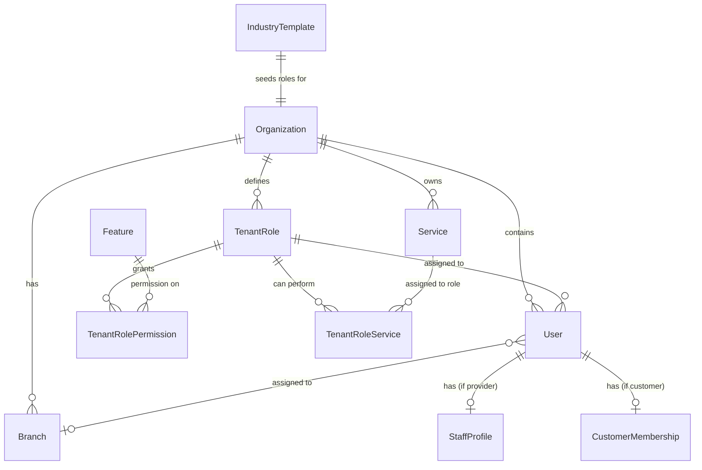
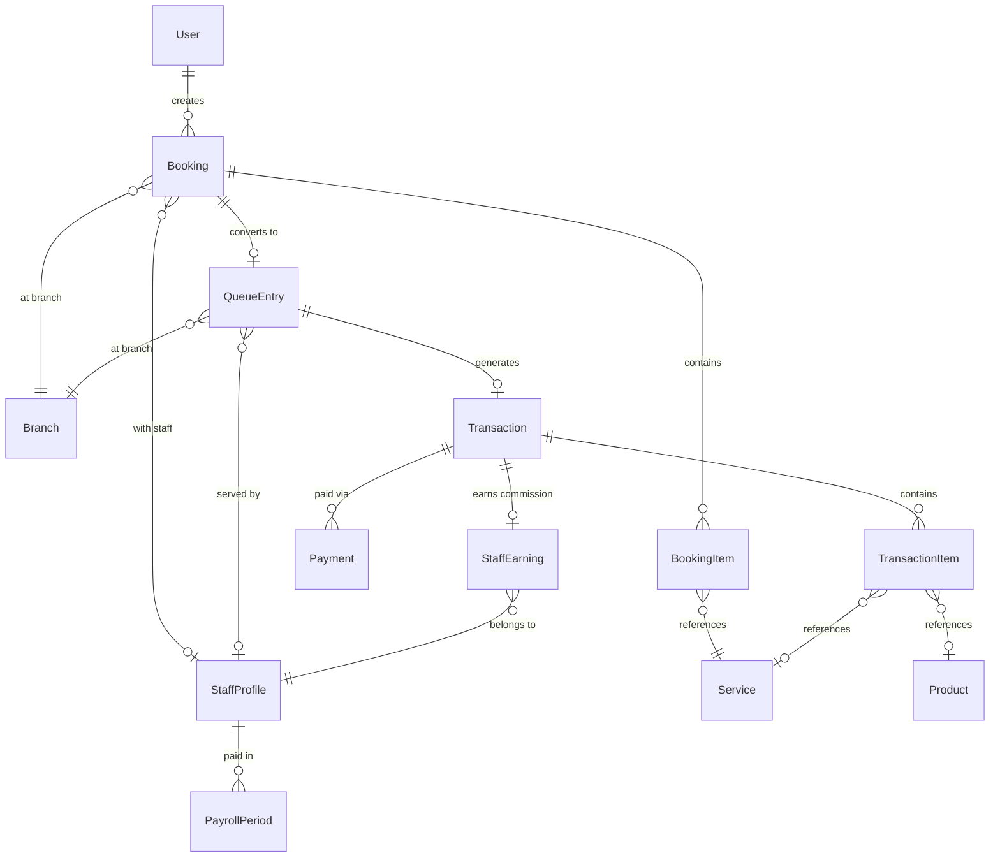
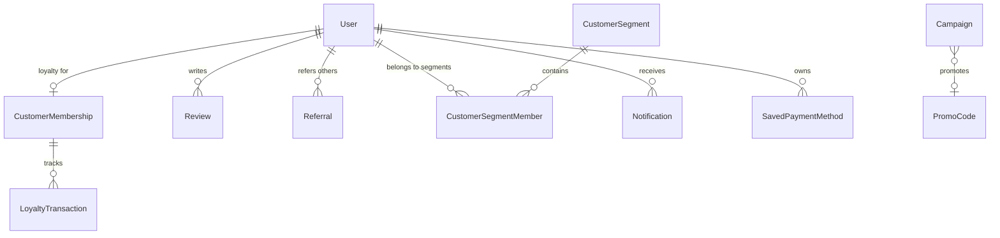

# Database Schema — Complete Prisma Reference

> Full multi-tenant schema for @tmng/saas-api. 56 models across 17 categories.
>
> For seed data documentation, see [business_logic.md §23](business_logic.md) (platform seed) and [templates/barbershop.md §5](templates/barbershop.md) (barbershop tenant seed).

---

## Change Summary vs. Current Schema

### Enums

| Action | Name | Details |
|--------|------|---------|
| REMOVED | `Role` | Replaced by `TenantRole` table |
| RENAMED | `BarberTier` -> `StaffTier` | Same values |
| RENAMED | `BarberStatus` -> `StaffStatus` | Same values |
| RENAMED | `LoyaltyTier` -> `LoyaltyTierLevel` | Avoid collision with loyalty tier concept |
| RENAMED VALUE | `TipDistribution.PER_BARBER` -> `PER_STAFF` | Generic naming |
| RENAMED VALUE | `QueueStatus.IN_CHAIR` -> `IN_SERVICE` | Generic naming |
| NEW | `PlatformRole` | PLATFORM_ADMIN, PLATFORM_SUPPORT |
| NEW | `IndustryType` | BARBERSHOP, VET_CLINIC, MASSAGE, etc. |
| NEW | `FeatureModule` | CORE, OPS, FINANCE, INTEL, ENGAGE, ADMIN |
| NEW | `RoleScope` | HQ, BRANCH, CUSTOMER |
| NEW | `AuthProvider` | EMAIL, GOOGLE |

### Models (Sprint 3 additions)

| Action | Name | Details |
|--------|------|---------|
| NEW | `Notification` | In-app notifications (push + inbox), org-scoped per user |
| NEW | `SavedPaymentMethod` | Tokenized payment cards via Xendit, org-scoped per user |

### Models (Sprint 7 additions)

| Action | Name | Details |
|--------|------|---------|
| NEW | `NotificationChannelConfig` | Per notification type push/WhatsApp/email toggle, org-scoped |
| NEW | `NotificationPreference` | Per user push/WhatsApp/email opt-out, org-scoped |

### Models (Sprint 9 additions)

| Action | Name | Details |
|--------|------|---------|
| NEW | `ReportSchedule` | Scheduled report email: `ReportFrequency` (DAILY/WEEKLY/MONTHLY), recipients, filters JSON, `nextRunAt` / `lastSentAt` |
| NEW | `SavedReportTemplate` | Named saved filter set per org for report generation |
| NEW | `WaitlistEntry` | Customer waitlist for preferred slot; `WaitlistStatus`; linked to org, branch, user |

### Enums (Sprint 9)

| Action | Name | Values |
|--------|------|--------|
| NEW | `ReportFrequency` | DAILY, WEEKLY, MONTHLY |
| NEW | `WaitlistStatus` | WAITING, NOTIFIED, CONVERTED, EXPIRED, CANCELLED |

### Field Changes (Sprint 9)

| Action | Model | Field | Details |
|--------|-------|-------|---------|
| ADDED | `QueueEntry` | `prepaidAmount Decimal?`, `prepaymentReference String?`, `refundAmount Decimal?` | Optional online prepayment + cancellation refund tracking |

### Models (Sprint 10 additions)

| Action | Name | Details |
|--------|------|---------|
| NEW | `DemandForecast` | 14-day demand predictions per branch per day; seasonal index, trend, predicted/actual demand |
| NEW | `ScheduleSuggestion` | Smart scheduling suggestions; demand-capacity gap analysis; status: PENDING/ACCEPTED/REJECTED |
| NEW | `ChurnScore` | Customer churn risk scores; weighted RFM scoring; risk level HIGH/MEDIUM/LOW |

### Field Changes (Sprint 4)

| Action | Model | Field | Details |
|--------|-------|-------|---------|
| ADDED | `Referral` | `expiresAt DateTime?` | Config-driven referral expiry; backfilled for existing PENDING referrals |

### Models

| Action | Name | Details |
|--------|------|---------|
| NEW | `PlatformAdmin` | TMNG platform staff |
| NEW | `Organization` | Tenant entity with all settings |
| NEW | `Feature` | Global feature catalog (25 features) |
| NEW | `TenantRole` | Configurable roles per org |
| NEW | `TenantRolePermission` | CRUD permission matrix |
| NEW | `TenantRoleService` | Service-to-role assignment |
| NEW | `IndustryTemplate` | Default role templates per industry |
| NEW | `CustomerMembership` | Customer loyalty/membership per org |
| RENAMED | `BarberProfile` -> `StaffProfile` | All references updated |
| RENAMED | `BarberAttendance` -> `StaffAttendance` | All references updated |
| RENAMED | `BarberEarning` -> `StaffEarning` | All references updated |
| REMOVED | `StaffAssignment` | Replaced by `User.branchId` |
| REMOVED | `LoyaltyAccount` | Replaced by `CustomerMembership` |
| MODIFIED | ~35 tenant tables | `organizationId` added to all |

### Key Field Changes on Existing Models

| Model | Added | Removed | Renamed |
|-------|-------|---------|---------|
| `User` | `organizationId`, `tenantRoleId`, `branchId`, `isCustomer`, `authProvider`, `googleId`, `emailVerified` | `role`, `favoriteBranchId`, `referralCode`, `referredById` | — |
| `Branch` | `organizationId`, `maxDiscountPercent` | — | — |
| `Booking` | `organizationId` | — | `barberProfileId` -> `staffProfileId` |
| `QueueEntry` | `organizationId` | — | `barberProfileId` -> `staffProfileId` |
| `Transaction` | `organizationId` | — | `barberProfileId` -> `staffProfileId` |
| `Review` | `organizationId` | — | `barberProfileId` -> `staffProfileId` |
| `AuditLog` | `organizationId`, `tenantRoleId` | `role` | — |
| `TierSurcharge` | `organizationId` | — | tier: `BarberTier` -> `StaffTier` |
| `CommissionTier` | — | — | `barberProfileId` -> `staffProfileId` |
| `ShiftSchedule` | — | — | `barberProfileId` -> `staffProfileId` |
| `LoyaltyTransaction` | `organizationId` | — | `loyaltyAccountId` -> `customerMembershipId` |

---

## Complete Schema

### Generator & Datasource

```prisma
generator client {
  provider = "prisma-client-js"
}

datasource db {
  provider = "postgresql"
}
```

---

### Enums

```prisma
// ============================================================================
// PLATFORM ENUMS
// ============================================================================

enum PlatformRole {
  PLATFORM_ADMIN
  PLATFORM_SUPPORT
}

enum IndustryType {
  BARBERSHOP
  VET_CLINIC
  MASSAGE
  NAIL_SALON
  SPA
  PET_GROOMING
  DENTAL_CLINIC
  AUTO_DETAILING
  BEAUTY_SALON
  TATTOO_PARLOR
  GENERAL_SERVICE
}

enum FeatureModule {
  CORE
  OPS
  FINANCE
  INTEL
  ENGAGE
  ADMIN
}

enum RoleScope {
  HQ
  BRANCH
  CUSTOMER
}

enum AuthProvider {
  EMAIL
  GOOGLE
}

// ============================================================================
// STAFF ENUMS (renamed from Barber)
// ============================================================================

enum StaffTier {
  JUNIOR
  SENIOR
  MASTER
}

enum StaffStatus {
  AVAILABLE
  BUSY
  ON_BREAK
  RESERVED
  OFF_DUTY
}

// ============================================================================
// QUEUE & BOOKING ENUMS
// ============================================================================

enum QueueSource {
  APP
  WEB
  WALK_IN
}

enum QueueStatus {
  WAITING
  CALLED
  IN_SERVICE       // renamed from IN_CHAIR
  COMPLETED
  AT_CHECKOUT
  PAID
  NO_SHOW
  CANCELLED
}

enum WaitlistStatus {
  WAITING
  NOTIFIED
  CONVERTED
  EXPIRED
  CANCELLED
}

enum BookingStatus {
  CONFIRMED
  COMPLETED
  CANCELLED
  NO_SHOW
}

// ============================================================================
// PAYMENT & TRANSACTION ENUMS
// ============================================================================

enum PaymentMethod {
  CASH
  CARD
  QRIS
  DIGITAL_WALLET
}

enum TransactionStatus {
  PENDING
  COMPLETED
  VOIDED
  REFUNDED
}

// ============================================================================
// COMMISSION & PAYROLL ENUMS
// ============================================================================

enum CommissionModel {
  FLAT_PERCENTAGE
  SLIDING_SCALE
  BASE_PLUS_BONUS
}

enum PayrollStatus {
  DRAFT
  PENDING_APPROVAL
  APPROVED
  DISPUTED
  DISBURSED
}

// ============================================================================
// LOYALTY & ENGAGEMENT ENUMS
// ============================================================================

enum LoyaltyTierLevel {
  BRONZE
  SILVER
  GOLD
  PLATINUM
}

enum ReferralStatus {
  PENDING
  COMPLETED
  EXPIRED
}

enum CampaignType {
  EMAIL
  PUSH
  IN_APP
}

enum CampaignStatus {
  DRAFT
  SCHEDULED
  ACTIVE
  COMPLETED
  CANCELLED
}

// ============================================================================
// REPORTING ENUMS (Sprint 9)
// ============================================================================

enum ReportFrequency {
  DAILY
  WEEKLY
  MONTHLY
}

// ============================================================================
// SERVICE & PRODUCT ENUMS
// ============================================================================

enum ServiceType {
  STANDARD
  COMBO
  ADD_ON
}

enum DiscountType {
  PERCENTAGE
  FIXED
}

// ============================================================================
// INVENTORY ENUMS
// ============================================================================

enum StockMovementType {
  IN
  OUT
  ADJUSTMENT
  VOID_REVERSAL
}

// ============================================================================
// OPERATIONS ENUMS
// ============================================================================

enum DayOfWeek {
  MONDAY
  TUESDAY
  WEDNESDAY
  THURSDAY
  FRIDAY
  SATURDAY
  SUNDAY
}

enum TipDistribution {
  PER_STAFF          // renamed from PER_BARBER
  POOLED
}

enum CashDrawerStatus {
  OPEN
  CLOSED
}

enum CashEntryType {
  SALE
  REFUND
  ADJUSTMENT
  FLOAT
}

// ============================================================================
// AUDIT & ANOMALY ENUMS
// ============================================================================

enum AuditAction {
  CREATE
  UPDATE
  DELETE
  VOID_TRANSACTION
  APPLY_DISCOUNT
  OVERRIDE_SCHEDULE
  CLOCK_IN
  CLOCK_OUT
  APPROVE_PAYROLL
  DISPUTE_PAYROLL
  EARN_POINTS
  REDEEM_POINTS
  TIER_UPGRADE
  REFERRAL_REWARD
  MODERATE_REVIEW
  CREATE_CAMPAIGN
  EMERGENCY_CLOSURE
  BRANCH_REOPENED
  STATUS_CHANGE
  ASSIGN_ROLE
  REMOVE_ROLE
  DEACTIVATE_USER
  BRANCH_ASSIGNMENT
  ANOMALY_FLAGGED
}

enum AnomalyType {
  EXCESSIVE_VOIDS
  HIGH_DISCOUNT
  OFF_HOURS_CLOCKIN
  UNUSUAL_REFUND
  INVENTORY_DISCREPANCY
}

enum AnomSeverity {
  LOW
  MEDIUM
  HIGH
  CRITICAL
}
```

---

### Platform-Level Models

These models are NOT scoped by `organizationId`. They belong to the TMNG platform itself.

```prisma
// ============================================================================
// PLATFORM ADMIN
// ============================================================================

model PlatformAdmin {
  id           String       @id @default(cuid())
  email        String       @unique
  passwordHash String
  firstName    String
  lastName     String
  role         PlatformRole @default(PLATFORM_SUPPORT)
  isActive     Boolean      @default(true)
  createdAt    DateTime     @default(now())
  updatedAt    DateTime     @updatedAt

  @@map("platform_admins")
}

// ============================================================================
// FEATURE CATALOG
// ============================================================================

model Feature {
  id          String        @id @default(cuid())
  code        String        @unique
  name        String
  description String?
  module      FeatureModule
  sortOrder   Int           @default(0)
  isActive    Boolean       @default(true)
  createdAt   DateTime      @default(now())

  permissions TenantRolePermission[]

  @@map("features")
}

// ============================================================================
// INDUSTRY TEMPLATE
// ============================================================================

model IndustryTemplate {
  id           String       @id @default(cuid())
  industryType IndustryType @unique
  name         String
  description  String?
  templateData Json         // { roles: [...], defaultServices: [...] }
  isActive     Boolean      @default(true)
  createdAt    DateTime     @default(now())
  updatedAt    DateTime     @updatedAt

  @@map("industry_templates")
}

// ============================================================================
// PLATFORM CONFIG
// ============================================================================

model PlatformConfig {
  key       String   @id
  value     String
  updatedBy String?
  updatedAt DateTime @updatedAt

  @@map("platform_config")
}
```

---

### Organization

```prisma
// ============================================================================
// ORGANIZATION (Tenant)
// ============================================================================

model Organization {
  id          String       @id @default(cuid())
  name        String
  slug        String       @unique   // URL-safe identifier, e.g. "budis-barbershop"
  industryType IndustryType
  logo        String?
  description String?
  contactEmail String?
  contactPhone String?
  website     String?
  address     String?
  city        String?
  country     String?

  // --- Tax Settings ---
  taxEnabled   Boolean @default(false)
  taxRate      Float   @default(0)      // e.g. 0.11 for 11%
  taxName      String  @default("Tax")  // "PPN", "VAT", "GST"
  taxInclusive Boolean @default(true)   // true = price includes tax

  // --- Currency & Locale ---
  currency       String @default("IDR")          // ISO 4217
  currencySymbol String @default("Rp")
  timezone       String @default("Asia/Jakarta") // IANA timezone
  locale         String @default("id-ID")        // BCP 47

  // --- Business Defaults ---
  tipDistribution     TipDistribution @default(PER_STAFF)
  maxDiscountPercent  Float           @default(50)
  autoNoShowMinutes   Int             @default(15)
  autoClockOutTime    String?                        // e.g. "22:00", null = disabled
  defaultBookingBuffer Int            @default(15)   // minutes between bookings
  requireVoidApproval Boolean         @default(true)

  // --- Loyalty Defaults ---
  loyaltyEnabled          Boolean @default(false)
  loyaltyPointsPerCurrency Float  @default(1)    // points earned per 1 unit of currency
  loyaltyRedemptionRate   Float   @default(100)  // points needed for 1 unit of currency

  isActive  Boolean  @default(true)
  createdAt DateTime @default(now())
  updatedAt DateTime @updatedAt

  // --- Relations ---
  users               User[]
  branches             Branch[]
  tenantRoles          TenantRole[]
  services             Service[]
  products             Product[]
  bookings             Booking[]
  queueEntries         QueueEntry[]
  transactions         Transaction[]
  promoCode            PromoCode[]
  reviews              Review[]
  campaigns            Campaign[]
  customerSegments     CustomerSegment[]
  customerMemberships  CustomerMembership[]
  referrals            Referral[]
  auditLogs            AuditLog[]
  anomalyFlags         AnomalyFlag[]
  branchDailySnapshots BranchDailySnapshot[]
  cashDrawerSessions   CashDrawerSession[]
  payrollPeriods       PayrollPeriod[]
  staffEarnings        StaffEarning[]
  loyaltyTransactions  LoyaltyTransaction[]
  stockMovements       StockMovement[]
  tenantRoleServices   TenantRoleService[]
  notifications        Notification[]
  paymentMethods       SavedPaymentMethod[]
  reportSchedules      ReportSchedule[]
  savedReportTemplates SavedReportTemplate[]
  waitlistEntries      WaitlistEntry[]

  @@map("organizations")
}
```

---

### RBAC Models

```prisma
// ============================================================================
// TENANT ROLE
// ============================================================================

model TenantRole {
  id                String    @id @default(cuid())
  organizationId    String
  name              String                       // "Owner", "Barber", "Vet", "Cashier"
  description       String?
  scope             RoleScope                    // HQ | BRANCH | CUSTOMER
  isDefault         Boolean   @default(false)    // true = seeded from industry template
  isSystemRole      Boolean   @default(false)    // true = cannot be deleted (Owner, Customer)
  isServiceProvider Boolean   @default(false)    // true = users perform services, get StaffProfile
  sortOrder         Int       @default(0)
  createdAt         DateTime  @default(now())
  updatedAt         DateTime  @updatedAt

  organization Organization          @relation(fields: [organizationId], references: [id], onDelete: Cascade)
  permissions  TenantRolePermission[]
  roleServices TenantRoleService[]
  users        User[]

  @@unique([organizationId, name])
  @@map("tenant_roles")
}

// ============================================================================
// TENANT ROLE PERMISSION
// ============================================================================

model TenantRolePermission {
  id           String  @id @default(cuid())
  tenantRoleId String
  featureCode  String
  canCreate    Boolean @default(false)
  canRead      Boolean @default(false)
  canUpdate    Boolean @default(false)
  canDelete    Boolean @default(false)

  tenantRole TenantRole @relation(fields: [tenantRoleId], references: [id], onDelete: Cascade)
  feature    Feature    @relation(fields: [featureCode], references: [code], onDelete: Cascade)

  @@unique([tenantRoleId, featureCode])
  @@map("tenant_role_permissions")
}

// ============================================================================
// TENANT ROLE SERVICE
// ============================================================================

model TenantRoleService {
  id             String @id @default(cuid())
  tenantRoleId   String
  serviceId      String
  organizationId String

  tenantRole   TenantRole   @relation(fields: [tenantRoleId], references: [id], onDelete: Cascade)
  service      Service      @relation(fields: [serviceId], references: [id], onDelete: Cascade)
  organization Organization @relation(fields: [organizationId], references: [id], onDelete: Cascade)

  @@unique([tenantRoleId, serviceId])
  @@map("tenant_role_services")
}
```

---

### User & Auth

```prisma
// ============================================================================
// USER
// ============================================================================

model User {
  id             String       @id @default(cuid())
  organizationId String
  tenantRoleId   String
  branchId       String?                          // null = HQ scope (sees all branches)
  email          String
  passwordHash   String?                          // nullable for Google OAuth users
  phone          String?
  firstName      String
  lastName       String
  avatar         String?
  isCustomer     Boolean      @default(false)     // true = customer, false = staff/admin
  isActive       Boolean      @default(true)

  // --- Google OAuth fields ---
  // authProvider: Which method the user registered with. EMAIL users have a
  //   passwordHash; GOOGLE users have a googleId and may have no password.
  authProvider  AuthProvider @default(EMAIL)
  // googleId: The "sub" claim from Google's ID token. Globally unique across
  //   all orgs — if a user uses the same Google account at two orgs, each org
  //   gets its own User record but they share the same googleId.
  googleId      String?      @unique
  // emailVerified: true if the email was confirmed via Google OAuth or an
  //   email verification flow. Google users are auto-verified.
  emailVerified Boolean      @default(false)

  createdAt DateTime @default(now())
  updatedAt DateTime @updatedAt

  // --- Relations ---
  organization       Organization          @relation(fields: [organizationId], references: [id], onDelete: Cascade)
  tenantRole         TenantRole            @relation(fields: [tenantRoleId], references: [id])
  branch             Branch?               @relation("BranchStaff", fields: [branchId], references: [id])
  staffProfile       StaffProfile?
  customerMembership CustomerMembership?
  bookings           Booking[]
  reviews            Review[]
  auditLogs          AuditLog[]
  refreshTokens      RefreshToken[]
  cashDrawerSessions CashDrawerSession[]
  referralsGiven     Referral[]            @relation("referrals_given")
  referralsReceived  Referral[]            @relation("referrals_received")
  segmentMemberships CustomerSegmentMember[]
  anomalyFlags       AnomalyFlag[]         @relation("anomaly_flags")
  notifications      Notification[]
  paymentMethods     SavedPaymentMethod[]
  waitlistEntries    WaitlistEntry[]

  @@unique([organizationId, email])
  @@unique([organizationId, phone])
  @@index([organizationId])
  @@index([tenantRoleId])
  @@map("users")
}

// ============================================================================
// REFRESH TOKEN
// ============================================================================

model RefreshToken {
  id             String   @id @default(cuid())
  token          String   @unique
  userId         String
  organizationId String
  expiresAt      DateTime
  createdAt      DateTime @default(now())

  user User @relation(fields: [userId], references: [id], onDelete: Cascade)

  @@index([userId])
  @@map("refresh_tokens")
}
```

---

### Branch

```prisma
// ============================================================================
// BRANCH
// ============================================================================

model Branch {
  id                 String   @id @default(cuid())
  organizationId     String
  name               String
  address            String
  city               String
  phone              String?
  email              String?
  latitude           Float?
  longitude          Float?
  imageUrl           String?
  isActive           Boolean          @default(true)
  isEmergencyClosed  Boolean          @default(false)
  tipDistribution    TipDistribution? // null = use org default
  maxDiscountPercent Float?           // null = use org default
  averageRating      Float            @default(0)
  totalReviews       Int              @default(0)
  createdAt          DateTime         @default(now())
  updatedAt          DateTime         @updatedAt

  organization       Organization          @relation(fields: [organizationId], references: [id], onDelete: Cascade)
  users              User[]                @relation("BranchStaff")
  operatingHours     OperatingHour[]
  serviceOverrides   BranchServiceOverride[]
  queueEntries       QueueEntry[]
  bookings           Booking[]
  transactions       Transaction[]
  inventory          BranchInventory[]
  surgeRules         SurgeRule[]
  promoCodes         PromoCode[]
  auditLogs          AuditLog[]
  cashDrawerSessions CashDrawerSession[]
  reviews            Review[]
  customerSegments   CustomerSegment[]
  campaigns          Campaign[]
  holidays           BranchHoliday[]
  dailySnapshots     BranchDailySnapshot[]
  anomalyFlags       AnomalyFlag[]
  waitlistEntries    WaitlistEntry[]

  @@index([organizationId])
  @@map("branches")
}

// ============================================================================
// OPERATING HOUR
// ============================================================================

model OperatingHour {
  id             String    @id @default(cuid())
  branchId       String
  organizationId String
  dayOfWeek      DayOfWeek
  openTime       String    // "09:00"
  closeTime      String    // "21:00"
  isClosed       Boolean   @default(false)

  branch Branch @relation(fields: [branchId], references: [id], onDelete: Cascade)

  @@unique([branchId, dayOfWeek])
  @@map("operating_hours")
}

// ============================================================================
// BRANCH HOLIDAY
// ============================================================================

model BranchHoliday {
  id             String   @id @default(cuid())
  branchId       String
  organizationId String
  date           DateTime @db.Date
  name           String
  isClosed       Boolean  @default(true)
  openTime       String?
  closeTime      String?
  createdAt      DateTime @default(now())

  branch Branch @relation(fields: [branchId], references: [id], onDelete: Cascade)

  @@unique([branchId, date])
  @@map("branch_holidays")
}
```

---

### Staff (renamed from Barber)

```prisma
// ============================================================================
// STAFF PROFILE (renamed from BarberProfile)
// ============================================================================

model StaffProfile {
  id              String          @id @default(cuid())
  userId          String          @unique
  organizationId  String
  bio             String?
  specialties     String[]
  tier            StaffTier       @default(JUNIOR)
  status          StaffStatus     @default(OFF_DUTY)
  commissionModel CommissionModel @default(FLAT_PERCENTAGE)
  commissionRate  Float           @default(0.4)
  baseSalary      Float?
  bonusRate       Float?
  averageRating   Float           @default(0)
  totalReviews    Int             @default(0)

  user            User               @relation(fields: [userId], references: [id], onDelete: Cascade)
  attendances     StaffAttendance[]
  queueEntries    QueueEntry[]
  bookings        Booking[]
  earnings        StaffEarning[]
  shiftSchedules  ShiftSchedule[]
  reviews         Review[]
  commissionTiers CommissionTier[]
  payrollPeriods  PayrollPeriod[]

  @@index([organizationId])
  @@map("staff_profiles")
}

// ============================================================================
// COMMISSION TIER
// ============================================================================

model CommissionTier {
  id             String @id @default(cuid())
  staffProfileId String
  minRevenue     Float
  maxRevenue     Float?
  rate           Float

  staff StaffProfile @relation(fields: [staffProfileId], references: [id], onDelete: Cascade)

  @@unique([staffProfileId, minRevenue])
  @@map("commission_tiers")
}

// ============================================================================
// STAFF ATTENDANCE (renamed from BarberAttendance)
// ============================================================================

model StaffAttendance {
  id             String    @id @default(cuid())
  staffProfileId String
  organizationId String
  clockIn        DateTime
  clockOut       DateTime?
  autoClockOut   Boolean   @default(false)
  createdAt      DateTime  @default(now())

  staff StaffProfile @relation(fields: [staffProfileId], references: [id], onDelete: Cascade)

  @@index([staffProfileId, clockIn])
  @@map("staff_attendances")
}

// ============================================================================
// SHIFT SCHEDULE
// ============================================================================

model ShiftSchedule {
  id             String   @id @default(cuid())
  staffProfileId String
  organizationId String
  date           DateTime @db.Date
  startTime      String   // "09:00"
  endTime        String   // "17:00"
  isLeave        Boolean  @default(false)
  note           String?

  staff StaffProfile @relation(fields: [staffProfileId], references: [id], onDelete: Cascade)

  @@unique([staffProfileId, date])
  @@map("shift_schedules")
}
```

---

### Service Catalog

```prisma
// ============================================================================
// SERVICE
// ============================================================================

model Service {
  id               String      @id @default(cuid())
  organizationId   String
  name             String
  description      String?
  category         String      // "HAIRCUT", "SHAVE", "TREATMENT", etc.
  type             ServiceType @default(STANDARD)
  basePrice        Float
  durationMinutes  Int
  bufferMinutes    Int         @default(5)
  isCommissionable Boolean     @default(true)
  loyaltyEligible  Boolean     @default(true)
  isActive         Boolean     @default(true)
  sortOrder        Int         @default(0)
  createdAt        DateTime    @default(now())
  updatedAt        DateTime    @updatedAt

  organization     Organization          @relation(fields: [organizationId], references: [id], onDelete: Cascade)
  comboChildren    ComboService[]        @relation("ComboParent")
  comboParents     ComboService[]        @relation("ComboChild")
  branchOverrides  BranchServiceOverride[]
  tierSurcharges   TierSurcharge[]
  bookingItems     BookingItem[]
  transactionItems TransactionItem[]
  roleServices     TenantRoleService[]

  @@index([organizationId])
  @@map("services")
}

// ============================================================================
// COMBO SERVICE
// ============================================================================

model ComboService {
  id             String @id @default(cuid())
  comboId        String
  childServiceId String
  organizationId String

  combo        Service @relation("ComboParent", fields: [comboId], references: [id], onDelete: Cascade)
  childService Service @relation("ComboChild", fields: [childServiceId], references: [id], onDelete: Cascade)

  @@unique([comboId, childServiceId])
  @@map("combo_services")
}

// ============================================================================
// TIER SURCHARGE
// ============================================================================

model TierSurcharge {
  id             String    @id @default(cuid())
  serviceId      String
  organizationId String
  tier           StaffTier // renamed from BarberTier
  surcharge      Float

  service Service @relation(fields: [serviceId], references: [id], onDelete: Cascade)

  @@unique([serviceId, tier])
  @@map("tier_surcharges")
}

// ============================================================================
// BRANCH SERVICE OVERRIDE
// ============================================================================

model BranchServiceOverride {
  id             String  @id @default(cuid())
  branchId       String
  serviceId      String
  organizationId String
  overridePrice  Float?
  isActive       Boolean @default(true)

  branch  Branch  @relation(fields: [branchId], references: [id], onDelete: Cascade)
  service Service @relation(fields: [serviceId], references: [id], onDelete: Cascade)

  @@unique([branchId, serviceId])
  @@map("branch_service_overrides")
}

// ============================================================================
// SURGE RULE
// ============================================================================

model SurgeRule {
  id             String    @id @default(cuid())
  branchId       String
  organizationId String
  name           String    @default("")
  dayOfWeek      DayOfWeek
  startHour      Int
  endHour        Int
  multiplier     Float     @default(1.0)
  isActive       Boolean   @default(true)

  branch Branch @relation(fields: [branchId], references: [id], onDelete: Cascade)

  @@map("surge_rules")
}
```

---

### Booking & Queue

```prisma
// ============================================================================
// BOOKING
// ============================================================================

model Booking {
  id             String        @id @default(cuid())
  organizationId String
  customerId     String
  branchId       String
  staffProfileId String?       // null = "any available" (renamed from barberProfileId)
  status         BookingStatus @default(CONFIRMED)
  scheduledAt    DateTime
  totalDuration  Int
  note           String?
  cancelledAt    DateTime?
  createdAt      DateTime      @default(now())
  updatedAt      DateTime      @updatedAt

  organization Organization  @relation(fields: [organizationId], references: [id], onDelete: Cascade)
  customer     User          @relation(fields: [customerId], references: [id])
  branch       Branch        @relation(fields: [branchId], references: [id])
  staff        StaffProfile? @relation(fields: [staffProfileId], references: [id])
  items        BookingItem[]
  queueEntry   QueueEntry?

  @@index([branchId, scheduledAt])
  @@index([customerId])
  @@index([organizationId])
  @@map("bookings")
}

// ============================================================================
// BOOKING ITEM
// ============================================================================

model BookingItem {
  id             String  @id @default(cuid())
  bookingId      String
  serviceId      String
  organizationId String
  price          Float
  isAddOn        Boolean @default(false)

  booking Booking @relation(fields: [bookingId], references: [id], onDelete: Cascade)
  service Service @relation(fields: [serviceId], references: [id])

  @@map("booking_items")
}

// ============================================================================
// QUEUE ENTRY
// ============================================================================

model QueueEntry {
  id             String      @id @default(cuid())
  organizationId String
  branchId       String
  staffProfileId String?     // renamed from barberProfileId
  bookingId      String?     @unique
  source         QueueSource
  status         QueueStatus @default(WAITING)
  position       Int
  customerName   String?
  customerId     String?
  estimatedWait  Int?
  calledAt       DateTime?
  startedAt      DateTime?   // IN_SERVICE time (renamed concept from IN_CHAIR)
  completedAt    DateTime?
  prepaidAmount        Decimal?  // Sprint 9: optional online prepayment
  prepaymentReference  String?   // e.g. Xendit invoice id
  refundAmount         Decimal?  // Sprint 9: partial/full refund on penalized cancel
  createdAt      DateTime    @default(now())
  updatedAt      DateTime    @updatedAt

  organization Organization  @relation(fields: [organizationId], references: [id], onDelete: Cascade)
  branch       Branch        @relation(fields: [branchId], references: [id])
  staff        StaffProfile? @relation(fields: [staffProfileId], references: [id])
  booking      Booking?      @relation(fields: [bookingId], references: [id])
  transaction  Transaction?

  @@index([branchId, status])
  @@index([branchId, createdAt])
  @@index([staffProfileId, status])
  @@index([organizationId])
  @@map("queue_entries")
}

model WaitlistEntry {
  id                String         @id @default(cuid())
  organizationId    String
  branchId          String
  userId            String
  customerName      String
  preferredDate     DateTime
  preferredTimeSlot String
  serviceIds        String[]
  staffProfileId    String?
  status            WaitlistStatus @default(WAITING)
  notifiedAt        DateTime?
  expiresAt         DateTime
  createdAt         DateTime       @default(now())

  organization Organization @relation(fields: [organizationId], references: [id], onDelete: Cascade)
  branch       Branch        @relation(fields: [branchId], references: [id], onDelete: Cascade)
  user         User          @relation(fields: [userId], references: [id], onDelete: Cascade)

  @@index([branchId, preferredDate])
  @@index([organizationId])
  @@map("waitlist_entries")
}
```

---

### Transactions & POS

```prisma
// ============================================================================
// TRANSACTION
// ============================================================================

model Transaction {
  id                  String            @id @default(cuid())
  organizationId      String
  branchId            String
  queueEntryId        String?           @unique
  staffProfileId      String?           // renamed from barberProfileId
  customerId          String?
  grossAmount         Float
  discountAmount      Float             @default(0)
  taxAmount           Float             @default(0)
  tipAmount           Float             @default(0)
  netAmount           Float
  totalDue            Float
  loyaltyPointsUsed   Int               @default(0)
  loyaltyPointsEarned Int               @default(0)
  promoCode           String?
  status              TransactionStatus @default(PENDING)
  clientUuid          String?           @unique
  createdAt           DateTime          @default(now())
  updatedAt           DateTime          @updatedAt

  organization Organization      @relation(fields: [organizationId], references: [id], onDelete: Cascade)
  branch       Branch            @relation(fields: [branchId], references: [id])
  queueEntry   QueueEntry?       @relation(fields: [queueEntryId], references: [id])
  items        TransactionItem[]
  payments     Payment[]

  @@index([branchId, createdAt])
  @@index([organizationId])
  @@map("transactions")
}

// ============================================================================
// TRANSACTION ITEM
// ============================================================================

model TransactionItem {
  id             String  @id @default(cuid())
  transactionId  String
  serviceId      String?
  productId      String?
  organizationId String
  name           String
  quantity       Int     @default(1)
  unitPrice      Float
  discount       Float   @default(0)
  total          Float
  isAddOn        Boolean @default(false)

  transaction Transaction @relation(fields: [transactionId], references: [id], onDelete: Cascade)
  service     Service?    @relation(fields: [serviceId], references: [id])
  product     Product?    @relation(fields: [productId], references: [id])

  @@map("transaction_items")
}

// ============================================================================
// PAYMENT
// ============================================================================

model Payment {
  id             String        @id @default(cuid())
  transactionId  String
  organizationId String
  method         PaymentMethod
  amount         Float
  reference      String?
  createdAt      DateTime      @default(now())

  transaction Transaction @relation(fields: [transactionId], references: [id], onDelete: Cascade)

  @@map("payments")
}
```

---

### Commission & Payroll

```prisma
// ============================================================================
// STAFF EARNING (renamed from BarberEarning)
// ============================================================================

model StaffEarning {
  id             String   @id @default(cuid())
  staffProfileId String
  organizationId String
  date           DateTime @db.Date
  commissionBase Float
  commission     Float
  tips           Float    @default(0)
  total          Float
  createdAt      DateTime @default(now())

  staff StaffProfile @relation(fields: [staffProfileId], references: [id], onDelete: Cascade)
  organization Organization @relation(fields: [organizationId], references: [id], onDelete: Cascade)

  @@unique([staffProfileId, date])
  @@map("staff_earnings")
}

// ============================================================================
// PAYROLL PERIOD
// ============================================================================

model PayrollPeriod {
  id              String        @id @default(cuid())
  staffProfileId  String
  organizationId  String
  periodStart     DateTime      @db.Date
  periodEnd       DateTime      @db.Date
  totalCommission Float
  totalTips       Float
  totalPayout     Float
  status          PayrollStatus @default(DRAFT)
  approvedBy      String?
  approvedAt      DateTime?
  note            String?
  createdAt       DateTime      @default(now())
  updatedAt       DateTime      @updatedAt

  staff        StaffProfile @relation(fields: [staffProfileId], references: [id], onDelete: Cascade)
  organization Organization @relation(fields: [organizationId], references: [id], onDelete: Cascade)

  @@index([staffProfileId, periodStart])
  @@index([organizationId])
  @@map("payroll_periods")
}
```

---

### Customer Membership & Loyalty

```prisma
// ============================================================================
// CUSTOMER MEMBERSHIP (replaces LoyaltyAccount)
// ============================================================================

model CustomerMembership {
  id               String           @id @default(cuid())
  userId           String
  organizationId   String
  pointsBalance    Int              @default(0)
  lifetimePoints   Int              @default(0)
  tier             LoyaltyTierLevel @default(BRONZE)
  tierMultiplier   Float            @default(1.0)
  referralCode     String?
  pointsExpiringAt DateTime?
  lastActivityAt   DateTime?
  createdAt        DateTime         @default(now())
  updatedAt        DateTime         @updatedAt

  user         User                 @relation(fields: [userId], references: [id], onDelete: Cascade)
  organization Organization         @relation(fields: [organizationId], references: [id], onDelete: Cascade)
  transactions LoyaltyTransaction[]

  @@unique([userId, organizationId])
  @@unique([organizationId, referralCode])
  @@map("customer_memberships")
}

// ============================================================================
// LOYALTY TRANSACTION
// ============================================================================

model LoyaltyTransaction {
  id                   String   @id @default(cuid())
  customerMembershipId String   // renamed from loyaltyAccountId
  organizationId       String
  points               Int      // positive = earn, negative = redeem
  description          String
  transactionId        String?
  createdAt            DateTime @default(now())

  membership   CustomerMembership @relation(fields: [customerMembershipId], references: [id], onDelete: Cascade)
  organization Organization      @relation(fields: [organizationId], references: [id], onDelete: Cascade)

  @@index([customerMembershipId, createdAt])
  @@map("loyalty_transactions")
}
```

---

### Promo Codes & Reviews

```prisma
// ============================================================================
// PROMO CODE
// ============================================================================

model PromoCode {
  id             String       @id @default(cuid())
  organizationId String
  code           String
  description    String?
  type           DiscountType
  value          Float
  minGrossAmount Float        @default(0)
  maxDiscount    Float?
  usageLimit     Int?
  usageCount     Int          @default(0)
  startDate      DateTime     @default(now())
  endDate        DateTime?
  isActive       Boolean      @default(true)
  branchId       String?
  createdAt      DateTime     @default(now())
  updatedAt      DateTime     @updatedAt

  organization Organization @relation(fields: [organizationId], references: [id], onDelete: Cascade)
  branch       Branch?      @relation(fields: [branchId], references: [id])
  campaigns    Campaign[]

  @@unique([organizationId, code])
  @@map("promo_codes")
}

// ============================================================================
// REVIEW
// ============================================================================

model Review {
  id             String   @id @default(cuid())
  organizationId String
  customerId     String
  staffProfileId String?  // renamed from barberProfileId
  branchId       String?
  queueEntryId   String?
  rating         Int      // 1-5
  comment        String?
  photoUrls      String[]
  isVisible      Boolean  @default(true)
  createdAt      DateTime @default(now())

  organization Organization  @relation(fields: [organizationId], references: [id], onDelete: Cascade)
  customer     User          @relation(fields: [customerId], references: [id])
  staff        StaffProfile? @relation(fields: [staffProfileId], references: [id])
  branch       Branch?       @relation(fields: [branchId], references: [id])

  @@unique([customerId, queueEntryId])
  @@index([branchId])
  @@index([staffProfileId])
  @@index([organizationId])
  @@map("reviews")
}
```

---

### Referrals

```prisma
// ============================================================================
// REFERRAL
// ============================================================================

model Referral {
  id             String         @id @default(cuid())
  organizationId String
  referrerId     String
  refereeId      String
  bonusPoints    Int            @default(10)
  status         ReferralStatus @default(PENDING)
  expiresAt      DateTime?
  completedAt    DateTime?
  createdAt      DateTime       @default(now())

  organization Organization @relation(fields: [organizationId], references: [id], onDelete: Cascade)
  referrer     User         @relation("referrals_given", fields: [referrerId], references: [id])
  referee      User         @relation("referrals_received", fields: [refereeId], references: [id])

  @@unique([referrerId, refereeId])
  @@map("referrals")
}
```

---

### Inventory & Products

```prisma
// ============================================================================
// PRODUCT
// ============================================================================

model Product {
  id             String   @id @default(cuid())
  organizationId String
  name           String
  sku            String
  description    String?
  costPrice      Float
  sellPrice      Float
  imageUrl       String?
  isActive       Boolean  @default(true)
  createdAt      DateTime @default(now())
  updatedAt      DateTime @updatedAt

  organization     Organization      @relation(fields: [organizationId], references: [id], onDelete: Cascade)
  inventory        BranchInventory[]
  stockMovements   StockMovement[]
  transactionItems TransactionItem[]

  @@unique([organizationId, sku])
  @@map("products")
}

// ============================================================================
// BRANCH INVENTORY
// ============================================================================

model BranchInventory {
  id               String @id @default(cuid())
  branchId         String
  productId        String
  organizationId   String
  quantity         Int    @default(0)
  reorderThreshold Int    @default(5)
  avgCost          Float  @default(0)

  branch  Branch  @relation(fields: [branchId], references: [id], onDelete: Cascade)
  product Product @relation(fields: [productId], references: [id], onDelete: Cascade)

  @@unique([branchId, productId])
  @@map("branch_inventory")
}

// ============================================================================
// STOCK MOVEMENT
// ============================================================================

model StockMovement {
  id             String            @id @default(cuid())
  productId      String
  branchId       String
  organizationId String
  type           StockMovementType
  quantity       Int
  costPerUnit    Float?
  note           String?
  createdAt      DateTime          @default(now())

  product      Product      @relation(fields: [productId], references: [id])
  organization Organization @relation(fields: [organizationId], references: [id], onDelete: Cascade)

  @@index([productId, branchId, createdAt])
  @@map("stock_movements")
}
```

---

### Cash Drawer

```prisma
// ============================================================================
// CASH DRAWER SESSION
// ============================================================================

model CashDrawerSession {
  id              String           @id @default(cuid())
  branchId        String
  organizationId  String
  openedById      String
  openingBalance  Float
  closingBalance  Float?
  expectedBalance Float?
  discrepancy     Float?
  status          CashDrawerStatus @default(OPEN)
  openedAt        DateTime         @default(now())
  closedAt        DateTime?
  notes           String?

  organization Organization      @relation(fields: [organizationId], references: [id], onDelete: Cascade)
  branch       Branch            @relation(fields: [branchId], references: [id])
  openedBy     User              @relation(fields: [openedById], references: [id])
  entries      CashDrawerEntry[]

  @@index([branchId, status])
  @@map("cash_drawer_sessions")
}

// ============================================================================
// CASH DRAWER ENTRY
// ============================================================================

model CashDrawerEntry {
  id             String        @id @default(cuid())
  sessionId      String
  organizationId String
  type           CashEntryType
  amount         Float
  reference      String?
  createdAt      DateTime      @default(now())

  session CashDrawerSession @relation(fields: [sessionId], references: [id], onDelete: Cascade)

  @@index([sessionId])
  @@map("cash_drawer_entries")
}
```

---

### CRM & Campaigns

```prisma
// ============================================================================
// CUSTOMER SEGMENT
// ============================================================================

model CustomerSegment {
  id             String   @id @default(cuid())
  organizationId String
  branchId       String?
  name           String
  rules          Json
  isAutomatic    Boolean  @default(true)
  createdAt      DateTime @default(now())
  updatedAt      DateTime @updatedAt

  organization Organization          @relation(fields: [organizationId], references: [id], onDelete: Cascade)
  branch       Branch?               @relation(fields: [branchId], references: [id])
  members      CustomerSegmentMember[]

  @@map("customer_segments")
}

// ============================================================================
// CUSTOMER SEGMENT MEMBER
// ============================================================================

model CustomerSegmentMember {
  id             String   @id @default(cuid())
  segmentId      String
  customerId     String
  organizationId String
  addedAt        DateTime @default(now())

  segment  CustomerSegment @relation(fields: [segmentId], references: [id], onDelete: Cascade)
  customer User            @relation(fields: [customerId], references: [id], onDelete: Cascade)

  @@unique([segmentId, customerId])
  @@map("customer_segment_members")
}

// ============================================================================
// CAMPAIGN
// ============================================================================

model Campaign {
  id             String         @id @default(cuid())
  organizationId String
  branchId       String?
  name           String
  description    String?
  type           CampaignType
  promoCodeId    String?
  segmentId      String?
  status         CampaignStatus @default(DRAFT)
  startsAt       DateTime
  endsAt         DateTime?
  sentCount      Int            @default(0)
  openCount      Int            @default(0)
  createdAt      DateTime       @default(now())
  updatedAt      DateTime       @updatedAt

  organization Organization @relation(fields: [organizationId], references: [id], onDelete: Cascade)
  branch       Branch?      @relation(fields: [branchId], references: [id])
  promoCode    PromoCode?   @relation(fields: [promoCodeId], references: [id])

  @@index([branchId, status])
  @@index([organizationId])
  @@map("campaigns")
}
```

---

### Audit Log

```prisma
// ============================================================================
// AUDIT LOG
// ============================================================================

model AuditLog {
  id             String      @id @default(cuid())
  organizationId String
  userId         String?
  tenantRoleId   String?     // replaces the old `role Role?` field
  branchId       String?
  action         AuditAction
  entityType     String
  entityId       String
  details        Json?       // { before: {...}, after: {...} }
  ipAddress      String?
  createdAt      DateTime    @default(now())

  organization Organization @relation(fields: [organizationId], references: [id], onDelete: Cascade)
  user         User?        @relation(fields: [userId], references: [id])
  branch       Branch?      @relation(fields: [branchId], references: [id])

  @@index([branchId, createdAt])
  @@index([userId, createdAt])
  @@index([action, createdAt])
  @@index([organizationId])
  @@map("audit_logs")
}
```

---

### Analytics

```prisma
// ============================================================================
// BRANCH DAILY SNAPSHOT
// ============================================================================

model BranchDailySnapshot {
  id               String   @id @default(cuid())
  branchId         String
  organizationId   String
  date             DateTime @db.Date
  totalRevenue     Float    @default(0)
  serviceRevenue   Float    @default(0)
  productRevenue   Float    @default(0)
  totalTips        Float    @default(0)
  transactionCount Int      @default(0)
  customerCount    Int      @default(0)
  walkInCount      Int      @default(0)
  onlineCount      Int      @default(0)
  avgTransValue    Float    @default(0)
  topServiceId     String?
  createdAt        DateTime @default(now())

  organization Organization @relation(fields: [organizationId], references: [id], onDelete: Cascade)
  branch       Branch       @relation(fields: [branchId], references: [id])

  @@unique([branchId, date])
  @@index([date])
  @@index([organizationId])
  @@map("branch_daily_snapshots")
}

// ============================================================================
// ANOMALY FLAG
// ============================================================================

model AnomalyFlag {
  id             String       @id @default(cuid())
  branchId       String
  organizationId String
  userId         String?
  type           AnomalyType
  severity       AnomSeverity @default(MEDIUM)
  details        Json
  isResolved     Boolean      @default(false)
  resolvedBy     String?
  resolvedAt     DateTime?
  createdAt      DateTime     @default(now())

  organization Organization @relation(fields: [organizationId], references: [id], onDelete: Cascade)
  branch       Branch       @relation(fields: [branchId], references: [id])
  user         User?        @relation("anomaly_flags", fields: [userId], references: [id])

  @@index([branchId, createdAt])
  @@index([organizationId])
  @@map("anomaly_flags")
}
```

---

### Payment Methods

```prisma
// ============================================================================
// SAVED PAYMENT METHODS (Xendit tokenization)
// ============================================================================

model SavedPaymentMethod {
  id             String   @id @default(cuid())
  organizationId String
  userId         String
  tokenId        String
  type           String   @default("CARD")
  last4          String
  expiryMonth    Int
  expiryYear     Int
  isDefault      Boolean  @default(false)
  createdAt      DateTime @default(now())

  organization Organization @relation(fields: [organizationId], references: [id], onDelete: Cascade)
  user         User         @relation(fields: [userId], references: [id], onDelete: Cascade)

  @@index([userId])
  @@index([organizationId])
  @@map("payment_methods")
}
```

---

### Notifications

```prisma
// ============================================================================
// NOTIFICATIONS (In-app notification inbox)
// ============================================================================

model Notification {
  id             String   @id @default(cuid())
  organizationId String
  userId         String
  title          String
  body           String
  type           String
  data           Json?
  read           Boolean  @default(false)
  createdAt      DateTime @default(now())

  organization Organization @relation(fields: [organizationId], references: [id], onDelete: Cascade)
  user         User         @relation(fields: [userId], references: [id], onDelete: Cascade)

  @@index([userId, read])
  @@index([organizationId])
  @@map("notifications")
}
```

### Notification Channel Config (Sprint 7)

```prisma
model NotificationChannelConfig {
  id               String   @id @default(cuid())
  organizationId   String
  notificationType String   // "BOOKING_CONFIRMED", etc.
  pushEnabled      Boolean  @default(true)
  whatsappEnabled  Boolean  @default(false)
  smsEnabled       Boolean  @default(false)
  emailEnabled     Boolean  @default(true)
  updatedAt        DateTime @updatedAt

  organization Organization @relation(fields: [organizationId], references: [id], onDelete: Cascade)

  @@unique([organizationId, notificationType])
  @@map("notification_channel_configs")
}

model NotificationPreference {
  id             String   @id @default(cuid())
  organizationId String
  userId         String   @unique
  pushOptOut     Boolean  @default(false)
  whatsappOptOut Boolean  @default(false)
  smsOptOut      Boolean  @default(false)
  emailOptOut    Boolean  @default(false)
  createdAt      DateTime @default(now())
  updatedAt      DateTime @updatedAt

  organization Organization @relation(fields: [organizationId], references: [id], onDelete: Cascade)
  user         User         @relation(fields: [userId], references: [id], onDelete: Cascade)

  @@map("notification_preferences")
}
```

### Report schedules & saved templates (Sprint 9)

```prisma
model ReportSchedule {
  id             String          @id @default(cuid())
  organizationId String
  branchId       String?
  reportType     String
  frequency      ReportFrequency
  recipients     String[]
  filters        Json            @default("{}")
  isActive       Boolean         @default(true)
  lastSentAt     DateTime?
  nextRunAt      DateTime
  createdBy      String
  createdAt      DateTime        @default(now())
  updatedAt      DateTime        @updatedAt

  organization Organization @relation(fields: [organizationId], references: [id], onDelete: Restrict, onUpdate: Cascade)

  @@index([organizationId, isActive, nextRunAt])
}

model SavedReportTemplate {
  id             String       @id @default(cuid())
  organizationId String
  name           String
  reportType     String
  filters        Json         @default("{}")
  createdBy      String
  createdAt      DateTime     @default(now())
  updatedAt      DateTime     @updatedAt

  organization Organization @relation(fields: [organizationId], references: [id], onDelete: Restrict, onUpdate: Cascade)

  @@index([organizationId])
}
```

### Demand Forecasting, Smart Scheduling & Churn (Sprint 10)

```prisma
enum SuggestionStatus {
  PENDING
  ACCEPTED
  REJECTED
}

enum ChurnRiskLevel {
  LOW
  MEDIUM
  HIGH
  CRITICAL
}

model DemandForecast {
  id                    String   @id @default(cuid())
  branchId              String
  organizationId        String
  date                  DateTime @db.Date
  predictedTransactions Float    @default(0)
  predictedRevenue      Float    @default(0)
  confidenceLow         Float    @default(0)
  confidenceHigh        Float    @default(0)
  dayOfWeek             Int
  isHoliday             Boolean  @default(false)
  createdAt             DateTime @default(now())

  organization Organization @relation(...)
  branch       Branch       @relation(...)

  @@unique([branchId, date])
  @@index([organizationId])
  @@map("demand_forecasts")
}

model ScheduleSuggestion {
  id              String           @id @default(cuid())
  branchId        String
  organizationId  String
  staffProfileId  String?
  date            DateTime         @db.Date
  suggestedStart  String
  suggestedEnd    String
  reason          String
  demandScore     Float            @default(0)
  status          SuggestionStatus @default(PENDING)
  createdAt       DateTime         @default(now())
  updatedAt       DateTime         @updatedAt

  organization Organization @relation(...)
  branch       Branch       @relation(...)

  @@index([branchId, date])
  @@index([organizationId])
  @@map("schedule_suggestions")
}

model ChurnScore {
  id             String         @id @default(cuid())
  customerId     String
  branchId       String
  organizationId String
  score          Float
  riskLevel      ChurnRiskLevel
  features       Json
  computedAt     DateTime       @default(now())

  organization Organization @relation(...)
  branch       Branch       @relation(...)
  customer     User         @relation(...)

  @@unique([customerId, branchId])
  @@index([branchId, riskLevel])
  @@index([organizationId])
  @@map("churn_scores")
}
```

---

## Entity Relationship Diagram

### Core Multi-Tenancy & RBAC



### Booking & Transaction Flow



### Customer Engagement



---

## Model Count

| Category | Models | Count |
|----------|--------|-------|
| Platform | PlatformAdmin, Feature, IndustryTemplate, PlatformConfig | 4 |
| Organization | Organization | 1 |
| RBAC | TenantRole, TenantRolePermission, TenantRoleService | 3 |
| User & Auth | User, RefreshToken | 2 |
| Branch | Branch, OperatingHour, BranchHoliday | 3 |
| Staff | StaffProfile, CommissionTier, StaffAttendance, ShiftSchedule | 4 |
| Services | Service, ComboService, TierSurcharge, BranchServiceOverride, SurgeRule | 5 |
| Booking & Queue | Booking, BookingItem, QueueEntry | 3 |
| Transactions | Transaction, TransactionItem, Payment | 3 |
| Commission & Payroll | StaffEarning, PayrollPeriod | 2 |
| Customer & Loyalty | CustomerMembership, LoyaltyTransaction, PromoCode, Review, Referral | 5 |
| Inventory | Product, BranchInventory, StockMovement | 3 |
| Cash Drawer | CashDrawerSession, CashDrawerEntry | 2 |
| CRM & Campaigns | CustomerSegment, CustomerSegmentMember, Campaign | 3 |
| Audit & Analytics | AuditLog, BranchDailySnapshot, AnomalyFlag | 3 |
| Notifications | Notification, NotificationChannelConfig, NotificationPreference | 3 |
| Payment Methods | SavedPaymentMethod | 1 |
| Waitlist (Sprint 9) | WaitlistEntry | 1 |
| Reporting (Sprint 9) | ReportSchedule, SavedReportTemplate | 2 |
| Forecasting & Scheduling (Sprint 10) | DemandForecast, ScheduleSuggestion, ChurnScore | 3 |
| **Total** | | **56** |

---

## Key Unique Constraints

| Model | Constraint | Purpose |
|-------|-----------|---------|
| `Organization` | `slug` | URL-safe org identifier |
| `User` | `[organizationId, email]` | Email unique per org |
| `User` | `[organizationId, phone]` | Phone unique per org |
| `User` | `googleId` | Globally unique Google identity |
| `TenantRole` | `[organizationId, name]` | Role name unique per org |
| `TenantRolePermission` | `[tenantRoleId, featureCode]` | One permission row per role+feature |
| `TenantRoleService` | `[tenantRoleId, serviceId]` | One assignment per role+service |
| `Feature` | `code` | Global feature identifier |
| `IndustryTemplate` | `industryType` | One template per industry |
| `CustomerMembership` | `[userId, organizationId]` | One membership per user per org |
| `CustomerMembership` | `[organizationId, referralCode]` | Referral code unique per org |
| `Product` | `[organizationId, sku]` | SKU unique per org |
| `PromoCode` | `[organizationId, code]` | Promo code unique per org |
| `StaffEarning` | `[staffProfileId, date]` | One earning record per staff per day |
| `BranchDailySnapshot` | `[branchId, date]` | One snapshot per branch per day |
| `SavedPaymentMethod` | — | No unique constraint (user may have multiple cards) |
| `NotificationChannelConfig` | `[organizationId, notificationType]` | One config per notification type per org |
| `NotificationPreference` | `userId` | One preference record per user |

---

## Key Indexes

All tenant-level tables have `@@index([organizationId])` for efficient org-scoped queries.

Additional performance indexes:

| Model | Index | Query Pattern |
|-------|-------|---------------|
| `User` | `[tenantRoleId]` | Find all users with a specific role |
| `Branch` | `[organizationId]` | List branches for org |
| `Booking` | `[branchId, scheduledAt]` | Branch schedule view |
| `Booking` | `[customerId]` | Customer booking history |
| `QueueEntry` | `[branchId, status]` | Active queue for branch |
| `QueueEntry` | `[branchId, createdAt]` | Queue history |
| `QueueEntry` | `[staffProfileId, status]` | Staff's current queue |
| `Transaction` | `[branchId, createdAt]` | Branch transaction history |
| `StaffAttendance` | `[staffProfileId, clockIn]` | Attendance lookup |
| `PayrollPeriod` | `[staffProfileId, periodStart]` | Payroll history |
| `AuditLog` | `[branchId, createdAt]` | Branch audit trail |
| `AuditLog` | `[userId, createdAt]` | User audit trail |
| `AuditLog` | `[action, createdAt]` | Action-based filtering |
| `LoyaltyTransaction` | `[customerMembershipId, createdAt]` | Points history |
| `Campaign` | `[branchId, status]` | Active campaigns |
| `BranchDailySnapshot` | `[date]` | Cross-branch date queries |
| `Notification` | `[userId, read]` | Unread notifications per user |
| `Notification` | `[organizationId]` | Org-scoped notification queries |
| `SavedPaymentMethod` | `[userId]` | User's saved payment methods |
| `SavedPaymentMethod` | `[organizationId]` | Org-scoped payment method queries |
